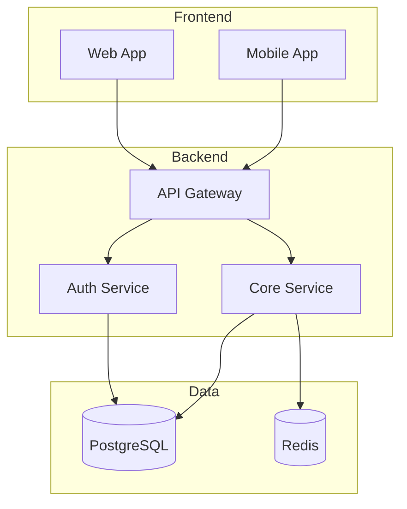

# Code Necromancer

**Tagline**: Raise dead codebases from the grave

**Category**: Development Archaeology & Legacy Resurrection

## Purpose

Code Necromancer is a systematic framework for understanding, resurrecting, and modernizing legacy codebases. It guides practitioners through three phases:

1. **ARCHAEOLOGY** - Understanding what exists in a multi-repo legacy system
2. **RESURRECTION** - Getting the system running again after years of dormancy
3. **REJUVENATION** - Modernizing the stack for current standards

## When to Activate

Use this skill when:
- Inheriting a codebase with 5+ repos and no documentation
- Resurrecting a product that hasn't been maintained for 2+ years
- Joining a company with significant technical debt and tribal knowledge loss
- Performing due diligence on acquired codebases
- Modernizing legacy systems without breaking existing functionality

## Phase 1: ARCHAEOLOGY

### Objective
Create a complete map of the system before touching anything.

### Outputs
1. **Repo Inventory** (`repo-inventory.json`)
   - All repositories with metadata
   - Primary language/framework per repo
   - Last activity date
   - Commit frequency analysis
   - README summary

2. **Dependency Graph** (`dependency-graph.mmd`)
   - Inter-repo dependencies
   - External service dependencies
   - Database connections
   - API integrations

3. **Architecture Diagram** (`architecture-diagram.mmd`)
   - Visual system architecture
   - Data flow between components
   - External integrations
   - Infrastructure topology

4. **Tech Stack Matrix** (`tech-stack-matrix.md`)
   - Language versions per repo
   - Framework versions
   - Database technologies
   - Cloud services used

5. **Maturity Assessment** (`maturity-assessment.md`)
   - Development status of each component
   - Code quality indicators
   - Test coverage (if detectable)
   - Documentation quality

6. **Missing Pieces** (`missing-pieces.md`)
   - Identified gaps in the system
   - Orphaned repos
   - Dead dependencies
   - Broken integrations

### Archaeology Process

```
1. INVENTORY
   └── List all repos in org/folder
   └── Extract basic metadata (language, size, last commit)
   └── Categorize by apparent purpose

2. DEEP SCAN (per repo)
   └── Identify framework(s)
   └── Parse dependency files (package.json, requirements.txt, etc.)
   └── Find configuration files
   └── Extract environment variable requirements
   └── Identify database schemas
   └── Map API endpoints

3. CROSS-REFERENCE
   └── Build dependency graph between repos
   └── Identify shared libraries
   └── Find service-to-service calls
   └── Map data flow

4. VISUALIZE
   └── Generate architecture diagrams
   └── Create dependency trees
   └── Build timeline of development activity

5. ASSESS
   └── Rate maturity of each component
   └── Identify the "core" vs "peripheral"
   └── Document tribal knowledge gaps
```

## Phase 2: RESURRECTION

### Objective
Get the system running in a development environment.

### Outputs
1. **Dependency Audit** (`dependency-audit.md`)
   - Outdated packages
   - Security vulnerabilities
   - Breaking changes in dependencies
   - Deprecated APIs

2. **Environment Map** (`environment-variables.md`)
   - All required environment variables
   - Which are secrets vs configuration
   - Default values where safe

3. **Secrets Inventory** (`secrets-needed.md`)
   - API keys needed
   - Certificates required
   - License keys
   - OAuth credentials

4. **Infrastructure Status** (`infrastructure-status.md`)
   - Cloud resources that exist
   - Resources that have been deleted
   - Resources that need updating
   - Cost analysis

5. **Resurrection Blockers** (`resurrection-blockers.md`)
   - Critical issues preventing launch
   - Prioritized by severity
   - Suggested fixes for each

6. **Integration Tests** (`integration-tests/`)
   - Tests that verify each component works
   - Tests that verify components communicate
   - Health check endpoints

### Resurrection Process

```
1. AUDIT DEPENDENCIES
   └── Run security audits (npm audit, safety check, etc.)
   └── Identify major version jumps needed
   └── Check for yanked/removed packages

2. MAP ENVIRONMENT
   └── Extract all env vars from code
   └── Categorize by service/purpose
   └── Identify which are missing

3. CHECK INFRASTRUCTURE
   └── Inventory cloud resources
   └── Check certificate expirations
   └── Verify DNS records
   └── Test database connectivity

4. CREATE RESURRECTION TESTS
   └── Write tests for each service startup
   └── Write tests for inter-service communication
   └── Write tests for external integrations

5. DOCUMENT BLOCKERS
   └── List everything preventing launch
   └── Prioritize by effort/impact
   └── Create actionable fix plans
```

## Phase 3: REJUVENATION

### Objective
Modernize the system while maintaining feature parity.

### Outputs
1. **Security Recommendations** (`security-recommendations.md`)
   - Vulnerability fixes
   - Security best practices
   - Compliance requirements

2. **Modernization Roadmap** (`modernization-roadmap.md`)
   - Prioritized upgrades
   - Framework migrations
   - Architecture improvements
   - Estimated effort levels

3. **Architecture Improvements** (`architecture-improvements.md`)
   - Scalability enhancements
   - Performance optimizations
   - Maintainability improvements

### Rejuvenation Process

```
1. SECURITY FIRST
   └── Fix all critical vulnerabilities
   └── Update authentication/authorization
   └── Implement security best practices

2. INFRASTRUCTURE
   └── Containerize if not already
   └── Set up CI/CD
   └── Implement infrastructure as code

3. CODE QUALITY
   └── Add linting/formatting
   └── Improve test coverage
   └── Add type safety where missing

4. ARCHITECTURE
   └── Identify refactoring opportunities
   └── Plan microservice boundaries
   └── Design for scale
```

## Key Commands and Tools

### GitHub Organization Scanning
```bash
# List all repos in an org
gh repo list ORG_NAME --limit 1000 --json name,description,primaryLanguage,pushedAt,isArchived

# Clone all repos
gh repo list ORG_NAME --limit 1000 --json sshUrl -q '.[].sshUrl' | xargs -I {} git clone {}
```

### Dependency Analysis
```bash
# Node.js
npm outdated
npm audit
npx depcheck

# Python
pip list --outdated
safety check
pipdeptree

# Go
go mod graph
go list -m -versions all
```

### Architecture Diagram Generation
Use Mermaid for portable diagrams:


## Anti-Patterns to Avoid

1. **Premature Resurrection**: Don't try to run code before understanding it
2. **Scope Creep**: Complete archaeology before starting resurrection
3. **Big Bang Updates**: Update dependencies incrementally, not all at once
4. **Ignoring Tests**: Write resurrection tests to measure progress
5. **Undocumented Changes**: Document everything you learn and change

## Success Metrics

### Archaeology Complete When:
- [ ] All repos cataloged with metadata
- [ ] Dependency graph visualized
- [ ] Architecture diagram created
- [ ] Core vs peripheral repos identified
- [ ] Missing pieces documented

### Resurrection Complete When:
- [ ] All services start locally
- [ ] Services can communicate with each other
- [ ] Integration tests pass
- [ ] At least one full user flow works

### Rejuvenation Complete When:
- [ ] No critical security vulnerabilities
- [ ] All dependencies reasonably current
- [ ] CI/CD pipeline working
- [ ] Documentation current
- [ ] Team can develop new features

## Example Workflow

```
# 1. Start Archaeology
Use this skill when the user says things like:
- "I inherited this codebase with 20 repos..."
- "This system hasn't been touched in 3 years..."
- "No one knows how this works anymore..."

# 2. Generate Inventory
Scan all repos, create repo-inventory.json

# 3. Deep Analysis
For each significant repo, analyze:
- Tech stack
- Dependencies
- Configuration
- API surface

# 4. Map Dependencies
Create dependency-graph.mmd showing how repos connect

# 5. Visualize Architecture
Create architecture-diagram.mmd showing system topology

# 6. Assess Status
Rate each component's maturity and identify gaps

# 7. Plan Resurrection
Create prioritized plan for getting things running

# 8. Execute Resurrection
Work through blockers, writing tests as you go

# 9. Plan Rejuvenation
Create modernization roadmap for long-term health
```

## References

- `references/archaeology-guide.md` - Deep dive on code archaeology techniques
- `references/dependency-patterns.md` - Common dependency detection patterns
- `references/framework-detection.md` - Identifying frameworks and stacks
- `references/infrastructure-mapping.md` - Cloud resource detection
- `references/integration-test-patterns.md` - Resurrection test patterns

## Templates

- `templates/repo-inventory.json` - Repository catalog template
- `templates/archaeology-report.md` - Phase 1 output template
- `templates/resurrection-plan.md` - Phase 2 output template
- `templates/rejuvenation-roadmap.md` - Phase 3 output template
