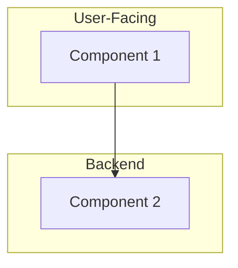
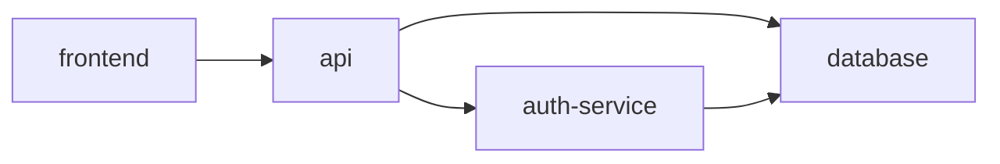

# Archaeology Report: [PROJECT_NAME]

**Organization**: [ORG_NAME]
**Scan Date**: [DATE]
**Analyst**: [NAME]

---

## Executive Summary

[2-3 paragraph summary of findings: what the system is, how it's structured, and what state it's in]

---

## System Overview

### What Is This?

[Describe the product/system in plain English. What does it do? Who uses it?]

### Architecture at a Glance



### Key Statistics

| Metric | Value |
|--------|-------|
| Total Repositories | X |
| Primary Languages | Lang1, Lang2 |
| Total Lines of Code | ~X,XXX |
| Last Active | YYYY-MM-DD |
| Dormancy Period | X years, X months |

---

## Repository Inventory

### Core Systems

These repositories form the heart of the application:

| Repo | Purpose | Tech Stack | Status | Maturity |
|------|---------|------------|--------|----------|
| repo-1 | Main API | Node.js/Express | Dormant | Medium |
| repo-2 | Web Frontend | React | Dormant | High |

### Supporting Services

These repos provide supporting functionality:

| Repo | Purpose | Tech Stack | Status | Maturity |
|------|---------|------------|--------|----------|
| repo-3 | Auth Service | Python/Flask | Dormant | Low |

### Libraries & Shared Code

Internal packages and shared utilities:

| Repo | Purpose | Used By |
|------|---------|---------|
| shared-lib | Common utilities | repo-1, repo-2 |

### Deprecated / Abandoned

These appear to be deprecated or abandoned:

| Repo | Last Activity | Notes |
|------|---------------|-------|
| old-repo | 2018-03-15 | Superseded by repo-2 |

### Unknown / Unclear

Purpose unclear, needs investigation:

| Repo | Notes |
|------|-------|
| mystery-repo | No README, sparse commits |

---

## Dependency Graph

### Inter-Repository Dependencies



### External Service Dependencies

| Service | Used By | Purpose | Status |
|---------|---------|---------|--------|
| AWS S3 | repo-1 | File storage | Unknown |
| PostgreSQL | repo-1, repo-3 | Primary database | Unknown |
| Redis | repo-1 | Caching/sessions | Unknown |
| Stripe | repo-1 | Payments | Unknown |

---

## Technology Stack

### Languages

| Language | Repos | Percentage |
|----------|-------|------------|
| TypeScript | 8 | 40% |
| Python | 5 | 25% |
| Go | 3 | 15% |
| Other | 4 | 20% |

### Frameworks

| Framework | Version Found | Current Version | Gap |
|-----------|---------------|-----------------|-----|
| React | 16.8.0 | 18.x | 2 major |
| Express | 4.17.0 | 4.18.x | Minor |
| Flask | 1.1.0 | 3.x | 2 major |

### Runtime Versions

| Runtime | Version Found | Current LTS | Support Status |
|---------|---------------|-------------|----------------|
| Node.js | 12.x | 20.x | EOL |
| Python | 3.7 | 3.12 | EOL |

---

## Maturity Assessment

### Scoring Criteria

- **Documentation** (1-5): README quality, inline comments, API docs
- **Test Coverage** (1-5): Presence and quality of tests
- **Code Quality** (1-5): Linting, typing, architecture
- **Activity** (1-5): Recent commits, active development
- **Maintainability** (1-5): Complexity, dependency health

### Repository Scores

| Repo | Doc | Tests | Quality | Activity | Maintain | Overall |
|------|-----|-------|---------|----------|----------|---------|
| repo-1 | 3 | 2 | 4 | 1 | 3 | 2.6 |
| repo-2 | 4 | 3 | 4 | 1 | 4 | 3.2 |

### Overall Assessment

**System Maturity**: [LOW / MEDIUM / HIGH]

[Explanation of overall system state]

---

## Missing Pieces

### Identified Gaps

1. **[Gap 1]**: [Description of what's missing and impact]
2. **[Gap 2]**: [Description]

### Orphaned Components

[Components that seem disconnected from the main system]

### Documentation Gaps

- [ ] No API documentation found
- [ ] No deployment guide
- [ ] No architecture decision records

---

## Configuration & Environment

### Environment Variables Required

| Variable | Used By | Purpose | Type |
|----------|---------|---------|------|
| DATABASE_URL | repo-1, repo-3 | Database connection | Secret |
| JWT_SECRET | repo-1, repo-3 | Auth tokens | Secret |
| AWS_ACCESS_KEY | repo-1 | S3 access | Secret |
| NODE_ENV | repo-1, repo-2 | Environment flag | Config |

### Configuration Files

| File | Found In | Purpose |
|------|----------|---------|
| .env.example | repo-1 | Environment template |
| config.yaml | repo-3 | Service configuration |

---

## Infrastructure

### Cloud Resources (Detected/Suspected)

- AWS Region: [if detected]
- Services: S3, RDS, EC2, etc.
- Databases: PostgreSQL, Redis, etc.

### CI/CD

| Repo | CI System | Status |
|------|-----------|--------|
| repo-1 | GitHub Actions | Likely broken |
| repo-2 | Travis CI | Unknown |

---

## Development History

### Timeline

```
2017 ─────────────────────────────────────────────────── 2024
     │                                                    │
     ├─ [2017-06] Initial commit (repo-1)                │
     ├─ [2018-03] Frontend added (repo-2)                │
     ├─ [2019-01] Auth service added (repo-3)            │
     ├─ [2020-08] Last significant feature               │
     └─ [2021-03] Last commit                            │
                                                          │
                      [3+ years dormancy]                 │
```

### Key Contributors (Historical)

| Contributor | Commits | Primary Repos |
|-------------|---------|---------------|
| dev1@company.com | 500 | repo-1, repo-2 |
| dev2@company.com | 300 | repo-3 |

---

## Recommendations

### Immediate Actions

1. **[Action 1]**: [Specific recommendation]
2. **[Action 2]**: [Specific recommendation]

### Before Resurrection

1. [Pre-requisite 1]
2. [Pre-requisite 2]

### Key Risks

1. **[Risk 1]**: [Description and mitigation]
2. **[Risk 2]**: [Description and mitigation]

---

## Appendices

### A. Full Repository List

[Complete list with all metadata]

### B. Dependency Trees

[Detailed dependency information per repo]

### C. API Surface Area

[All detected endpoints and their status]
