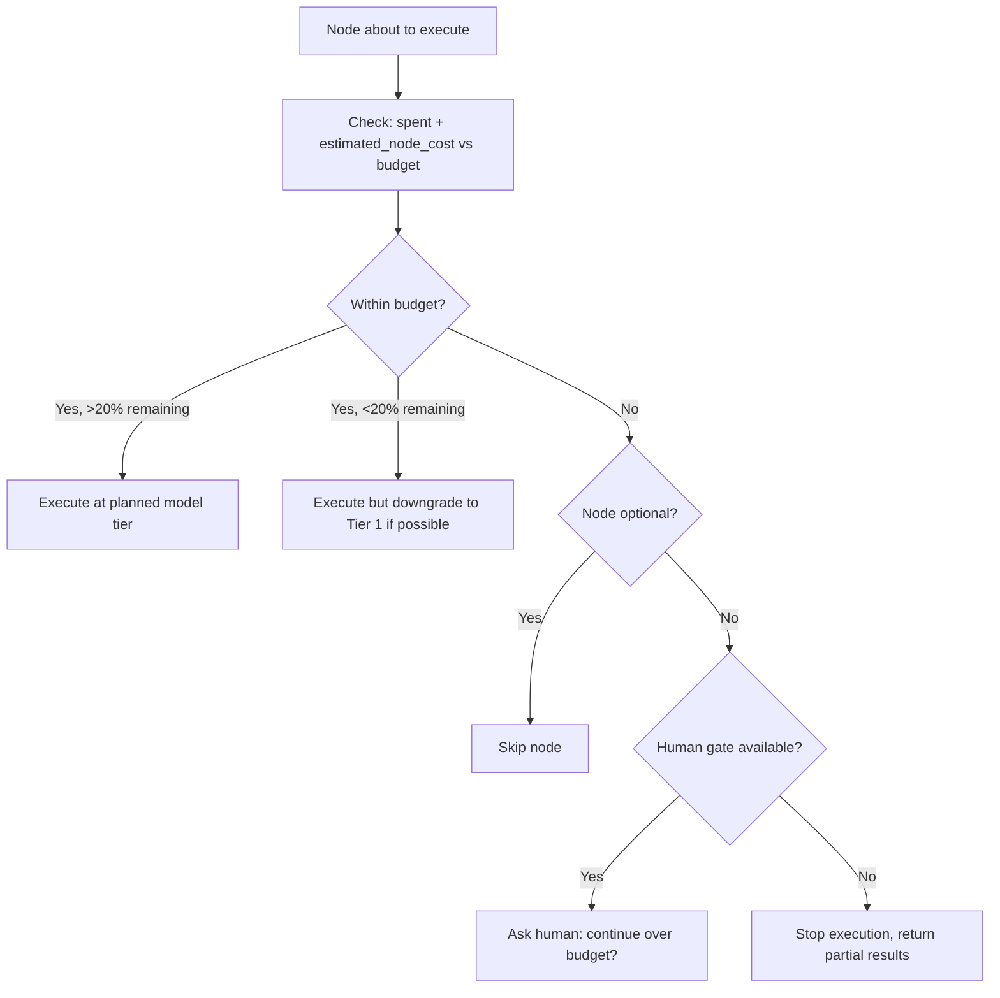

# Cost Optimizer

Tracks cumulative LLM costs across DAG execution and makes real-time decisions to stay within budget: downgrade models, skip optional nodes, or stop early.

---

## When to Use

✅ **Use for**:
- Setting and enforcing cost budgets for DAG executions
- Real-time cost monitoring during execution
- Deciding when to downgrade model tiers mid-execution
- Identifying which nodes are most expensive and why
- Post-execution cost analysis and optimization recommendations

❌ **NOT for**:
- Choosing which model to use per node (use `llm-router`)
- Provider pricing comparisons (static data, not a skill)
- Billing or invoicing features

---

## Budget Enforcement Process



### Budget Tiers

| Budget Remaining | Action |
|-----------------|--------|
| >50% | Execute at planned model tier |
| 20-50% | Log warning. Continue at planned tier. |
| 10-20% | Downgrade remaining Tier 2 nodes to Tier 1 (Haiku) |
| 5-10% | Downgrade ALL remaining nodes to Tier 1. Skip optional nodes. |
| <5% | Stop execution unless next node is critical path |
| 0% | Stop. Return partial results with cost breakdown. |

### Cost Estimation Per Node

Before each node executes, estimate its cost:
```
estimated_cost = (avg_input_tokens × input_price + avg_output_tokens × output_price)
```

Use historical averages for this skill + model combination. If no history, use defaults:
- Tier 1 (Haiku): ~800 input + 400 output = ~$0.001
- Tier 2 (Sonnet): ~2000 input + 1000 output = ~$0.012
- Tier 3 (Opus): ~3000 input + 1500 output = ~$0.16

### Post-Execution Report

```yaml
cost_report:
  total_budget: 0.50
  total_spent: 0.37
  budget_remaining: 0.13
  nodes_executed: 8
  nodes_skipped: 1
  nodes_downgraded: 2
  model_breakdown:
    haiku: { calls: 4, cost: 0.004 }
    sonnet: { calls: 3, cost: 0.036 }
    opus: { calls: 1, cost: 0.33 }
  savings_recommendations:
    - "Node 'deep-analysis' used Opus ($0.33) but downstream accepted on first try. Try Sonnet next time — potential saving: $0.32"
    - "Nodes 'validate-a' and 'validate-b' are sequential but independent. Parallelize to reduce wall-clock time."
```

---

## Anti-Patterns

### No Budget at All
**Wrong**: Running DAGs without any cost tracking until the API bill arrives.
**Right**: Every DAG execution has a budget, even if generous. Track spend per node.

### Aggressive Downgrading
**Wrong**: Downgrading Opus nodes to Haiku at 50% budget remaining, causing quality failures that trigger expensive retries.
**Right**: Only downgrade when the alternative is stopping execution. Retries cost more than the original model tier.

### Ignoring Retries in Cost
**Wrong**: Budgeting for one attempt per node.
**Right**: Budget for avg_retries × cost_per_attempt. A node with 3 retries on Sonnet costs $0.036, not $0.012.
