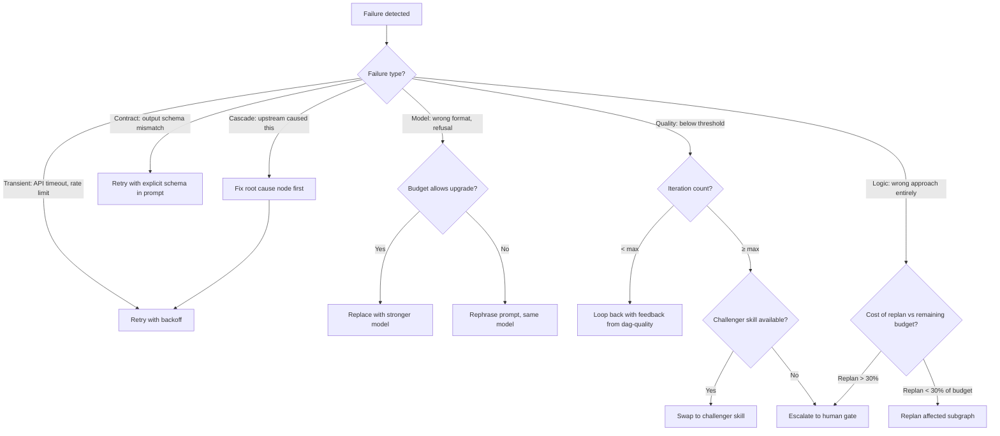

# DAG Mutation Strategist

Decides HOW to mutate a DAG when things go wrong. Given a failure diagnosis from `dag-quality` or `dag-ops`, selects the optimal recovery strategy.

---

## When to Use

✅ **Use for**:
- Choosing a mutation strategy after a node fails
- Deciding between retry, replan, fork, or escalate
- Adapting to mid-execution discoveries that change the plan
- Cost-aware recovery (don't spend $0.50 recovering a $0.01 failure)

❌ **NOT for**:
- Detecting failures (use `dag-quality`)
- Executing the mutation (use `dag-planner` to rewire, `dag-runtime` to execute)
- General error handling in code

---

## Strategy Selection

## Strategy Catalog

| Strategy | When | Cost | Risk |
|----------|------|------|------|
| **Retry with backoff** | Transient failures (timeout, rate limit) | Same as original (~$0.001-0.01) | Low — usually works in 1-3 retries |
| **Rephrase prompt** | Model refused or misunderstood | Same as original | Medium — may not fix the root cause |
| **Upgrade model** | Cheap model failed on complex task | +$0.01-0.10 | Low — stronger model usually succeeds |
| **Downgrade + simplify** | Expensive model failed, budget tight | -$0.01-0.10 | Medium — simpler approach may miss nuance |
| **Inject schema** | Output didn't match contract | Same as original | Low — explicit schema usually works |
| **Loop with feedback** | Quality below threshold | Same as original + eval cost | Medium — may plateau after 2-3 iterations |
| **Swap skill** | Current skill isn't working for this task | Same as original | Medium — challenger may or may not be better |
| **Fork parallel paths** | Ambiguous situation, multiple valid approaches | 2-3x original | Low — pick best result from parallel attempts |
| **Replan subgraph** | Wrong approach for this section | Variable (Sonnet call for replanning) | Medium — new plan may also be wrong |
| **Insert validator node** | Output needs additional checking | +$0.001 | Low — cheap verification step |
| **Escalate to human** | All automated strategies exhausted or too risky | Human time | Zero technical risk — but blocks execution |

## Decision Principles

1. **Cheapest effective fix first**: Retry before rephrase. Rephrase before model upgrade. Upgrade before replan.
2. **Cost-proportional recovery**: Don't spend $0.50 recovering a $0.01 failure. If recovery costs more than re-running the entire DAG, re-run.
3. **Escalate, don't loop forever**: Max 3 iterations of the same strategy. If it hasn't worked by then, escalate to a different strategy or human.
4. **Fix root causes, not symptoms**: If Node C failed because Node A produced bad input, fixing Node C is treating the symptom. Fix Node A.

---

## Anti-Patterns

### Retry Everything
**Wrong**: Retrying every failure with the same prompt and model 10 times.
**Right**: Retry once for transient failures. If it fails twice, the problem isn't transient — change strategy.

### Expensive Recovery for Cheap Failures
**Wrong**: Spawning an Opus replan call ($0.10) to recover from a Haiku formatting error ($0.001).
**Right**: Just retry with explicit schema injection ($0.001).

### Ignoring Cascade Failures
**Wrong**: Fixing Node C when Node A was the root cause. Node C will fail again on the next run.
**Right**: Trace backward through dependencies to find the first node that deviated. Fix that one.
