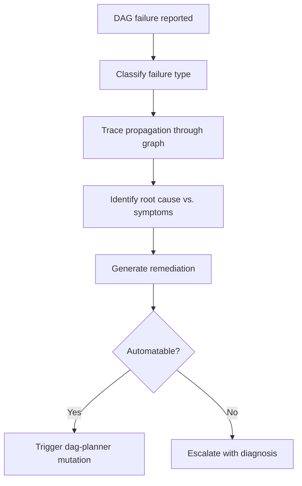

# DAG Ops

Operations, debugging, and optimization for DAG workflows. Consolidates dag-failure-analyzer, dag-performance-profiler, dag-result-aggregator, dag-context-bridger, and dag-pattern-learner.

---

## When to Use

✅ **Use for**:
- Diagnosing why a DAG execution failed (root cause analysis)
- Profiling execution performance (latency, cost, token usage bottlenecks)
- Aggregating/merging results from parallel branches (fan-in)
- Bridging context between nodes across waves
- Learning patterns from execution history for future optimization

❌ **NOT for**:
- Planning DAGs (use `dag-planner`)
- Running DAGs (use `dag-runtime`)
- Validating individual node outputs (use `dag-quality`)

---

## Failure Analysis



### Failure Classification

| Type | Root Cause | Typical Remediation |
|------|-----------|-------------------|
| **Transient** | API timeout, rate limit, network blip | Retry with backoff |
| **Model** | LLM refused, hallucinated, wrong format | Retry with different model or stronger prompt |
| **Contract** | Output doesn't match schema | Retry with explicit schema in prompt |
| **Logic** | Wrong approach, misunderstood task | Replan with dag-planner mutation |
| **Resource** | Cost budget exceeded, token limit hit | Downgrade model tier or split node |
| **Cascade** | Upstream failure propagated downstream | Fix root node, re-execute downstream |

### Root Cause vs. Symptom

If Node C failed, check: did Node A or B produce bad input? Trace backward through dependencies until you find the first node that deviated from expectations. That's the root cause; downstream failures are symptoms.

---

## Performance Profiling

### Metrics Tracked

| Metric | Per-Node | Per-DAG |
|--------|----------|---------|
| Duration (ms) | ✓ | ✓ (wall clock + sum) |
| Input tokens | ✓ | ✓ (total) |
| Output tokens | ✓ | ✓ (total) |
| Cost (USD) | ✓ | ✓ (total) |
| Model used | ✓ | Mix breakdown |
| Retries | ✓ | ✓ (total) |
| Queue wait time | ✓ | ✓ (avg) |

### Bottleneck Detection

```
Critical path = longest chain of sequential dependencies
Bottleneck = node on critical path with highest duration
Optimization = can this node be parallelized, downgraded, or cached?
```

### Cost Optimization Suggestions

- "Node X used Sonnet but downstream accepted on first try — try Haiku next time"
- "Nodes A and B are sequential but have no data dependency — parallelize"
- "Node C retried 3 times — the prompt may need clarification, not retries"

---

## Result Aggregation (Fan-In)

When parallel branches converge, merge their outputs:

| Strategy | When to Use |
|----------|------------|
| **Concatenate** | Results are independent sections (e.g., parallel research on different topics) |
| **Merge** | Results overlap and need deduplication (e.g., parallel code review findings) |
| **Select best** | Parallel approaches to same task, pick highest quality |
| **Synthesize** | Results are complementary perspectives, need a unified narrative |

### Conflict Resolution

When parallel nodes produce contradictory outputs:
1. Score each by confidence and downstream evaluator
2. If one is clearly higher quality, use it
3. If comparable, present both to a synthesis node (or human gate)
4. Never silently drop a contradiction — it's a signal

---

## Pattern Learning

Track execution history to improve future DAGs:

- **Successful patterns**: "For portfolio-builder DAGs, the research→design parallel path succeeds 94% of the time"
- **Anti-patterns**: "Putting code review before implementation always fails (output contract mismatch)"
- **Model routing**: "Classification nodes succeed on Haiku 98% of the time in this domain"
- **Cost trends**: "Average cost for research-synthesis template dropped from $0.15 to $0.08 after routing optimization"

Feed these patterns into dag-planner (for better DAG design) and llm-router (for better model selection).

---

## Replaces

Consolidates: `dag-failure-analyzer`, `dag-performance-profiler`, `dag-result-aggregator`, `dag-context-bridger`, `dag-pattern-learner`
