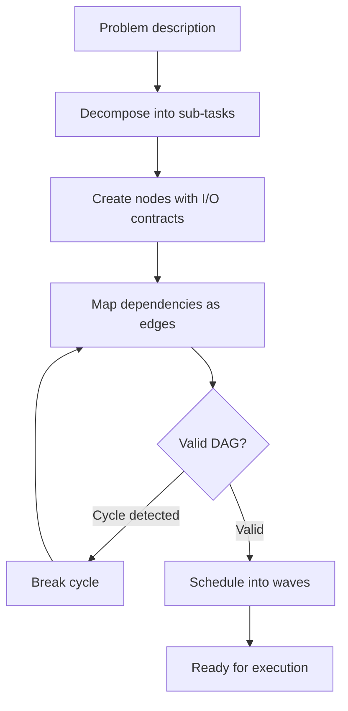

# DAG Planner

Builds, validates, schedules, and dynamically modifies DAG execution graphs. Consolidates the capabilities of dag-graph-builder, dag-dependency-resolver, dag-task-scheduler, and dag-dynamic-replanner.

---

## When to Use

✅ **Use for**:
- Decomposing a problem into a DAG of agent nodes
- Validating DAG structure (cycle detection, dependency resolution)
- Scheduling execution in parallel waves
- Modifying a running DAG (add/remove/replace nodes, rewire edges)

❌ **NOT for**:
- Executing the DAG (use `dag-runtime`)
- Validating node outputs (use `dag-quality`)
- Selecting skills for nodes (use `dag-skills-matcher`)

---

## Core Process



### Step 1: Problem Decomposition

Break the problem into atomic sub-tasks. Each sub-task becomes a node.

**Granularity heuristic**: A node should be completable by a single agent with 1-3 skills in one LLM call. If it requires multiple sequential LLM calls, split it.

### Step 2: Node Definition

Each node specifies:
```yaml
node:
  id: unique-identifier
  type: agent | vague | human-gate
  role: "what this node does (1 sentence)"
  skills: [skill-1, skill-2]
  input_schema: { fields the node receives }
  output_schema: { fields the node produces }
  depends_on: [upstream-node-ids]
  execution:
    timeout: 300s
    retries: 2
    model_tier: 1 | 2 | 3
```

### Step 3: Dependency Mapping

Types of dependencies:
- **Data dependency**: Node B needs Node A's output (explicit edge)
- **Resource dependency**: Nodes A and B modify the same file (conflict — serialize)
- **Ordering dependency**: B must run after A for logical reasons (implicit edge)

### Step 4: Validation

```python
def validate_dag(nodes, edges):
    """Kahn's algorithm: topological sort + cycle detection."""
    in_degree = {n.id: 0 for n in nodes}
    for e in edges:
        in_degree[e.to] += 1
    
    queue = [nid for nid, d in in_degree.items() if d == 0]
    sorted_nodes = []
    
    while queue:
        nid = queue.pop(0)
        sorted_nodes.append(nid)
        for e in edges:
            if e.from_ == nid:
                in_degree[e.to] -= 1
                if in_degree[e.to] == 0:
                    queue.append(e.to)
    
    if len(sorted_nodes) != len(nodes):
        raise CycleError("DAG contains a cycle")
    return sorted_nodes
```

### Step 5: Wave Scheduling

Group nodes into parallel execution waves:
- Wave 1: All nodes with no dependencies (in_degree = 0)
- Wave 2: All nodes whose dependencies are all in Wave 1
- Wave N: All nodes whose dependencies are all in Waves 1..N-1

Nodes within the same wave execute in parallel.

### Step 6: Dynamic Modification

During execution, the DAG may need modification:

| Mutation | Trigger | Implementation |
|----------|---------|----------------|
| Add node | Gap in output | Insert between existing nodes, rewire edges |
| Remove node | Node is redundant | Connect predecessors to successors directly |
| Replace node | Repeated failure | Swap agent/skills/model, keep edges |
| Fork | Ambiguous approach | Split into parallel paths, pick best result |
| Loop back | Quality below threshold | Add edge from evaluator back to producer |

After any mutation: re-validate (cycle check), re-schedule (new waves), re-estimate cost.

---

## Anti-Patterns

### Over-Decomposition
**Wrong**: 30 nodes for a simple task. Each node does one trivial operation.
**Right**: 5-10 nodes is typical. Each node is meaningful enough to justify an LLM call.

### Missing Output Contracts
**Wrong**: Nodes produce unstructured text that downstream nodes must parse.
**Right**: Every node has an explicit output schema. Downstream nodes know exactly what they're receiving.

### Ignoring Resource Conflicts
**Wrong**: Two parallel nodes both modify the same file.
**Right**: Detect file conflicts and serialize conflicting nodes into sequential waves.

---

## Replaces

Consolidates: `dag-graph-builder`, `dag-dependency-resolver`, `dag-task-scheduler`, `dag-dynamic-replanner`
