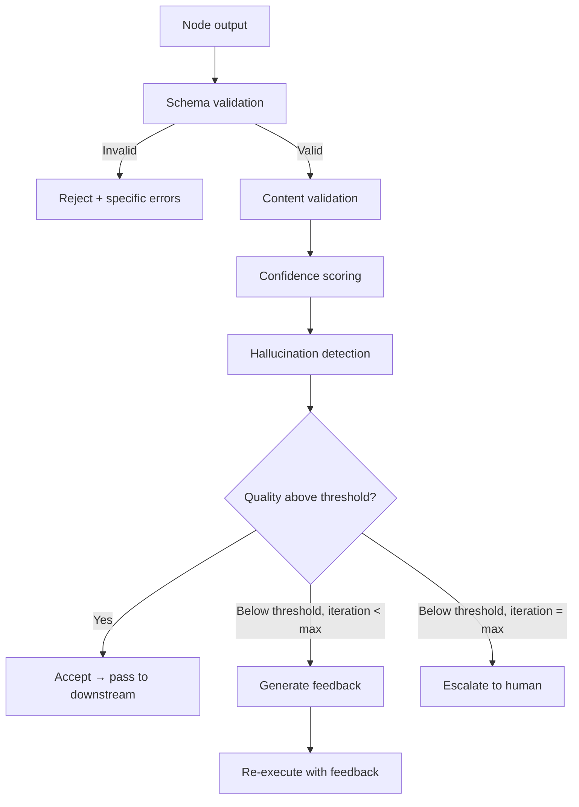

# DAG Quality

Validates outputs, scores confidence, detects hallucinations, monitors convergence, decides on iteration, and synthesizes feedback. The quality gate between DAG nodes. Consolidates dag-output-validator, dag-confidence-scorer, dag-hallucination-detector, dag-convergence-monitor, dag-iteration-detector, and dag-feedback-synthesizer.

---

## When to Use

✅ **Use for**:
- Validating node output against declared schema
- Scoring confidence on agent outputs (0-1)
- Detecting fabricated content, false citations, unverifiable claims
- Deciding whether to iterate (re-execute a node or loop)
- Generating structured improvement feedback for re-execution
- Monitoring quality trends across iterations

❌ **NOT for**:
- Executing nodes (use `dag-runtime`)
- Planning DAG structure (use `dag-planner`)
- Grading skills themselves (use `skill-grader`)

---

## Quality Pipeline



### Schema Validation

Structural check: does the output match the node's declared output contract?
- Required fields present
- Types correct (string, number, array, object)
- Constraints met (min/max length, ranges, enums)
- Nested structures valid

### Content Validation

Semantic check: is the content reasonable?
- Non-empty meaningful content (not just filler)
- Length within expected range for the task
- Internal consistency (no contradictions)
- References exist (cited files, URLs, identifiers)

### Confidence Scoring

Aggregate four evaluator signals (see skill-lifecycle.md for full architecture):

| Evaluator | Weight | Signal |
|-----------|--------|--------|
| Self-evaluation | 0.15 | Agent's own assessment (sycophancy-biased) |
| Peer evaluation | 0.25 | Separate judge agent with skill-grader |
| Downstream evaluation | 0.35 | Next node reports usability |
| Human evaluation | 0.50 | At human gates, gold standard |

Final score = weighted average of available signals (normalize weights to sum to 1.0).

### Hallucination Detection

Specific checks for fabricated content:
- **Citation verification**: Do cited sources exist? Do they say what's claimed?
- **Internal consistency**: Does the output contradict itself or the input?
- **Confidence calibration**: High-confidence claims on topics where uncertainty is expected
- **Entity verification**: Do named entities (people, tools, APIs) actually exist?

### Iteration Decision

```
If quality_score >= 0.8: ACCEPT
If quality_score < 0.8 AND iterations < max_iterations: ITERATE with feedback
If quality_score < 0.5 AND iterations >= max_iterations: ESCALATE to human
If quality_score < 0.3 on first attempt: ESCALATE immediately (fundamentally wrong)
```

### Feedback Synthesis

When iterating, produce structured improvement guidance:
```json
{
  "overall_score": 0.65,
  "specific_issues": [
    {"field": "recommendations", "issue": "Only 2 of 5 required recommendations provided", "fix": "Add 3 more recommendations addressing scalability, testing, and deployment"},
    {"field": "citations", "issue": "Source [3] returns 404", "fix": "Replace with a working source or remove the claim"}
  ],
  "strengths_to_preserve": ["Clear structure", "Good code examples"],
  "iteration_guidance": "Focus on completeness (missing recommendations) and citation accuracy. Do not rewrite the well-structured sections."
}
```

---

## Convergence Monitoring

Track quality scores across iterations to detect:
- **Improving**: Score trending up → continue iterating
- **Plateauing**: Score stable for 2+ iterations → stop, accept current best
- **Degrading**: Score declining → stop, revert to best previous iteration
- **Oscillating**: Score alternating up/down → stop, the feedback is contradictory

---

## Replaces

Consolidates: `dag-output-validator`, `dag-confidence-scorer`, `dag-hallucination-detector`, `dag-convergence-monitor`, `dag-iteration-detector`, `dag-feedback-synthesizer`
