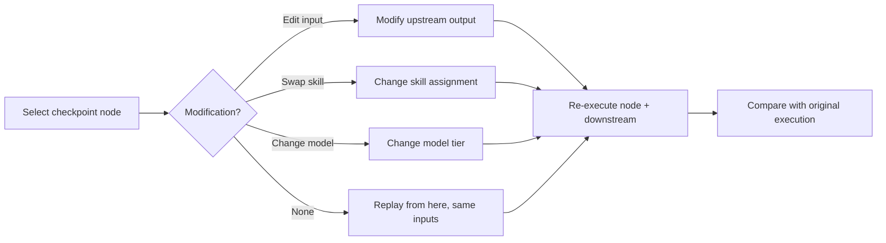
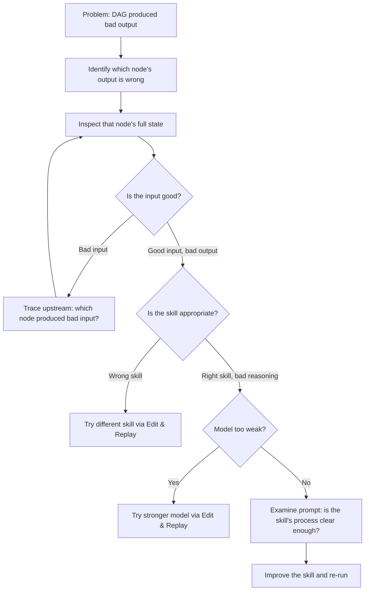

# DAG Replay Debugger

Time-travel debugging for DAG executions. Inspect any node's full state (inputs, prompt, output, reasoning), replay from any checkpoint with modifications, and compare execution traces.

---

## When to Use

✅ **Use for**:
- Post-mortem analysis of failed or low-quality DAG executions
- Inspecting exactly what a node received and produced
- Replaying from a checkpoint with modified inputs or skills
- Comparing two execution traces to find where they diverged
- Understanding WHY a node made a specific decision

❌ **NOT for**:
- Live monitoring of running DAGs (use `websocket-streaming`)
- Automated failure recovery (use `dag-mutation-strategist`)
- Profiling cost/performance (use `dag-ops`)

---

## Core Capabilities

### 1. State Inspection

At any node in a completed execution, view:

```
┌──────────────────────────────────────────────────────┐
│  Node: analyze-codebase (Wave 2)                     │
│  Status: completed ✓  Duration: 4.2s  Cost: $0.028  │
│                                                      │
│  Model: claude-sonnet-4.5                            │
│  Skills loaded: code-review-skill, react-server-...  │
│                                                      │
│  ▸ System Prompt (3,421 tokens)         [Expand]     │
│  ▸ User Message (1,205 tokens)          [Expand]     │
│  ▸ Input from upstream nodes            [Expand]     │
│  ▸ Full output (1,847 tokens)           [Expand]     │
│  ▸ Evaluator scores                     [Expand]     │
│    Self: 0.85  Peer: 0.78  Downstream: accepted      │
│  ▸ Context Store entries used           [Expand]     │
│                                                      │
│  [Replay from here]  [Edit & Replay]  [Compare]      │
└──────────────────────────────────────────────────────┘
```

### 2. Replay from Checkpoint

Pick any completed node and re-execute from that point forward:
- **Same inputs**: Useful for non-deterministic debugging (did the model just get unlucky?)
- **Modified inputs**: Edit the upstream output, then replay to see if downstream behaves differently
- **Modified skills**: Swap in a different skill version, then replay to compare output quality
- **Modified model**: Try the same node with Haiku vs. Sonnet to validate routing decisions



### 3. Execution Diff

Compare two traces side-by-side:

```
Original Run (2026-02-05 14:32)      │  Replay Run (2026-02-05 14:45)
────────────────────────────────────  │  ──────────────────────────────
Node: analyze-codebase               │  Node: analyze-codebase
Model: sonnet-4.5                    │  Model: haiku-4.5 ← CHANGED
Output: 3 recommendations            │  Output: 2 recommendations ← DIFF
  1. Extract auth module ✓            │    1. Extract auth module ✓
  2. Add error boundaries ✓           │    2. Add error boundaries ✓
  3. Migrate to React Query ✗         │    [missing] ← DIFF
Downstream accepted: yes             │  Downstream accepted: no ← DIFF
Cost: $0.028                         │  Cost: $0.001 ← 96% cheaper
```

This tells you: Haiku saved money but missed recommendation #3, which caused downstream rejection. The routing decision (Sonnet for this node) was correct.

### 4. Reasoning Trace

For models with extended thinking, inspect the thinking tokens:

```
[thinking]
The user asked me to analyze this codebase for refactoring opportunities.
Looking at src/auth.ts — it's 450 lines with mixed concerns (auth + validation + session).
This violates single-responsibility. I should recommend extracting...
[/thinking]
```

This exposes WHY the agent made its decisions, not just what it decided.

---

## Debugging Workflow



---

## Anti-Patterns

### Debugging Without Traces
**Wrong**: Trying to figure out what went wrong without execution traces.
**Right**: Every DAG execution should save full traces (input, prompt, output, timing, cost per node). Debug from data, not guesses.

### Replaying the Whole DAG
**Wrong**: Re-running the entire 10-node DAG to test a fix to Node 7.
**Right**: Replay from Node 7's checkpoint. Nodes 1-6 were fine — don't re-execute them.

### Ignoring the Reasoning Trace
**Wrong**: Only looking at inputs and outputs, not the thinking process.
**Right**: If extended thinking is available, inspect it. The reasoning trace often reveals the exact moment the agent went wrong.
