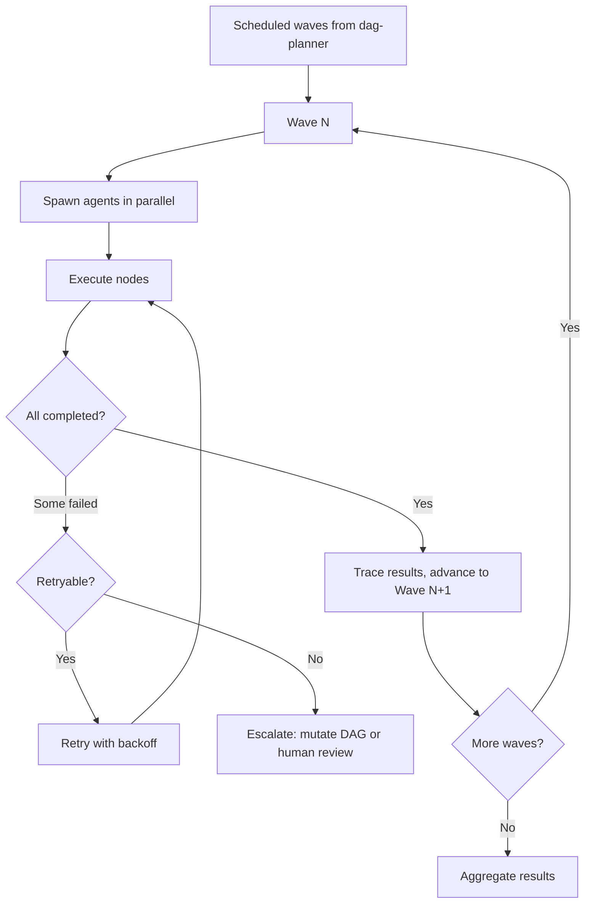

# DAG Runtime

Executes DAG workflows with parallel wave processing, agent spawning, context isolation, permission enforcement, and full execution tracing. Consolidates dag-executor, dag-parallel-executor, dag-execution-tracer, dag-isolation-manager, dag-scope-enforcer, and dag-permission-validator.

---

## When to Use

✅ **Use for**:
- Executing a planned DAG (from dag-planner)
- Managing concurrent agent spawning and wave execution
- Enforcing isolation and permission boundaries per node
- Tracing execution for debugging and observability
- Handling retries, timeouts, and failure escalation

❌ **NOT for**:
- Planning the DAG structure (use `dag-planner`)
- Validating output quality (use `dag-quality`)
- Selecting skills for nodes (use `dag-skills-matcher`)

---

## Execution Loop



### Agent Spawning

Each node executes as an isolated agent call:
1. Load the node's skills into a system prompt
2. Provide the node's inputs (from upstream outputs via Context Store)
3. Call the LLM via the provider router (model selected by llm-router)
4. Capture output, validate against schema (delegate to dag-quality)
5. Record execution trace (timing, tokens, cost, model used)

### Isolation Levels

| Level | What's Isolated | Use When |
|-------|----------------|----------|
| **None** | Shared context, shared filesystem | Cooperating nodes on same task |
| **Context** | Separate LLM conversations, shared filesystem | Independent nodes, no context bleed |
| **Process** | Separate processes, shared filesystem | Untrusted skills, resource limits |
| **Container** | Separate Docker containers | Security boundaries, code execution |

### Permission Enforcement

Each node has a permission set. Child nodes inherit from parent with **equal or more restrictive** permissions:
- `tools`: Which tools the node may use (Read, Write, Bash, etc.)
- `paths`: Which filesystem paths are accessible
- `models`: Which LLM models may be called
- `cost_budget`: Maximum spend for this node

### Execution Tracing

Every node execution produces a trace entry:
```json
{
  "node_id": "analyze-codebase",
  "wave": 2,
  "status": "completed",
  "model": "claude-sonnet-4.5",
  "skills_used": ["code-review-skill"],
  "input_tokens": 3421,
  "output_tokens": 1205,
  "cost_usd": 0.028,
  "duration_ms": 4200,
  "retries": 0,
  "output_summary": "Identified 3 refactoring opportunities..."
}
```

---

## Anti-Patterns

### No Timeout
**Wrong**: Letting a node run forever on a hung API call.
**Right**: Every node has a timeout. Default 300s. Configurable per node.

### Unlimited Retries
**Wrong**: Retrying a fundamentally broken node indefinitely.
**Right**: Max 3 retries for expensive models, max 10 for cheap. Then escalate.

### Context Leakage
**Wrong**: Node B sees Node A's full conversation history.
**Right**: Nodes receive only their declared inputs. Use the Context Store for cross-wave access.

---

## Replaces

Consolidates: `dag-executor`, `dag-parallel-executor`, `dag-execution-tracer`, `dag-isolation-manager`, `dag-scope-enforcer`, `dag-permission-validator`
