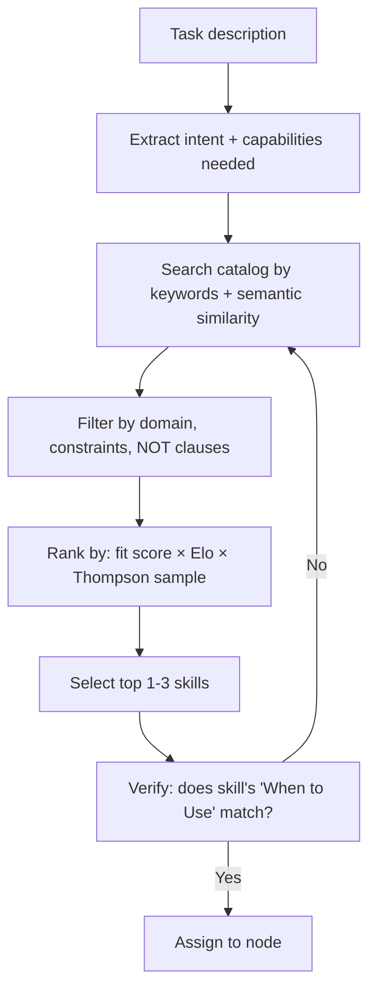

# DAG Skills Matcher

Matches tasks to skills, ranks candidates, and maintains the skill catalog. Consolidates dag-semantic-matcher, dag-capability-ranker, and dag-skill-registry.

---

## When to Use

✅ **Use for**:
- Assigning skills to DAG nodes based on task descriptions
- Finding the right skill for a specific task
- Ranking competing skills by fit, Elo, and performance history
- Browsing and searching the skill catalog
- Thompson sampling for skill exploration

❌ **NOT for**:
- Creating new skills (use `skill-architect`)
- Grading skill quality (use `skill-grader`)
- Executing skills (use `dag-runtime`)

---

## Matching Process



### Intent Extraction

From the task description, extract:
- **Required capabilities**: What the skill must be able to do
- **Domain**: What field this falls in (code, design, research, etc.)
- **Constraints**: Language, framework, tools, cost limits
- **Exclusions**: What the skill should NOT do (maps to NOT clauses)

### Catalog Search

Three search strategies, combined:
1. **Keyword match**: Does the task contain words from the skill's description?
2. **Semantic similarity**: Embedding-based similarity between task and skill descriptions
3. **Domain tag match**: Does the skill's domain align with the task's domain?

### Ranking

For each candidate skill, compute a composite score:

```
score = (fit_score × 0.4) + (elo_normalized × 0.3) + (thompson_sample × 0.3)
```

- **fit_score** (0-1): How well the skill's description matches the task
- **elo_normalized** (0-1): The skill's Elo rating mapped to [0, 1] (1500=0.5, 1800=0.75, etc.)
- **thompson_sample** (0-1): A draw from the skill's Beta posterior (enables exploration)

### Verification

Before final assignment, check the candidate skill's "When to Use / NOT for" sections against the task. If the task matches a NOT clause, reject and try the next candidate.

---

## Catalog Schema

```yaml
skill_entry:
  name: code-review-skill
  description: "Reviews TypeScript/React diffs..."
  domain: [code-review, typescript, react]
  elo:
    code-review: 1847
    typescript: 1723
  execution_count: 2341
  last_updated: 2026-01-15
  thompson_params:
    code-review: { alpha: 1847, beta: 494 }
  avg_cost_per_use: 0.012
  downstream_acceptance_rate: 0.94
```

---

## Anti-Patterns

### Keyword-Only Matching
**Wrong**: Only matching exact words (missing synonyms, related concepts).
**Right**: Combine keyword, semantic, and domain matching. "PR review" should match "code review skill."

### Ignoring NOT Clauses
**Wrong**: Assigning a skill whose NOT clause explicitly excludes the task.
**Right**: Always check NOT clauses as a hard filter after ranking.

### Always Picking #1
**Wrong**: Always assigning the top-ranked skill, never exploring alternatives.
**Right**: Thompson sampling occasionally selects lower-ranked skills, generating comparison data.

---

## Replaces

Consolidates: `dag-semantic-matcher`, `dag-capability-ranker`, `dag-skill-registry`
