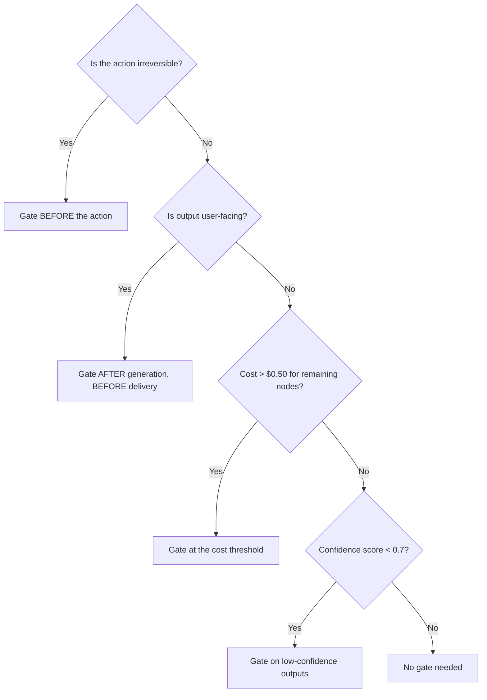
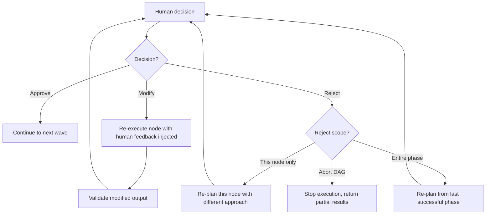

# Human Gate Designer

Designs human-in-the-loop review points in DAG workflows: what to present, how to collect feedback, how to route decisions back into the DAG.

---

## When to Use

✅ **Use for**:
- Deciding WHERE in a DAG to place human gates
- Designing WHAT the human sees at each gate
- Defining HOW feedback routes back (approve/reject/modify)
- Balancing automation speed with human oversight

❌ **NOT for**:
- Runtime execution of human gates (use `dag-runtime` + Temporal signals)
- General UI/UX design (use design skills)
- Chatbot conversation flow (different pattern)

---

## Gate Placement Decision Tree



### Where to Place Gates

| Situation | Gate Position | Why |
|-----------|-------------|-----|
| Irreversible action (deploy, send email, submit) | Before the action | Can't undo |
| User-facing deliverable (report, website, PR) | After generation, before delivery | Quality check |
| High cost remaining (>$0.50) | Before expensive phase | Budget confirmation |
| Low confidence output (<0.7) | After the uncertain node | Expert judgment needed |
| Ambiguous task decomposition | After planning, before execution | Validate the plan |
| First run of a new template DAG | After each phase | Build trust gradually |

---

## Gate Presentation Design

### What the Human Sees

```
┌──────────────────────────────────────────────────────┐
│  🔍 Human Review: [Node Name]                        │
│                                                      │
│  Context: [1-2 sentences: what happened so far]      │
│                                                      │
│  Output to Review:                                   │
│  ┌──────────────────────────────────────────────────┐│
│  │ [The node's output, formatted for readability]   ││
│  │ [Key decisions highlighted]                      ││
│  │ [Confidence: 0.82]                               ││
│  └──────────────────────────────────────────────────┘│
│                                                      │
│  Cost so far: $0.08 / $0.50 budget                  │
│  Remaining nodes: 4 (est. $0.12)                    │
│                                                      │
│  [✅ Approve]  [✏️ Modify]  [❌ Reject]              │
│                                                      │
│  If modifying, what should change?                   │
│  ┌──────────────────────────────────────────────────┐│
│  │ [text input for human feedback]                  ││
│  └──────────────────────────────────────────────────┘│
└──────────────────────────────────────────────────────┘
```

### Presentation Principles

1. **Show context, not just output**: The human needs to understand what the DAG has done so far, not just the current node's result.
2. **Highlight decisions**: Bold or annotate the choices the agent made. These are what the human is actually reviewing.
3. **Show confidence**: If the agent was uncertain, say so. Low-confidence outputs need more scrutiny.
4. **Show cost**: The human should know what they've spent and what's remaining.
5. **Make "Modify" easy**: A text input for feedback that gets injected into the retry prompt.

---

## Feedback Routing



### Feedback Injection

When the human selects "Modify," their text becomes part of the re-execution prompt:

```
Original task: [same as before]
Previous output: [the output the human rejected]
Human feedback: "[the human's modification text]"

Revise your output to address the human's feedback.
Preserve the parts they didn't comment on.
```

---

## Anti-Patterns

### Gate After Every Node
**Wrong**: Requiring human approval after every single node.
**Right**: Gate only at irreversible actions, user-facing outputs, and low-confidence decisions. Most internal nodes need no gate.

### Binary Approve/Reject Only
**Wrong**: The human can only approve or reject, with no way to provide specific feedback.
**Right**: Always include a "Modify" option with a text input for targeted feedback.

### No Context in the Gate
**Wrong**: Showing the human a raw JSON output with no explanation.
**Right**: Show: what the DAG is doing, what happened so far, what this output means, what happens next if approved.
