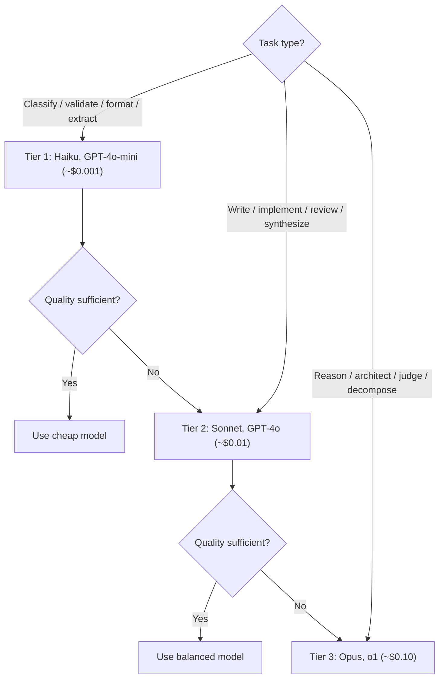

# LLM Router

Selects the optimal LLM model for each task. The single biggest cost lever in multi-agent systems — intelligent routing saves 45-85% while maintaining 95%+ of top-model quality.

---

## When to Use

✅ **Use for**:
- Deciding which model to call for a specific task
- Assigning models to DAG nodes in agent workflows
- Optimizing LLM API costs across a system
- Building cascading try-cheap-first patterns

❌ **NOT for**:
- Prompt engineering (use `prompt-engineer`)
- Model fine-tuning or training
- Comparing model architectures (academic research)

---

## Routing Decision Tree



---

## Tier Assignment Table

| Task Type | Tier | Models | Cost/Call | Why This Tier |
|-----------|------|--------|-----------|---------------|
| Classify input type | 1 | Haiku, GPT-4o-mini | ~$0.001 | Deterministic categorization |
| Validate schema/format | 1 | Haiku, GPT-4o-mini | ~$0.001 | Mechanical checking |
| Format output / template | 1 | Haiku, GPT-4o-mini | ~$0.001 | Structured transformation |
| Extract structured data | 1 | Haiku, GPT-4o-mini | ~$0.001 | Pattern matching |
| Summarize text | 1-2 | Haiku → Sonnet | ~$0.001-0.01 | Short summaries: Haiku; nuanced: Sonnet |
| Write content/docs | 2 | Sonnet, GPT-4o | ~$0.01 | Creative quality matters |
| Implement code | 2 | Sonnet, GPT-4o | ~$0.01 | Correctness + style |
| Review code/diffs | 2 | Sonnet, GPT-4o | ~$0.01 | Needs judgment, not just pattern matching |
| Research synthesis | 2 | Sonnet, GPT-4o | ~$0.01 | Multi-source reasoning |
| Decompose ambiguous problem | 3 | Opus, o1 | ~$0.10 | Requires deep understanding |
| Design architecture | 3 | Opus, o1 | ~$0.10 | Complex system reasoning |
| Judge output quality | 3 | Opus, o1 | ~$0.10 | Meta-reasoning about quality |
| Plan multi-step strategy | 3 | Opus, o1 | ~$0.10 | Long-horizon planning |

---

## Three Routing Strategies

### Strategy 1: Static Tier Assignment (Start Here)

Assign model by task type at DAG design time. No runtime logic. Gets 60-70% of possible savings.

```yaml
nodes:
  - id: classify
    model: claude-haiku-4.5     # Tier 1: $0.001
  - id: implement
    model: claude-sonnet-4.5    # Tier 2: $0.01  
  - id: evaluate
    model: claude-opus-4.6      # Tier 3: $0.10
```

### Strategy 2: Cascading (Try Cheap First)

Try the cheap model; if quality is below threshold, escalate. Adds ~1s latency but saves 50-80% on nodes where cheap succeeds.

```
1. Execute with Tier 1 model
2. Quick quality check (also Tier 1 — costs ~$0.001)
3. If quality ≥ threshold → done
4. If quality < threshold → re-execute with Tier 2
```

Best for nodes where you're genuinely unsure which tier is needed.

### Strategy 3: Adaptive (Learn from History)

Record success/failure per task type per model. Over time, the router learns:
- "Classification nodes always succeed on Haiku" → stay cheap
- "Code review nodes fail on Haiku 40% of the time" → upgrade to Sonnet
- "Architecture nodes succeed on Sonnet 90% of the time" → don't need Opus

Gets 75-85% savings after ~100 executions of training data.

---

## Provider Selection

Once model tier is chosen, select the provider:

| Model Class | Provider Options | Selection Criteria |
|------------|-----------------|-------------------|
| Haiku-class | Anthropic, AWS Bedrock | Latency, regional availability |
| Sonnet-class | Anthropic, AWS Bedrock, GCP Vertex | Cost, rate limits |
| Opus-class | Anthropic | Only provider |
| GPT-4o-class | OpenAI, Azure OpenAI | Rate limits, compliance |
| Open-source | Ollama (local), Together.ai, Fireworks | Cost ($0), latency, GPU availability |

---

## Cost Impact Example

10-node DAG, "refactor a codebase":

| Strategy | Mix | Cost | Savings |
|----------|-----|------|---------|
| All Opus | 10× $0.10 | $1.00 | — |
| All Sonnet | 10× $0.01 | $0.10 | 90% |
| Static tiers | 4× Haiku + 4× Sonnet + 2× Opus | $0.24 | 76% |
| Cascading | 6× Haiku + 3× Sonnet + 1× Opus | $0.14 | 86% |
| Adaptive (trained) | Dynamic | ~$0.08 | 92% |

---

## Anti-Patterns

### Always Use the Best Model
**Wrong**: Route everything to Opus/o1 "for quality."
**Reality**: 60%+ of typical DAG nodes are classification, validation, or formatting — tasks where Haiku performs identically to Opus. You're burning money.

### Always Use the Cheapest Model
**Wrong**: Route everything to Haiku "for cost."
**Reality**: Complex reasoning, architecture design, and quality judgment genuinely need stronger models. Haiku will produce plausible-looking but subtly wrong output on hard tasks.

### Ignoring Latency
**Wrong**: Only optimizing for cost, ignoring that Opus takes 5-10x longer than Haiku.
**Reality**: In a 10-node DAG, model choice affects total execution time as much as cost. Route time-critical paths to faster models.

### No Feedback Loop
**Wrong**: Setting model tiers once and never adjusting.
**Reality**: As models improve (Haiku gets smarter every generation), tasks that needed Sonnet last month may work on Haiku today. Record outcomes and adapt.
