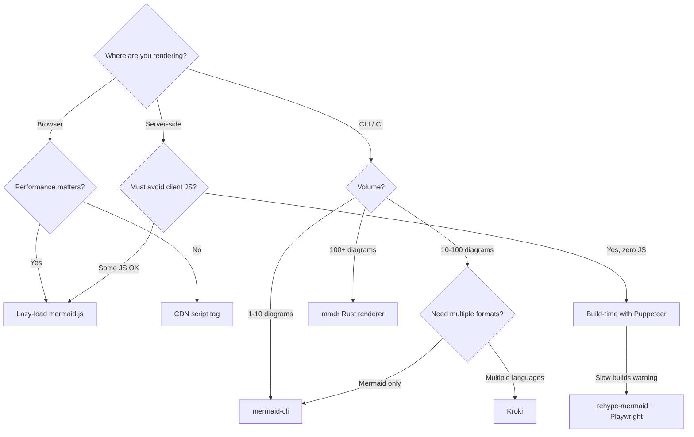

# Mermaid Graph Renderer

Renders Mermaid diagrams to production-quality SVG, PNG, and PDF in web and offline contexts. Covers the full spectrum from lazy-loaded client-side rendering to 1000x-faster native Rust batch export.

## Core Constraint

Mermaid.js requires browser APIs (`document.createElement`, `SVGTextElement.getBBox()`) to compute text dimensions. Every non-browser rendering path must either embed a headless browser or reimplement the renderer from scratch. This constraint shapes every decision below.

---

## When to Use

✅ **Use for**:
- Rendering Mermaid diagrams on web pages (performance-optimized)
- Exporting diagrams to SVG, PNG, or PDF (offline/CLI)
- Setting up CI/CD pipelines that generate diagram images
- Choosing between rendering libraries for a project
- Optimizing Mermaid load time on documentation sites

❌ **NOT for**:
- Writing Mermaid syntax (use `mermaid-graph-writer`)
- Rendering non-Mermaid formats (PlantUML, GraphViz — see Kroki)
- General image processing or manipulation

---

## Rendering Decision Tree



---

## Web Rendering

### Option 1: Lazy-Loaded mermaid.js (Recommended)

Best for documentation sites, blogs, and apps where only some pages have diagrams.

**How it works**: Check for `.mermaid` elements before loading the library. The ~480 KB cost is only paid on pages that actually need it.

```javascript
// Lazy load pattern — only loads mermaid.js when diagrams exist
function initMermaid() {
  const diagrams = document.querySelectorAll('.mermaid');
  if (diagrams.length === 0) return;

  const script = document.createElement('script');
  script.src = 'https://cdn.jsdelivr.net/npm/mermaid@11/dist/mermaid.min.js';
  script.onload = () => {
    mermaid.initialize({ startOnLoad: false, theme: 'neutral' });
    mermaid.run({ nodes: diagrams });
  };
  document.head.appendChild(script);
}

// Handle initial load + SPA navigation
document.addEventListener('DOMContentLoaded', initMermaid);
// For SPA route changes: call initMermaid() after navigation
```

**Key detail**: Handle both initial page load AND client-side navigation (SPA route changes) by re-running `mermaid.run()` when new diagram content appears.

| Aspect | Value |
|--------|-------|
| Bundle size | ~480 KB (core + lazy diagram chunks) |
| Render time | ~50-200 ms per diagram (client) |
| Diagram coverage | Full (all Mermaid types) |
| Best for | Docs sites, blogs, apps with occasional diagrams |

### Option 2: @mermaid-js/tiny

Pre-bundled subset for CDN use. All diagram types included upfront (no lazy-loading of diagram chunks). Smaller total but loaded eagerly.

**Use when**: You know exactly which 1-2 diagram types you need and want a single-file import.

### Option 3: Build-Time SSR (Usually Not Worth It)

Render SVGs at build time using Puppeteer/Playwright. Sounds appealing; painful in practice.

**Costs**:
- Adds ~280 MB to `node_modules` (Puppeteer + Chromium)
- ~2-3 seconds per diagram to spin up and render
- A 5-second build becomes 45 seconds for ~30 diagrams
- Docker/CI headaches (Chrome needs to be installed)

**When actually worth it**: Strict zero-JS requirements, or sites with hundreds of diagrams where you want to eliminate client-side rendering entirely.

**Tools**: `rehype-mermaid` (uses Playwright), `rehype-mermaid-cli` (wraps official CLI).

**Verdict**: Unless you have strict zero-JS requirements, lazy-loaded client-side rendering is the better trade-off.

---

## Offline / CLI Rendering

### Option 1: mermaid-cli (Official)

The canonical CLI tool. Launches headless Chromium, renders, captures output.

```bash
# Install
npm install -g @mermaid-js/mermaid-cli

# Basic usage
mmdc -i input.mmd -o output.svg
mmdc -i input.mmd -o output.png -b transparent
mmdc -i input.mmd -o output.pdf

# With config
mmdc -i input.mmd -o output.svg -t dark --configFile mermaid.config.json

# Batch: process Markdown with embedded diagrams
mmdc -i document.md -o document-with-images.md

# Docker
docker run --rm -v $(pwd):/data minlag/mermaid-cli -i /data/input.mmd -o /data/output.svg
```

| Aspect | Value |
|--------|-------|
| Speed | ~3000 ms per diagram (Chromium overhead) |
| Output | SVG, PNG, PDF |
| Size | ~280 MB (Puppeteer + Chromium) |
| Coverage | Full (all Mermaid types, 100% parity) |
| Best for | 1-50 diagrams, when accuracy matters most |

**SVG gotcha**: Output SVGs contain `<foreignObject>` elements that break in Inkscape and `rsvg-convert`. Fix: set `"htmlLabels": false` in config, or export to PNG instead.

### Option 2: Kroki (Multi-Format Gateway)

Unified HTTP API that routes diagram source to appropriate rendering engine. Supports 25+ languages (Mermaid, PlantUML, GraphViz, D2, Excalidraw, etc.).

```bash
# Render via HTTP (self-hosted or kroki.io)
curl -X POST https://kroki.io/mermaid/svg \
  -H 'Content-Type: text/plain' \
  -d 'flowchart LR
    A --> B --> C' \
  -o diagram.svg

# Self-host via Docker Compose
# docker-compose.yml needs: yuzutech/kroki + yuzutech/kroki-mermaid
```

| Aspect | Value |
|--------|-------|
| Speed | ~500-2000 ms (network + render) |
| Output | SVG, PNG, PDF, JPEG |
| Languages | 25+ (Mermaid, PlantUML, GraphViz, D2, etc.) |
| Best for | Multi-language pipelines, CI/CD, documentation generators |

**When Kroki wins**: You need multiple diagram languages in one pipeline.
**When it doesn't**: Simple "render one Mermaid diagram" — overkill.

### Option 3: mmdr (Native Rust — Fastest)

Native Rust reimplementation. No browser, no Node.js. ~1000x faster than mermaid-cli.

```bash
# Install (Rust toolchain required)
cargo install mmdr

# Usage
mmdr input.mmd -o output.svg
mmdr input.mmd -o output.png  # via resvg, no browser
```

| Aspect | Value |
|--------|-------|
| Speed | ~3 ms per diagram (1000x faster) |
| Output | SVG (native), PNG (via resvg) |
| Size | ~5-10 MB binary |
| Coverage | 13 diagram types (partial parity) |
| Best for | Batch processing 100+ diagrams, CI/CD speed |

**Trade-off**: Not all Mermaid features are supported yet. Flowcharts and sequence diagrams are mature; other types vary. Accept imperfection for speed, or fall back to mermaid-cli for edge cases.

**No `<foreignObject>` issue**: Uses native SVG text, so output works with Inkscape and other SVG tools.

---

## Comparison Matrix

| Criterion | mermaid.js CDN | mermaid-cli | Kroki | mmdr (Rust) |
|-----------|---------------|-------------|-------|-------------|
| Runtime | Browser | Node + Puppeteer | Docker | Native binary |
| Speed/diagram | ~100 ms | ~3000 ms | ~1000 ms | ~3 ms |
| SVG quality | Excellent | Excellent | Excellent | Good (improving) |
| PNG quality | N/A | Good | Good | Good (resvg) |
| PDF export | N/A | Yes | Yes | Not yet |
| Install size | ~480 KB | ~280 MB | ~1 GB (Docker) | ~5-10 MB |
| Diagram coverage | Full | Full | Full | 13 types |
| CI/CD fit | Poor | Moderate | Good | Excellent |
| Multi-language | No | No | Yes (25+) | No |

---

## Recommendations by Use Case

| Use Case | Recommendation | Why |
|----------|---------------|-----|
| Docs site with occasional diagrams | Lazy-loaded mermaid.js | Only loads on pages that need it |
| Next.js / SSR app | Dynamic import, `ssr: false` | Don't fight build-time rendering |
| CI/CD generating static docs (Mermaid only) | mmdr for speed, mermaid-cli for accuracy | 1000x faster vs. 100% feature parity |
| CI/CD with multiple diagram languages | Kroki | One API for PlantUML + Mermaid + GraphViz |
| Batch export for print/PDF (100+ diagrams) | mmdr + mermaid-cli fallback | Fast for most, accurate for edge cases |
| Desktop apps (Electron/Obsidian/VS Code) | Built-in mermaid.js | Chromium already embedded |

---

## Anti-Patterns

### SSR Obsession
**Wrong**: Spending 3 days setting up Puppeteer in CI to avoid 480 KB of client JS.
**Right**: Lazy-load mermaid.js. The 480 KB is only fetched on pages with diagrams. Most users won't notice.

### foreignObject Surprise
**Wrong**: Exporting SVGs from mermaid-cli and wondering why Inkscape can't open them.
**Right**: Set `"htmlLabels": false` in config, or export to PNG directly.

### One Tool for Everything
**Wrong**: Using mermaid-cli for 500 diagrams in CI (25 minutes of build time).
**Right**: Use mmdr for batch, mermaid-cli for the few diagrams that need full parity.
