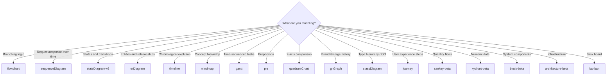
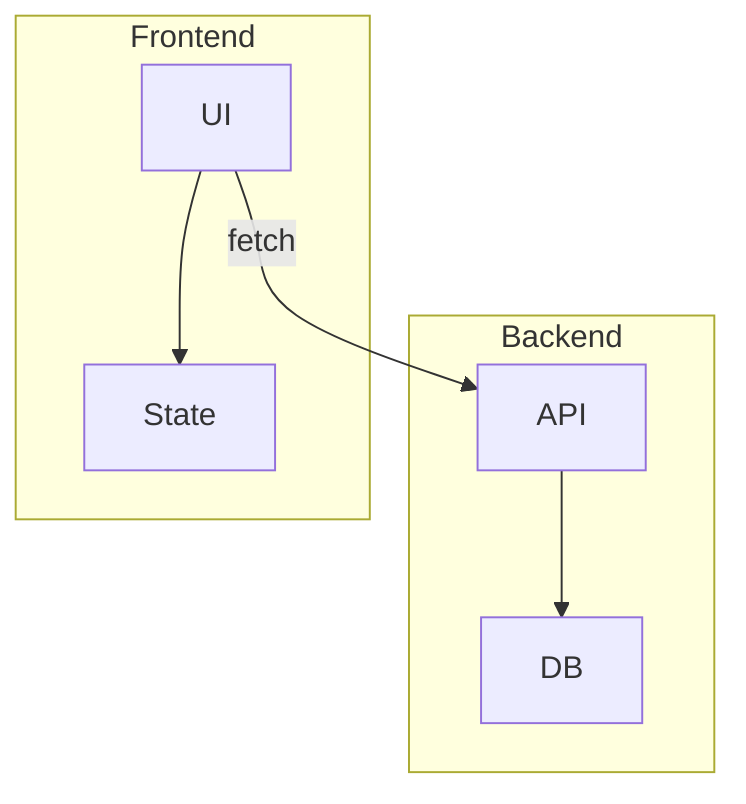
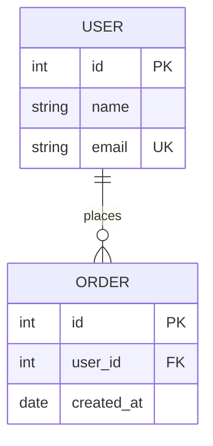

# Mermaid Graph Writer

Writes precise, well-structured Mermaid diagrams. Selects the optimal diagram type for the content, uses correct syntax, and produces diagrams that are readable by both humans (rendered) and agents (text DSL).

---

## When to Use

✅ **Use for**:
- Creating any Mermaid diagram from a description or data
- Choosing the right diagram type for a visualization need
- Refactoring prose decision trees into Mermaid flowcharts
- Modeling system architectures, protocols, state machines, data models
- Encoding temporal knowledge as timeline diagrams

❌ **NOT for**:
- Rendering/exporting Mermaid to PNG/SVG/PDF (use `mermaid-graph-renderer`)
- ASCII art or Unicode box-drawing (use `diagramming-expert`)
- GUI-based design tools (Figma, etc.)

---

## Diagram Type Selection



### Quick Reference

| Content | Type | Direction |
|---------|------|-----------|
| Decision tree / process | `flowchart TD` | Top-down for decisions, LR for processes |
| API protocol / agent comms | `sequenceDiagram` | Always vertical (implicit) |
| Lifecycle / status machine | `stateDiagram-v2` | Automatic layout |
| Database / data model | `erDiagram` | Automatic layout |
| "What changed when" | `timeline` | Horizontal chronological |
| Taxonomy / brainstorm | `mindmap` | Radial from root |
| Project schedule | `gantt` | Horizontal timeline |
| Category proportions | `pie` | Circular |
| Effort vs. impact | `quadrantChart` | 2D scatter |
| Git branching strategy | `gitGraph` | Horizontal |
| Class/interface hierarchy | `classDiagram` | Automatic |
| User flow with satisfaction | `journey` | Horizontal sections |
| Flow quantities between categories | `sankey-beta` | Left-to-right flow |
| Bar/line charts | `xychart-beta` | Standard axes |
| System block layout | `block-beta` | Grid-based |
| Cloud/infra topology | `architecture-beta` | Grouped services |
| Task status columns | `kanban` | Column-based |

---

## Flowchart Deep Dive (Most Common)

### Direction

- `TD` / `TB` — top-down (best for decision trees)
- `LR` — left-right (best for processes, pipelines)
- `BT` — bottom-up (rare, for dependency graphs)
- `RL` — right-left (rare)

### Node Shapes

```
[text]       Rectangle (default action)
(text)       Rounded rectangle (soft step)
{text}       Diamond (decision/condition)
([text])     Stadium/pill (start/end)
[[text]]     Subroutine (subprocess)
[(text)]     Cylinder (database/storage)
((text))     Circle (event/trigger)
>text]       Flag (async/signal)
{{text}}     Hexagon (preparation)
[/text/]     Parallelogram (input/output)
[\text\]     Reverse parallelogram
[/text\]     Trapezoid
[\text/]     Reverse trapezoid
```

### Edge Styles

```
-->          Solid arrow (main flow)
---          Solid line (association)
-.->         Dotted arrow (optional/async)
==>          Thick arrow (emphasis/critical path)
--text-->    Labeled edge
~~~          Invisible link (layout control only)
```

### Subgraphs



---

## Sequence Diagram Essentials

### Messages

```
->>    Solid arrow (sync request)
-->>   Dotted arrow (async response)
-)     Open arrow (async fire-and-forget)
-x     Cross (failed/rejected)
```

### Blocks

```
activate / deactivate    Lifeline activation
alt / else / end         Conditional branching
loop / end               Repetition
par / and / end          Parallel execution
critical / end           Critical section
break / end              Break-out flow
rect rgb(...)  / end     Background highlight
```

### Numbering

Add `autonumber` after the first line to auto-number all messages.

---

## State Diagram Essentials

```
[*] --> State1           Start transition
State1 --> State2        Named transition
State1 --> State2: event Labeled transition
State2 --> [*]           End transition

state State1 {          Nested states
  [*] --> SubA
  SubA --> SubB
}

state fork <<fork>>      Fork pseudostate
state join <<join>>      Join pseudostate
state choice <<choice>>  Choice pseudostate
```

---

## ER Diagram Essentials

### Cardinality

```
||--||    Exactly one to exactly one
||--o{    One to zero-or-many
}o--o{    Zero-or-many to zero-or-many
||--|{    One to one-or-many
```

### Attributes



---

## Writing Principles

### 1. Descriptive Labels, Not Codes

- ✅ `A[Check if tests pass]`
- ❌ `A[Step 2.3]`

### 2. Consistent Direction

Pick one direction for the whole diagram. Don't mix TD and LR within the same flowchart.

### 3. Max 15 Nodes per Diagram

Beyond 15 nodes, split into multiple diagrams or use subgraphs. A crowded diagram is worse than no diagram.

### 4. Use Subgraphs for Grouping

When a diagram has natural clusters (frontend/backend, phases, teams), use subgraphs to group them visually.

### 5. Label All Decision Edges

Every edge leaving a diamond (`{decision}`) node must have a label:

- ✅ `A{Ready?} -->|Yes| B` and `A -->|No| C`
- ❌ `A{Ready?} --> B` and `A --> C` (which is yes? which is no?)

### 6. Use Appropriate Edge Styles

- Solid arrows for main flow
- Dotted arrows for optional/async paths
- Thick arrows for critical paths or emphasis
- Invisible links (`~~~`) only for layout tweaking

---

## Anti-Patterns

### Wrong Diagram Type
**Novice**: Using a flowchart for everything — even protocols, state machines, and data models.
**Expert**: Match diagram type to content structure. Sequence diagrams for protocols. State diagrams for lifecycle. ER for data models. Each type exists because flowcharts can't express that structure well.

### Overcrowded Diagram
**Novice**: One diagram with 30 nodes and crossing edges.
**Expert**: Split into overview diagram + detail diagrams. Use subgraphs. Max ~15 nodes per diagram.

### Unlabeled Decision Edges
**Novice**: `{Decision} --> A` and `{Decision} --> B` — which condition leads where?
**Expert**: Always label edges from decision diamonds: `-->|Yes|` and `-->|No|` (or `-->|Success|` and `-->|Failure|`, etc.)

### Prose That Should Be a Diagram
**Novice**: "First check if X. If X then do A, otherwise do B. Then if A succeeds, do C, otherwise retry A."
**Expert**: That's a flowchart. Write it as one. The formal graph is more precise AND more readable.

---

## Detailed syntax reference for all 16+ diagram types

See `references/diagram-types.md` for comprehensive syntax, features, and examples for every Mermaid diagram type including timeline, mindmap, quadrant, sankey, XY chart, block, architecture, kanban, pie, gitgraph, class, and journey.
