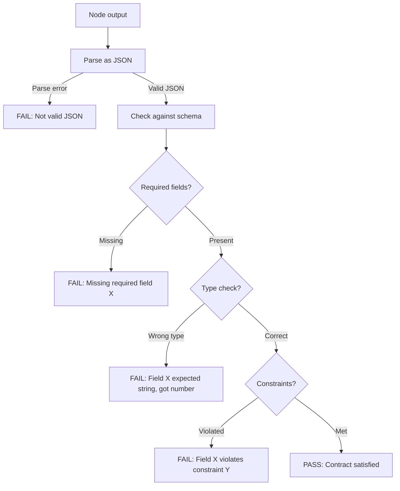

# Output Contract Enforcer

Validates that a DAG node's output matches its declared JSON schema before passing to downstream nodes. The glue that makes multi-agent DAGs reliable. Without this, downstream nodes receive unpredictable input and the DAG breaks.

---

## When to Use

✅ **Use for**:
- Validating a node's output against its declared schema
- Generating output schemas from natural-language output descriptions
- Debugging why a downstream node rejected its input
- Ensuring contract compatibility between connected nodes

❌ **NOT for**:
- Assessing content quality or correctness (use `dag-quality`)
- Grading skill quality (use `skill-grader`)
- General JSON schema work outside DAG context

---

## Validation Process



### What Gets Checked

| Check | Example | Failure Message |
|-------|---------|----------------|
| JSON parseable | `{broken json` | "Output is not valid JSON" |
| Required fields | `status` missing | "Missing required field: status" |
| Field types | `status: 42` (expected string) | "Field 'status' expected string, got number" |
| Enum values | `status: "maybe"` | "Field 'status' must be one of: pass, warn, fail" |
| String constraints | `summary: ""` (minLength: 1) | "Field 'summary' must have minLength 1" |
| Number constraints | `score: 1.5` (maximum: 1.0) | "Field 'score' must be ≤ 1.0" |
| Array constraints | `items: []` (minItems: 1) | "Field 'items' must have at least 1 item" |
| Nested objects | Missing sub-field | "Field 'metadata.cost' is required" |

### The Standard Output Contract

Every DAG node should produce output matching this base schema (fields can be extended):

```json
{
  "type": "object",
  "required": ["status", "summary"],
  "properties": {
    "status": {
      "type": "string",
      "enum": ["pass", "warn", "fail"]
    },
    "summary": {
      "type": "string",
      "minLength": 1,
      "description": "1-3 sentence description of what was produced"
    },
    "artifacts": {
      "type": "array",
      "items": { "type": "string" },
      "description": "List of files created or modified"
    },
    "data": {
      "type": "object",
      "description": "Node-specific output data (schema varies per node)"
    },
    "risks": {
      "type": "array",
      "items": { "type": "string" },
      "description": "Remaining risks or assumptions"
    }
  }
}
```

### Contract Compatibility Check

When connecting Node A's output to Node B's input, verify:
1. Every field B requires is present in A's output schema
2. Types match (A produces string, B expects string)
3. A's output constraints are compatible with B's input constraints
4. If A produces optional fields that B requires → incompatible

```
Node A output: { status: string, recommendations: string[] }
Node B input:  { status: string, recommendations: string[], priority: number }

Result: INCOMPATIBLE — Node B requires 'priority' but Node A doesn't produce it.
Fix: Add 'priority' to Node A's output, or add a transformer node between A and B.
```

---

## Schema Generation

When a node description says "produces a list of recommendations with priorities," generate:

```json
{
  "type": "object",
  "required": ["status", "summary", "data"],
  "properties": {
    "status": { "type": "string", "enum": ["pass", "warn", "fail"] },
    "summary": { "type": "string", "minLength": 1 },
    "data": {
      "type": "object",
      "required": ["recommendations"],
      "properties": {
        "recommendations": {
          "type": "array",
          "minItems": 1,
          "items": {
            "type": "object",
            "required": ["text", "priority"],
            "properties": {
              "text": { "type": "string" },
              "priority": { "type": "integer", "minimum": 1, "maximum": 5 }
            }
          }
        }
      }
    }
  }
}
```

---

## Anti-Patterns

### No Contract at All
**Wrong**: Nodes produce free-form text with no schema.
**Why**: Downstream nodes can't reliably parse the input. The DAG is fragile.
**Right**: Every node declares its output schema. Every output is validated before passing downstream.

### Overly Strict Contracts
**Wrong**: Requiring exact character counts, specific formatting, or field values that depend on runtime context.
**Right**: Constrain structure (types, required fields), not content. Let dag-quality handle content assessment.

### Ignoring Optional Fields
**Wrong**: Treating all fields as required.
**Right**: Use `required` only for fields that downstream nodes absolutely need. Mark everything else as optional.
