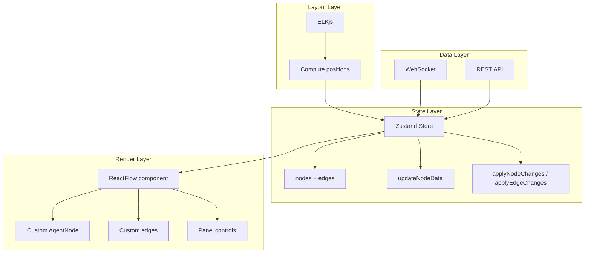

# ReactFlow Expert

Builds DAG visualizations using ReactFlow v12 with custom agent nodes, ELKjs auto-layout, Zustand state management, and live execution state updates.

---

## When to Use

✅ **Use for**:
- Building workflow/DAG visualization dashboards
- Creating custom ReactFlow node components for agent state
- Integrating ELKjs auto-layout for automatic graph positioning
- Wiring WebSocket execution events into ReactFlow state
- Implementing zoom, pan, selection, and node interaction

❌ **NOT for**:
- Static Mermaid diagrams (use `mermaid-graph-writer`)
- General React component development
- Non-graph visualizations (charts, tables)

---

## Architecture



---

## Core Patterns (ReactFlow v12)

### Zustand Store (Recommended over useNodesState for complex editors)

```typescript
import { create } from 'zustand';
import { applyNodeChanges, applyEdgeChanges, type Node, type Edge } from '@xyflow/react';

interface DAGStore {
  nodes: Node[];
  edges: Edge[];
  onNodesChange: (changes: any) => void;
  onEdgesChange: (changes: any) => void;
  setNodes: (nodes: Node[]) => void;
  setEdges: (edges: Edge[]) => void;
  updateNodeData: (nodeId: string, data: Record<string, any>) => void;
}

const useDAGStore = create<DAGStore>((set, get) => ({
  nodes: [],
  edges: [],
  onNodesChange: (changes) => set({ nodes: applyNodeChanges(changes, get().nodes) }),
  onEdgesChange: (changes) => set({ edges: applyEdgeChanges(changes, get().edges) }),
  setNodes: (nodes) => set({ nodes }),
  setEdges: (edges) => set({ edges }),
  // CRITICAL: create NEW object to trigger ReactFlow re-render
  updateNodeData: (nodeId, data) => set({
    nodes: get().nodes.map((n) =>
      n.id === nodeId ? { ...n, data: { ...n.data, ...data } } : n
    ),
  }),
}));
```

### Custom Agent Node

```typescript
import { Handle, Position, type NodeProps } from '@xyflow/react';

const STATUS_COLORS = {
  pending: '#9CA3AF', scheduled: '#60A5FA', running: '#3B82F6',
  completed: '#10B981', failed: '#EF4444', retrying: '#F59E0B',
  paused: '#8B5CF6', skipped: '#D1D5DB', mutated: '#EAB308',
};

function AgentNode({ data }: NodeProps) {
  return (
    <div className={`agent-node status-${data.status}`}
         style={{ borderColor: STATUS_COLORS[data.status] }}>
      <Handle type="target" position={Position.Top} />
      <div className="node-header">
        <span className={`status-dot ${data.status}`} />
        <span>{data.role}</span>
      </div>
      {data.skills && (
        <div className="node-skills">
          {data.skills.map((s: string) => <span key={s} className="badge">{s}</span>)}
        </div>
      )}
      {data.status === 'completed' && data.output?.summary && (
        <div className="node-output">{data.output.summary.slice(0, 60)}...</div>
      )}
      {data.metrics?.cost_usd > 0 && (
        <div className="node-meta">${data.metrics.cost_usd.toFixed(3)}</div>
      )}
      <Handle type="source" position={Position.Bottom} />
    </div>
  );
}

// MUST define outside component (or useMemo) to avoid re-registration
const nodeTypes = { agentNode: AgentNode };
```

### ELKjs Auto-Layout Hook

```typescript
import ELK from 'elkjs/lib/elk.bundled.js';
import { useCallback } from 'react';
import { useReactFlow } from '@xyflow/react';

const elk = new ELK();

export function useAutoLayout() {
  const { fitView } = useReactFlow();

  return useCallback(async (nodes: Node[], edges: Edge[], direction = 'DOWN') => {
    const isHorizontal = direction === 'RIGHT';
    const layouted = await elk.layout({
      id: 'root',
      layoutOptions: {
        'elk.algorithm': 'layered',
        'elk.direction': direction,
        'elk.spacing.nodeNode': '80',
        'elk.layered.spacing.nodeNodeBetweenLayers': '100',
        'elk.edgeRouting': 'ORTHOGONAL',
      },
      children: nodes.map((n) => ({
        ...n,
        targetPosition: isHorizontal ? 'left' : 'top',
        sourcePosition: isHorizontal ? 'right' : 'bottom',
        width: n.measured?.width ?? 220,
        height: n.measured?.height ?? 120,
      })),
      edges,
    });
    const result = layouted.children!.map((elkN) => ({
      ...nodes.find((n) => n.id === elkN.id)!,
      position: { x: elkN.x!, y: elkN.y! },
    }));
    window.requestAnimationFrame(() => fitView());
    return result;
  }, [fitView]);
}
```

### Dashboard Assembly

```typescript
import { ReactFlow, ReactFlowProvider, Panel } from '@xyflow/react';
import '@xyflow/react/dist/style.css';

function DAGDashboard({ dagId }: { dagId: string }) {
  const { nodes, edges, onNodesChange, onEdgesChange } = useDAGStore();
  const layout = useAutoLayout();

  // WebSocket → Zustand (see websocket-streaming skill)
  useDAGStream(dagId);

  return (
    <ReactFlow nodes={nodes} edges={edges} nodeTypes={nodeTypes}
      onNodesChange={onNodesChange} onEdgesChange={onEdgesChange} fitView>
      <Panel position="top-right">
        <button onClick={() => layout(nodes, edges, 'DOWN')}>↓ Vertical</button>
        <button onClick={() => layout(nodes, edges, 'RIGHT')}>→ Horizontal</button>
      </Panel>
    </ReactFlow>
  );
}

export default function DAGPage({ dagId }: { dagId: string }) {
  return <ReactFlowProvider><DAGDashboard dagId={dagId} /></ReactFlowProvider>;
}
```

---

## v12 Gotchas

| Pitfall | Fix |
|---------|-----|
| `nodeTypes` defined inside component → infinite re-render | Define OUTSIDE component or wrap in `useMemo` |
| State update doesn't trigger re-render | Must create NEW node object: `{ ...node, data: { ...node.data, ...update } }` |
| `xPos`/`yPos` in custom node → undefined | Use `positionAbsoluteX`/`positionAbsoluteY` (v12 rename) |
| `nodeInternals` → undefined | Use `nodeLookup` (v12 rename) |
| ELK layout ignores node size | Pass `node.measured?.width` and `height` explicitly |
| `fitView` fires before DOM paint | Wrap in `requestAnimationFrame(() => fitView())` |
| Interactive elements drag the node | Add `className="nodrag"` to inputs, buttons, selects |

---

## Anti-Patterns

### Canvas Rendering for Debugging
**Wrong**: Using canvas-based libraries (GoJS) where you can't inspect nodes in dev tools.
**Right**: ReactFlow renders SVG + HTML. Every node is inspectable in React DevTools and the DOM.

### Re-running Layout on Every State Update
**Wrong**: Calling ELK layout every time a node's status changes (expensive, causes visual jitter).
**Right**: Only re-layout when topology changes (add/remove node/edge). Status color changes are just data updates — no layout needed.

### Monolithic Node Component
**Wrong**: One giant node component handling all node types.
**Right**: Register separate node types: `agentNode`, `humanGateNode`, `pluripotentNode`. Each is a focused React component.
