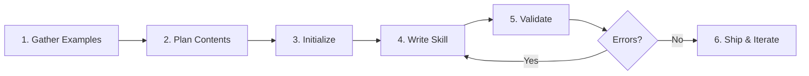

# Skill Architect: The Authoritative Meta-Skill

The unified authority for creating expert-level Agent Skills. Encodes the knowledge that separates a skill that *merely exists* from one that *activates precisely, teaches efficiently, and makes users productive immediately*.

## Philosophy

**Great skills are progressive disclosure machines.** They encode real domain expertise (shibboleths), not surface instructions. They follow a three-layer architecture: lightweight metadata for discovery, lean SKILL.md for core process, and reference files for deep dives loaded only on demand.

---

## When to Use This Skill

✅ **Use for**:
- Creating new skills from scratch or from existing expertise
- Auditing/reviewing skills for quality, activation, and progressive disclosure
- Improving activation rates and reducing false positives
- Encoding domain expertise (shibboleths, anti-patterns, temporal knowledge)
- Designing skills that subagents consume effectively
- Building self-contained tools (scripts, MCPs, subagents)
- Debugging why skills don't activate or activate incorrectly

❌ **NOT for**:
- General Claude Code features (slash commands, MCP server implementation)
- Non-skill coding advice or code review
- Debugging runtime errors (use domain-specific skills)
- Template generation without real domain expertise to encode

---

## Quick Wins (Immediate Improvements)

For existing skills, apply in priority order:

1. **Tighten description** → Follow `[What] [When] [Keywords]. NOT for [Exclusions]` formula
2. **Check line count** → SKILL.md must be <500 lines; move depth to `/references`
3. **Add NOT clause** → Prevent false activation with explicit exclusions
4. **Add 1-2 anti-patterns** → Use shibboleth template (Novice/Expert/Timeline)
5. **Remove dead files** → Delete unreferenced scripts/references (no phantoms)
6. **Test activation** → Write 5 queries that should trigger and 5 that shouldn't

---

## Progressive Disclosure Architecture

Skills use three-layer loading. The runtime scans metadata at startup, loads SKILL.md on activation, and pulls reference files *only when the agent decides it needs them*.

| Layer | Content | Size | Loading |
|-------|---------|------|---------|
| 1. Metadata | `name` + `description` in frontmatter | ~100 tokens | Always in context (catalog scan) |
| 2. SKILL.md | Core process, decision trees, brief anti-patterns | <5k tokens | On skill activation |
| 3. References | Deep dives, examples, templates, specs | Unlimited | On-demand, per-file, only when relevant |

**Critical rules**:
- Keep SKILL.md under 500 lines. Move depth to `/references`.
- Reference files are NOT auto-loaded. Only SKILL.md enters context on activation.
- In SKILL.md, list each reference file with a 1-line description of when to consult it. This teaches the agent what's available without loading it.
- Never instruct "read all reference files before starting." Instead: "Read only the files relevant to the current step."
- If a reference file is large, the agent should skim headings first, then drill into the relevant section.

---

## Frontmatter Rules

### Required Fields

| Key | Purpose | Example |
|-----|---------|---------|
| `name` | Lowercase-hyphenated identifier | `react-server-components` |
| `description` | Activation trigger: `[What] [When] [Keywords]. NOT for [Exclusions]` | See Description Formula |

### Optional Fields

| Key | Purpose | Example |
|-----|---------|---------|
| `allowed-tools` | Comma-separated tool names (least privilege) | `Read,Write,Grep` |
| `argument-hint` | Hint shown in autocomplete for expected arguments | `"[path] [format]"` |
| `license` | License identifier | `MIT` |
| `disable-model-invocation` | If `true`, only user-triggered via `/skill-name` | `true` |
| `user-invocable` | Controls whether skill appears in UI menus | `true` |
| `context` | Execution context; `fork` runs skill in isolated subagent | `fork` |
| `metadata` | Arbitrary key-value map for tooling/dashboards | `author: your-org` |

### Invalid Keys (Will Fail Upload)

```yaml
# ❌ These are NOT valid frontmatter — move info to SKILL.md body
integrates_with: [...]
triggers: [...]
tools: Read,Write        # Use 'allowed-tools' instead
outputs: [...]
coordinates_with: [...]
python_dependencies: [...]
```

---

## Description Formula

**Pattern**: `[What it does] [When to use] [Trigger keywords]. NOT for [Exclusions].`

The description is the most important line for activation. Claude's runtime scans descriptions to decide which skill to load. A weak description means zero activations or constant false positives.

| Problem | Bad | Good |
|---------|-----|------|
| Too vague | "Helps with images" | "CLIP semantic search for image-text matching and zero-shot classification. NOT for counting, spatial reasoning, or generation." |
| No exclusions | "Reviews code changes" | "Reviews TypeScript/React diffs and PRs for correctness. NOT for writing new features." |
| Mini-manual | "Researches, then outlines, then drafts..." | "Structured research producing 1-3 page synthesis reports. NOT for quick factual questions." |
| Catch-all | "Helps with product management" | "Writes and refines product requirement documents (PRDs). NOT for strategy decks." |
| Name mismatch | name: `db-migration` / desc: "writes marketing emails" | name: `db-migration` / desc: "Plans database schema migrations with rollback strategies." |

**Full guide with more examples**: See `references/description-guide.md`

---

## SKILL.md Template

```markdown
---
name: your-skill-name
description: [What] [When] [Keywords]. NOT for [Exclusions].
allowed-tools: Read,Write
---

# Skill Name
[One sentence purpose]

## When to Use
✅ Use for: [A, B, C with specific trigger keywords]
❌ NOT for: [D, E, F — explicit boundaries]

## Core Process
[Decision trees as Mermaid flowcharts, not prose. See visual-artifacts.md]

## Anti-Patterns
### [Pattern Name]
**Novice**: [Wrong assumption]
**Expert**: [Why it's wrong + correct approach]
**Timeline**: [When this changed, if temporal]

## References
- `references/guide.md` — Consult when [specific situation]
- `references/examples.md` — Consult for [worked examples of X]
```

---

## The 6-Step Skill Creation Process



### Step 1: Gather Concrete Examples

Collect 3-5 real queries that should trigger this skill, and 3-5 that should NOT.

### Step 2: Plan Reusable Contents

For each example, identify what scripts, references, or assets would prevent re-work. Also identify shibboleths: domain algorithms, temporal knowledge, framework evolution, common pitfalls.

### Step 3: Initialize

```bash
scripts/init_skill.py <skill-name> --path <output-directory>
```

For existing skills, skip to Step 4.

### Step 4: Write the Skill

Order of implementation:
1. **Scripts first** (`scripts/`) — Working code, not templates
2. **References next** (`references/`) — Domain knowledge, schemas, guides
3. **SKILL.md last** — Core process, anti-patterns, reference index

Write in imperative form: "To accomplish X, do Y" not "You should do X."

Answer these questions in SKILL.md:
1. **Purpose**: What is this skill for? (1-2 sentences)
2. **Activation**: What triggers it? What shouldn't?
3. **Process**: Step-by-step decision trees — use Mermaid flowcharts, not prose
4. **Anti-patterns**: What do novices get wrong?
5. **Visual artifacts**: Render workflows, architectures, timelines as Mermaid diagrams (see `references/visual-artifacts.md`)
6. **References**: What files exist and when to consult them?

### Step 5: Validate

```bash
python scripts/validate_skill.py <path>
python scripts/check_self_contained.py <path>
```

Fix ERRORS → WARNINGS → SUGGESTIONS.

### Step 6: Iterate

After real-world use: notice struggles, improve SKILL.md and resources, update CHANGELOG.md.

---

## Designing Skills for Subagent Consumption

When skills will be loaded by subagents (not just direct user invocation), apply these patterns:

### Three Skill-Loading Layers

1. **Preloaded** (2-5 core skills): Injected into the subagent's system context. These are its standard operating procedures — always present.
2. **Dynamically selected**: Subagent receives a catalog (name + 1-line description) and picks 1-3 matching skills before starting. The orchestrator can also pre-filter.
3. **Execution-time**: Subagent reads each skill's "When to use" section, follows numbered steps in order, respects output contracts, and runs QA checks.

### How Subagents Should Use Skills

Teach the subagent to treat each skill like a mini-protocol:
- Check the "When to use / When not to use" section for applicability
- Follow numbered steps in order (adapt only if task constraints force it)
- Respect the skill's output contract (templates, JSON shapes, required sections)
- Apply QA/validation steps last
- Reference skill steps by number: "Completed step 3 of refactor-plan-skill"

### Subagent Prompt Structure

The subagent's prompt should have four sections:
1. **Identity**: "You are the [role]. You handle [narrow domain]. If outside scope, say so."
2. **Skill usage rules**: "Your skills define your methods. Decide which apply, follow their workflows."
3. **Task loop**: Restate → Select skills → Clarify → Plan → Execute step-by-step → Validate → Return (artifacts + skills used + remaining risks).
4. **Constraints**: Quality bar, safety rules, tie-breaking priorities.

**Full templates and orchestration patterns**: See `references/subagent-design.md`

---

## Visual Artifacts: Mermaid Diagrams & Code

Skills that include Mermaid diagrams serve two audiences at once. **For humans**, diagrams render as visual flowcharts, state machines, and timelines — instantly parseable. **For agents**, Mermaid is a text-based graph DSL — `A -->|Yes| B` is an explicit, unambiguous edge that's actually easier to reason about than equivalent prose. The agent reads the text; the human sees the picture. Both win.

**Rule**: If a skill describes a process, decision tree, architecture, state machine, timeline, or data relationship, include a Mermaid diagram. Use raw ` ```mermaid ` blocks directly in SKILL.md — not wrapped in outer markdown fences.

### Which Diagram for Which Content

| Skill Content | Diagram Type |
|---------------|-------------|
| Decision trees / troubleshooting | `flowchart` |
| Agent/API communication | `sequenceDiagram` |
| Lifecycle / status transitions | `stateDiagram-v2` |
| Data models / schemas | `erDiagram` |
| Temporal knowledge / evolution | `timeline` |
| Domain taxonomy / concept maps | `mindmap` |
| Priority matrices (effort vs. impact) | `quadrantChart` |
| System architecture | `block-beta` or `architecture-beta` |
| Project timelines | `gantt` |

### YAML Frontmatter in Mermaid (Optional)

Mermaid supports an optional `---` frontmatter block for rendering customization (themes, colors, spacing). **It is not required.** Agents ignore it. Renderers apply sensible defaults without it. Only add it when you need specific visual styling for published documentation.

```yaml
# Optional — only for render customization
---
title: My Diagram
config:
  theme: neutral
  flowchart:
    curve: basis
---
```

Themes: `default`, `dark`, `forest`, `neutral`, `base`. Full config reference: https://mermaid.ai/open-source/config/configuration.html

**Full diagram catalog with examples of all 16+ types**: See `references/visual-artifacts.md`

---

## Encoding Shibboleths

Expert knowledge that separates novices from experts. Things LLMs get wrong due to outdated training data or cargo-culted patterns.

### Shibboleth Template

```markdown
### Anti-Pattern: [Name]
**Novice**: "[Wrong assumption]"
**Expert**: [Why it's wrong, with evidence]
**Timeline**: [Date]: [Old way] → [Date]: [New way]
**LLM mistake**: [Why LLMs suggest the old pattern]
**Detection**: [How to spot this in code/config]
```

### What to Encode

- Framework evolution (React Classes → Hooks → Server Components)
- Model limitations (CLIP can't count; embedding models are task-specific)
- Tool architecture (Script → MCP graduation path)
- API versioning (ada-002 → text-embedding-3-large)
- Temporal traps (advice that was correct in 2023 but harmful in 2025)

**Full catalog with case studies**: See `references/antipatterns.md`

---

## Self-Contained Tools and the Extension Taxonomy

Skills are one of six Claude extension types: **Skills** (domain knowledge), **MCP Servers** (external APIs + auth), **Scripts** (local operations), **Slash Commands** (user-triggered skills), **Hooks** (lifecycle automation), and **SDK Tools** (API integration). Most skills should include scripts. MCPs are only for auth/state boundaries.

| Need | Extension Type | Key Requirement |
|------|---------------|-----------------|
| Domain expertise / process | **Skill** (SKILL.md) | Decision trees, anti-patterns, output contracts |
| External API + auth | **MCP Server** | Working server + setup README |
| Repeatable local operation | **Script** | Actually runs (not a template), minimal deps |
| Multi-step orchestration | **Subagent** | 4-section prompt, skills, workflow |
| User-triggered action | **Slash Command** | Skill with `user-invocable: true` |
| Deep reference docs | **References** | Separate files, loaded on demand |

**Evolution path**: Skill → Skill + Scripts → Skill + MCP Server → Skill + Subagent. Only promote when complexity justifies it.

**Full taxonomy with examples and common mistakes**: See `references/claude-extension-taxonomy.md`
**Detailed tool patterns**: See `references/self-contained-tools.md`

---

## Tool Permissions

**Principle**: Least privilege — only grant what's needed.

| Access Level | `allowed-tools` |
|-------------|-----------------|
| Read-only | `Read,Grep,Glob` |
| File modifier | `Read,Write,Edit` |
| Build integration | `Read,Write,Bash(npm:*,git:*)` |
| ⚠️ Never for untrusted | Unrestricted `Bash` |

---

## Anti-Pattern Summary

| # | Anti-Pattern | Fix |
|---|-------------|-----|
| 1 | Documentation Dump | Decision trees in SKILL.md, depth in `/references` |
| 2 | Missing NOT clause | Always include "NOT for X, Y, Z" in description |
| 3 | Phantom Tools | Only reference files that exist and work |
| 4 | Template Soup | Ship working code or nothing |
| 5 | Overly Permissive Tools | Least privilege: specific tool list, scoped Bash |
| 6 | Stale Temporal Knowledge | Date all advice, update quarterly |
| 7 | Catch-All Skill | Split by expertise type, not domain |
| 8 | Vague Description | Use `[What] [When] [Keywords]. NOT for [Exclusions]` |
| 9 | Eager Loading | Never "read all files first"; lazy-load references |
| 10 | Prose-Only Processes | Use Mermaid diagrams for decision trees, workflows, architectures |

**Full case studies**: See `references/antipatterns.md`

---

## Validation Checklist

```
□ SKILL.md exists and is <500 lines
□ Frontmatter has name + description (minimum required)
□ Description follows [What][When][Keywords] NOT [Exclusions] formula
□ Description uses keywords users would actually type
□ Name and description are aligned (not contradictory)
□ At least 1 anti-pattern with shibboleth template
□ All referenced files actually exist (no phantoms)
□ Scripts work (not templates), have clear CLI, handle errors
□ Reference files each have a 1-line purpose in SKILL.md
□ Decision trees/workflows use Mermaid diagrams, not prose
□ CHANGELOG.md tracks version history
□ If subagent-consumed: output contracts are defined
```

---

## Success Metrics

| Metric | Target | How to Measure |
|--------|--------|----------------|
| Correct activation | >90% | Test queries that should trigger |
| False positive rate | <5% | Test queries that shouldn't trigger |
| Token usage | <5k | SKILL.md size + typical reference loads |
| Time to productive | <5 min | User starts working immediately |
| Anti-pattern prevention | >80% | Users avoid documented mistakes |

---

## Reference Files

Consult these for deep dives — they are NOT loaded by default:

| File | Consult When |
|------|-------------|
| `references/knowledge-engineering.md` | KE methods for extracting expert knowledge into skills; protocol analysis, repertory grids, aha! moments |
| `references/description-guide.md` | Writing or rewriting a skill description |
| `references/antipatterns.md` | Looking for shibboleths, case studies, or temporal patterns |
| `references/self-contained-tools.md` | Adding scripts, MCP servers, or subagents to a skill |
| `references/subagent-design.md` | Designing skills for subagent consumption or orchestration |
| `references/claude-extension-taxonomy.md` | Skills vs MCPs vs scripts vs slash commands vs hooks vs SDK tools |
| `references/visual-artifacts.md` | Adding Mermaid diagrams: type catalog, YAML config, best practices |
| `references/mcp-template.md` | Building an MCP server for a skill |
| `references/subagent-template.md` | Defining subagent prompts and multi-agent pipelines |
