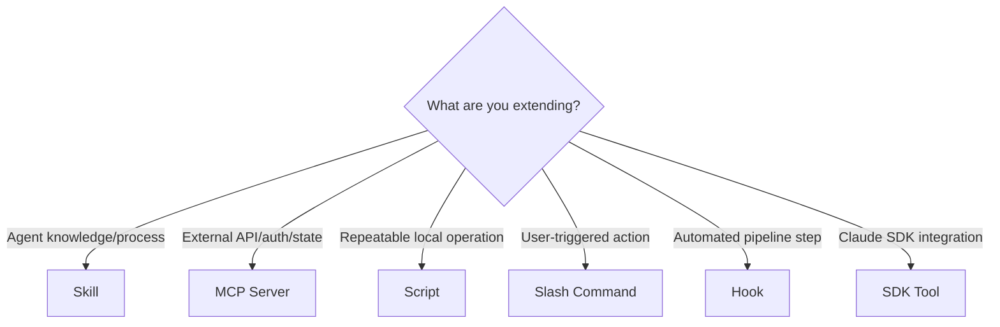

# Claude Extension Taxonomy: Skills, MCPs, Scripts, Plugins, Slash Commands, Hooks

The Claude ecosystem has multiple extension points. Each serves a different purpose. Choosing the wrong one is a common mistake. This reference defines each type and when to use it.

---

## The Full Taxonomy



---

## Skills (SKILL.md in `.claude/skills/`)

**What they are**: Markdown documents that encode domain expertise, decision trees, anti-patterns, and process instructions. Loaded into the agent's context as standard operating procedures.

**How they work**: The runtime scans `name` + `description` at startup. When a skill matches a query, its full SKILL.md is loaded into context. Reference files are loaded on demand.

**When to use**:
- Encoding domain expertise (shibboleths, anti-patterns, temporal knowledge)
- Providing decision trees and process workflows
- Defining output contracts for downstream consumers
- Teaching the agent HOW to think about a domain

**When NOT to use**:
- Calling external APIs (use MCP)
- Running code (use scripts)
- Providing a user-triggered action (use slash command)

**Key property**: Skills are **passive knowledge** — they shape the agent's reasoning but don't execute code. They're the cheapest, most portable extension type.

---

## MCP Servers (Model Context Protocol)

**What they are**: Standalone servers that expose tools, resources, and prompts to Claude via a standardized protocol. They run as separate processes and communicate via stdio or HTTP.

**How they work**: Claude discovers available tools from the MCP server at startup. When the agent decides to use a tool, it sends a JSON-RPC request to the server, which executes the operation and returns results.

**When to use**:
- External API access requiring authentication (OAuth, API keys)
- Stateful connections (WebSockets, database connections, sessions)
- Operations needing security boundaries (credentials shouldn't be in prompts)
- Real-time data streams or event subscriptions
- Rate-limited services that need connection pooling

**When NOT to use**:
- Simple local file operations (just use scripts or built-in tools)
- Stateless computations (scripts are lighter weight)
- One-off operations that don't need auth or state
- Encoding domain knowledge (use skills)

**Architecture**: Server process → stdio/HTTP → Claude runtime → agent uses tool

**Key property**: MCPs are for **operations that need auth, state, or security boundaries**. They are NOT a general abstraction layer — their job is to manage the auth, networking, and security boundaries and then get out of the way. If you don't need those things, a script is simpler.

**Status (2025-2026)**: MCP is the standard protocol for tool integration. Every major LLM platform supports it (Claude, GPT, Gemini). Build MCPs when you need persistent connections or OAuth flows. Don't build MCPs for things that could be a 20-line Python script.

---

## Scripts (`scripts/` in skill folders)

**What they are**: Working code files (Python, Bash, Node.js) bundled with skills that perform repeatable operations.

**How they work**: The agent runs them via Bash tool calls. They take CLI arguments, do their work, and return results via stdout.

**When to use**:
- Repeatable local operations (validation, analysis, transformation)
- Domain-specific algorithms that must be implemented correctly
- Pre-flight checks that prevent common errors
- Batch processing of local files
- Any stateless computation

**When NOT to use**:
- Operations requiring auth or API keys (use MCP)
- Stateful operations across multiple calls (use MCP)
- Long-running background processes (use MCP or Temporal)

**Requirements**: Must actually work (not templates), minimal dependencies (prefer stdlib), clear CLI interface, graceful error handling, installation docs.

**Key property**: Scripts are **the workhorse of self-contained skills**. They make skills immediately useful without any infrastructure setup. Every skill with repeatable operations should have working scripts.

**Evolution path**: Script → Multiple Scripts → Helper Library → MCP Server. Only promote when complexity justifies the additional infrastructure.

---

## Slash Commands (`/command-name`)

**What they are**: User-triggered actions invoked by typing `/` in the Claude Code interface. They execute a specific skill or action on demand.

**How they work**: When a user types `/skill-name`, Claude loads that skill's SKILL.md and executes it with any provided arguments. Slash commands map 1:1 to skills with `user-invocable: true`.

**When to use**:
- Providing a user-triggered action that should be discoverable in the UI
- Skills that are primarily invoked explicitly rather than auto-triggered
- Operations the user consciously chooses to run (not auto-matched)

**Relation to skills**: A slash command IS a skill. The frontmatter field `user-invocable: true` makes it appear in the `/` menu. The field `disable-model-invocation: true` makes it ONLY available via `/` (not auto-triggered).

---

## Hooks (Git hooks, lifecycle hooks)

**What they are**: Scripts that run automatically at specific lifecycle points — git operations (post-checkout, post-merge, pre-commit), build events, or deployment triggers.

**How they work**: Configured in `.git/hooks/` or via tool-specific hook systems. They execute without user intervention at the right lifecycle moment.

**When to use**:
- Auto-syncing skills on `git pull` / `git checkout`
- Pre-commit validation (lint, typecheck, skill validation)
- Post-deploy verification
- Automated data generation or cache invalidation

**Not an agent extension**: Hooks are infrastructure automation, not agent intelligence. They complement skills (e.g., syncing the skill library) but don't shape the agent's reasoning.

---

## SDK Tools (Anthropic SDK `tool_use`)

**What they are**: Functions defined in code that Claude can call via the Messages API's tool_use capability. The calling code defines the tool schema; Claude decides when to invoke it.

**How they work**: You define tool schemas (name, description, JSON schema for parameters) in your `messages.create()` call. Claude returns a `tool_use` content block when it wants to call a tool. Your code executes the function and returns the result.

**When to use**:
- Building applications on top of Claude's API
- Integrating Claude into existing systems
- Custom tool implementations in your own codebase
- winDAGs node execution (each node uses SDK tools)

**Relation to MCPs**: SDK tools are the lower-level primitive. MCPs are a standardized way to package and share SDK tools across projects. If you're building a one-off integration, use SDK tools directly. If you're building a reusable tool server, package it as an MCP.

---

## Decision Matrix

| Need | Extension Type | Why |
|------|---------------|-----|
| Encode domain expertise | **Skill** | Passive knowledge, cheapest, most portable |
| External API + auth | **MCP Server** | Manages auth, state, security boundaries |
| Local repeatable operation | **Script** | Works immediately, no infra needed |
| User-triggered explicit action | **Slash Command** (skill) | Discoverable in UI, invoked with `/` |
| Lifecycle automation | **Hook** | Runs at git/build/deploy events |
| Custom app integration | **SDK Tool** | Direct API tool_use for your codebase |

### The Graduation Path

```
Domain knowledge → Skill (SKILL.md)
                     ↓ needs code?
                   Script (scripts/)
                     ↓ needs auth/state?
                   MCP Server (mcp-server/)
                     ↓ needs orchestration?
                   Subagent (agents/)
                     ↓ needs multi-agent DAG?
                   winDAGs architecture
```

Each level adds infrastructure. Only promote when the simpler level genuinely can't do the job. Premature promotion to MCP is a common anti-pattern — if you don't need auth or state, a script is better.

---

## Common Mistakes

### MCP for Everything
**Wrong**: Building an MCP server for local JSON parsing.
**Right**: Write a 10-line Python script. MCPs are for auth/state boundaries.

### Skills Without Scripts
**Wrong**: A skill that describes a validation process but doesn't include a validation script.
**Right**: Include `scripts/validate.py` that actually runs. Skills + scripts = immediately productive.

### Slash Command for Auto-Trigger Skills
**Wrong**: Making every skill a slash command.
**Right**: Most skills should auto-trigger on matching queries. Only make it a slash command if the user needs to invoke it explicitly.

### Script That Should Be an MCP
**Wrong**: A script that stores API keys in environment variables and makes authenticated API calls.
**Right**: Package it as an MCP server with proper credential management.
