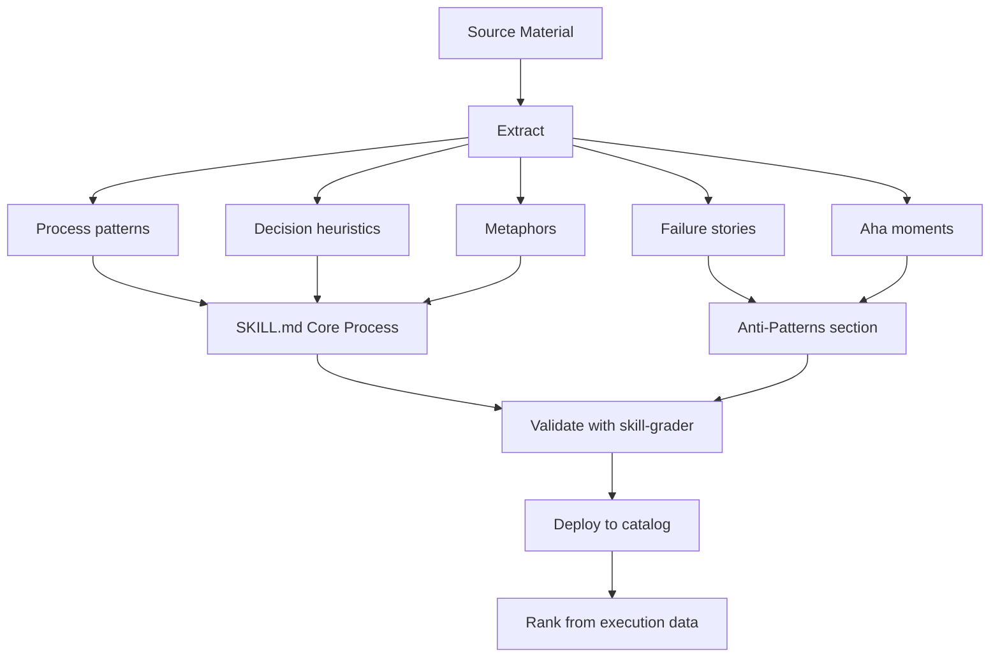

# Knowledge Engineering for Skill Creation

How to apply knowledge engineering (KE) methods to extract expert knowledge and build skills. Covers structured knowledge acquisition, mental model elicitation, tacit-to-explicit conversion, and novel AI-native approaches.

---

## Why Knowledge Engineering Matters for Skills

A skill is a **codified expert mental model**. The challenge: experts don't think in SKILL.md templates. They think in intuitions, pattern-matching, contextual heuristics, and embodied know-how accumulated over years. Knowledge engineering is the discipline of extracting this tacit knowledge and converting it to explicit, transferable form.

Traditional KE built expert systems with formal rules. We build skills with natural language. The extraction challenge is the same.

---

## Structured Knowledge Acquisition Methods

### Protocol Analysis (Think-Aloud)

**What**: Ask the expert to solve a real problem while narrating their thought process.

**How to apply**:
1. Give the expert a representative task in their domain
2. Record them solving it while explaining each decision
3. Listen for: decision points, rejection of alternatives, pattern-matching, "obvious" shortcuts that aren't obvious to novices
4. Extract: decision trees, anti-patterns, temporal knowledge, shibboleths

**What you're extracting**: The expert's **procedural knowledge** — the steps they follow and why. This maps directly to a skill's "Core Process" section.

**The gold**: The moments where the expert says "well, obviously you wouldn't..." or "the trick here is..." or "most people get this wrong because...". These are shibboleths. They go in the anti-patterns section.

**Real-world example (University of Southampton)**: A geologist analyzing a hand specimen narrated: "it's obviously a fairly coarse-grained rock... and you've got some nice big orthoclase crystals... quartz, which is this fairly clear mineral." From this, production rules were extracted: `IF grain size is large THEN rock is plutonic`. The verbalization exposed classification logic that the expert used automatically but had never articulated.

**Practical note**: Train the expert to think aloud first using a simple warm-up task (like long multiplication). Uninhibited verbalization is a learned skill. Keep sessions short — they are mentally exhausting, especially for automatized knowledge the expert has never had to explain.

### Repertory Grid Technique

**What**: Elicit the expert's personal construct system — the dimensions along which they evaluate things in their domain.

**How to apply**:
1. Present the expert with 3 examples of [domain objects] (e.g., 3 code PRs, 3 building designs, 3 patient cases)
2. Ask: "In what way are two of these alike but different from the third?"
3. The expert produces a **construct** (a bipolar dimension, e.g., "well-structured vs. tangled" or "safe vs. risky")
4. Repeat with different triads until constructs stabilize
5. Rate all examples on all constructs

**What you're extracting**: The expert's **evaluative framework** — the axes along which they judge quality. These map to the skill's evaluation criteria and to the skill-grader's axes for this domain.

**Real-world example (Boeing, 1983-1989)**: Boeing's Expertise Transfer System (ETS) and its successor Aquinas used repertory grids to build 100+ expert system prototypes. In a typical 30-minute session, an associate sat with a domain expert (e.g., a DBMS advisor). The expert listed solutions (database systems), ETS presented triads and elicited discriminating traits, and within an hour a working prototype with production rules was generated. Experts found the process *engaging* rather than threatening — the analysis tools surfaced implications in their own knowledge they hadn't consciously recognized.

**Practical note**: Grids become unwieldy beyond ~15-20 elements. Boeing found a 38×35 grid "hard for the expert to use and manage." The solution: hierarchical decomposition — break a large domain into sub-grids at different abstraction levels.

### Card Sorting

**What**: Give the expert a pile of domain concepts and ask them to organize them into groups.

**How to apply**:
1. Write each domain concept/task/tool on a card
2. Ask the expert to sort into groups that "make sense to them"
3. Ask them to name each group
4. Ask why certain items are together and others aren't
5. Repeat with different experts; compare group structures

**What you're extracting**: The expert's **ontology** — how they categorize their domain. This maps to domain meta-skills (decomposition patterns) and skill catalog organization.

### Critical Incident Technique

**What**: Ask experts to describe times things went very wrong (or very right) and what they did.

**How to apply**:
1. "Tell me about a time when [domain task] went badly. What happened? What would you do differently?"
2. "Tell me about a time when you caught a problem that someone else missed. How did you spot it?"
3. Extract: failure modes, recovery strategies, early warning signs

**What you're extracting**: The expert's **failure knowledge** — what goes wrong and how to prevent it. These map directly to anti-patterns and shibboleths. This is often the most valuable knowledge because it's the hardest to acquire any other way.

**Real-world example (Healthcare, Ireland 2020)**: Researchers used CIT to study interdisciplinary team interventions. Seventeen informants described critical incidents, producing seven Context-Mechanism-Outcome Configurations. Two findings emerged ONLY through CIT: prior personal relationships as a contextual enabler and inter-professional tensions as a barrier — neither identified in the literature review.

**Real-world example (Flanagan's WWII pilot studies)**: The original CIT application asked trainees and observers to recount incidents of success and failure. Common threads in aptitude, proficiency, and temperament were extracted and used to formulate selection tests for pilots. Incidents "need not be spectacular" — significance, not drama, defines criticality.

### Concept Mapping

**What**: The expert draws a visual map of how concepts in their domain relate to each other.

**How to apply**:
1. Give the expert a whiteboard or tool
2. Ask: "Map out the key concepts in [domain] and how they connect"
3. Listen for: hierarchies, causal relationships, conditional dependencies, temporal sequences

**What you're extracting**: The expert's **conceptual structure** — how ideas relate. This maps to the Mermaid diagrams in skills and to domain meta-skill phase patterns.

---

## Extracting How Professionals Think

### The Architecture of Expert Cognition

Research on expertise (Dreyfus, Ericsson, Klein) identifies how expert thinking differs from novice thinking:

| Dimension | Novice | Expert |
|-----------|--------|--------|
| **Problem representation** | Surface features ("it's a React bug") | Deep structure ("it's a stale closure over mutable state") |
| **Pattern matching** | Slow, rule-by-rule | Instant recognition of familiar patterns |
| **Anomaly detection** | Can't tell when something is "off" | Immediately senses when a situation is atypical |
| **Forward reasoning** | Works from symptoms to causes | Works from hypotheses to evidence |
| **Chunking** | Sees individual elements | Sees meaningful clusters (the chess master's "chunks") |
| **Metacognition** | Doesn't know what they don't know | Knows precisely what they're uncertain about |

Skills should encode ALL of these dimensions:
- **Deep structure** → decision trees based on underlying causes, not surface symptoms
- **Pattern matching** → "If you see X, that's almost always Y" shibboleths
- **Anomaly detection** → "If this looks unusual, check for Z"
- **Forward reasoning** → hypothesis-first diagnostic processes
- **Chunking** → domain-specific vocabulary and abbreviations
- **Metacognition** → "You should be uncertain about this if..." qualifiers

### The Aha! Moment Problem

The most valuable knowledge is often the hardest to extract: the moment when a practitioner's mental model clicked. The music student who suddenly hears harmonic structure instead of individual notes. The programmer who suddenly sees the dependency graph instead of individual files. The mathematician who suddenly recognizes a problem as homologous to one they've solved before.

These moments represent **conceptual phase transitions** — qualitative reorganizations of the mental model that can't be reached by accumulating individual facts. They're Kuhnian revolutions at the individual level.

**How to extract them**:
1. Ask: "When did [domain] stop feeling confusing and start making sense? What changed?"
2. Ask: "What do you see now that you couldn't see as a beginner?"
3. Ask: "If you could give your younger self one insight that would have saved years, what would it be?"
4. The answers to these questions are the highest-leverage content for skills. A single paragraph capturing an expert's aha! moment can be worth more than pages of procedural steps.

### Structured Ignorance Management

Experts are distinguished not by what they know but by **how they manage what they don't know**:

- **Known unknowns**: "I don't know X, but I know how to find out"
- **Unknown unknowns**: "I don't even know what questions to ask"
- **Knowable but not worth knowing**: "I could learn X but the ROI isn't there"
- **Axiomatic certainties**: "I know X is true and can reason from it"

This maps to skill architecture:
- **Known unknowns** → "Consult `references/X.md` when you need this information"
- **Unknown unknowns** → "If the situation doesn't match any known pattern, escalate to research/human"
- **Not worth knowing** → "NOT for X" in the description (explicit scope boundaries)
- **Axiomatic certainties** → Decision trees built on stable truths

---

## AI-Native Knowledge Acquisition

### Technique: Corpus Distillation

Deploy an army of Haiku summarization agents at professional handbooks, biographies, and career guides. Each agent extracts:

1. **Process patterns**: "When this expert encounters [situation], they do [steps]"
2. **Decision heuristics**: "The expert chooses between A and B based on [criteria]"
3. **Failure stories**: "This went wrong because [reason]; the fix was [approach]"
4. **Aha! moments**: "The turning point was realizing [insight]"
5. **Metaphors and mental models**: "They think of [domain] as [metaphor]"

The summarization army processes at ~$0.001/page. A 300-page handbook costs ~$0.30 to distill. The output is a structured knowledge map that feeds skill crystallization.

See the `very-long-text-summarization` skill for the technical implementation.

### Technique: Interview Simulation

Use a Sonnet agent with the domain meta-skill to "interview" the source material:

```
Given this handbook chapter on [topic], answer as if you are the author:
1. What's the most common mistake newcomers make?
2. What changed in your field in the last 5 years?
3. What do you check first when things go wrong?
4. What's the one thing you wish everyone in your field understood?
```

This extracts the same knowledge that a real interview would, at machine speed.

### Technique: Cross-Source Triangulation

Extract knowledge from multiple sources about the same domain. Where they agree, that's reliable. Where they disagree, that's interesting — it may indicate:
- A paradigm shift in progress (Kuhnian revolution)
- Domain-specific school-of-thought divisions
- Temporal drift (older source vs. newer source)

---

## From Knowledge to Skill

### The Pipeline



---

## Source Material: Books That Expose Expert Thinking

For the corpus distillation pipeline (`very-long-text-summarization`), these books expose HOW experts think, not just what they know. Organized by the type of knowledge they yield.

### Cross-Domain (How Expertise Itself Works)

| Book | Author | What It Yields |
|------|--------|---------------|
| **Sources of Power** | Gary Klein | Recognition-Primed Decision model: experts pattern-match, simulate one option, act. Firefighters, nurses, pilots, military. |
| **The Reflective Practitioner** | Donald Schön | "Reflection-in-action" across 5 professions (engineering, architecture, management, therapy, planning). Professionals know more than they can say. |
| **Thinking in Systems** | Donella Meadows | Feedback loops, stocks and flows, leverage points. The meta-mental-model for any complex system. |
| **Seeing Like a State** | James C. Scott | Mētis (practical, local, embodied knowledge) vs. legibility (top-down simplification). Why abstract models destroy the knowledge that makes systems work. |
| **Range** | David Epstein | Generalists outperform specialists in complex domains. Analogical transfer across fields. |

### Software Engineering

| Book | What It Yields for Skills |
|------|--------------------------|
| **A Philosophy of Software Design** (Ousterhout) | Deep vs. shallow modules, information hiding, complexity as the root enemy. Empirically tested heuristics. |
| **The Pragmatic Programmer** (Hunt & Thomas) | DRY, tracer bullets, broken window theory, programming by coincidence. A practitioner's operating system. |
| **The Mythical Man-Month** (Brooks) | Conceptual integrity, Brooks' Law, surgical team model. Human topology of projects. |

### Architecture & Design

| Book | What It Yields for Skills |
|------|--------------------------|
| **A Pattern Language** (Alexander) | 253 problem-solution patterns composable into designs. Origin of pattern thinking. |
| **How Buildings Learn** (Brand) | Shearing layers: 6 layers changing at different rates. Design for adaptability. |

### Mathematics

| Book | What It Yields for Skills |
|------|--------------------------|
| **How to Solve It** (Pólya) | 67 heuristics: analogy, generalization, working backward, auxiliary problems. The foundation of structured problem-solving. |
| **Proofs and Refutations** (Lakatos) | Math proceeds by conjecture → proof → counterexample → revision, not clean deduction. Messy iteration as the actual method. |

### Medicine

| Book | What It Yields for Skills |
|------|--------------------------|
| **How Doctors Think** (Groopman) | Specific cognitive errors: anchoring, availability, commission bias. Thinking process made visible. |
| **The Checklist Manifesto** (Gawande) | When to rely on expert judgment vs. systematic process. The boundary that defines skill structure. |

### Finance

| Book | What It Yields for Skills |
|------|--------------------------|
| **Poor Charlie's Almanack** (Munger) | Latticework of mental models from every discipline. Inversion, fat pitches, Lollapalooza Effect. |
| **Thinking in Bets** (Annie Duke) | Separate decision quality from outcome quality. Think in probabilities, not certainties. |

### The Distillation Pipeline

Feed these books through `very-long-text-summarization` in skill-draft mode:
1. Haiku army extracts process patterns, decision heuristics, failure stories, aha! moments, metaphors
2. Sonnet synthesizes into a structured knowledge map
3. Opus crystallizes into a SKILL.md
4. skill-grader validates quality (must score B+ or above)

Cost: ~$0.19 per 300-page book. The entire cross-domain reading list (~12 books, ~3,600 pages) costs ~$2.30 to distill.

---

### Quality Gate

Before deploying a KE-derived skill:
1. Grade it with `skill-grader` — must score B+ or above overall
2. Test with 5 should-trigger and 5 shouldn't-trigger queries
3. Run through one complete DAG execution as a dry run
4. If the skill was derived from source material, include citations ("Based on [Handbook], Chapter 7")
