# Visual Artifacts in Skills: Mermaid Diagrams & Code

Skills that produce visual artifacts — Mermaid diagrams, structured code blocks, annotated tables — are dramatically more useful than skills that produce only prose. A decision tree rendered as a flowchart is parsed instantly; the same logic in paragraph form forces the reader to mentally reconstruct the graph.

**Rule of thumb**: If a skill describes a process, decision tree, architecture, state machine, timeline, or data relationship, it should include or generate a Mermaid diagram for it.

---

## Why Mermaid in Skills

Mermaid diagrams are text-based, version-controllable, and render natively in GitHub, Docusaurus, most Markdown renderers, and Claude's own output. They cost very few tokens relative to their information density.

| Medium | Tokens | Comprehension | Version-controllable |
|--------|--------|---------------|---------------------|
| Prose paragraph | ~200 | Slow, sequential | Yes but hard to diff |
| Markdown table | ~80 | Fast for comparisons | Yes |
| Mermaid diagram | ~60 | Instant for relationships | Yes, text-based |
| ASCII art | ~150 | Fragile, breaks easily | Painful to maintain |

**Prefer Mermaid over ASCII art.** Mermaid is semantic; ASCII art is visual noise that breaks on re-flow.

---

## Mermaid YAML Frontmatter Configuration

Every Mermaid diagram can include a YAML frontmatter block (delimited by `---`) before the diagram definition. This controls theme, layout direction, and per-diagram-type settings.

### Basic Structure

````markdown
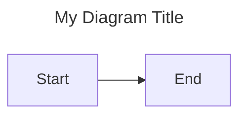
```mermaid
---
title: My Diagram Title
config:
  theme: default
  themeVariables:
    primaryColor: "#4a86c8"
---
flowchart LR
  A[Start] --> B[End]
```
````

### Theme Options

| Theme | Use When |
|-------|----------|
| `default` | General purpose, clean look |
| `dark` | Dark-mode environments |
| `forest` | Green-toned, organic feel |
| `neutral` | Minimal, grayscale |
| `base` | Starting point for full customization via `themeVariables` |

### Common `themeVariables`

```yaml
config:
  themeVariables:
    primaryColor: "#4a86c8"        # Main node fill
    primaryTextColor: "#fff"       # Text on primary nodes
    primaryBorderColor: "#3a76b8"  # Border of primary nodes
    secondaryColor: "#f4f4f4"      # Secondary node fill
    tertiaryColor: "#e8e8e8"       # Tertiary node fill
    lineColor: "#333"              # Edge/arrow color
    fontSize: "16px"               # Base font size
    fontFamily: "monospace"        # Font family
    background: "#ffffff"          # Diagram background
    nodeBorder: "#333"             # Default node border
    noteTextColor: "#333"          # Note text color
    noteBkgColor: "#fff5ad"        # Note background
    edgeLabelBackground: "#fff"    # Edge label background
```

### Per-Diagram Configuration

The `config` block can include diagram-specific keys:

```yaml
---
config:
  flowchart:
    htmlLabels: true
    curve: basis           # basis, linear, stepBefore, stepAfter
    padding: 15
    nodeSpacing: 50
    rankSpacing: 50
    defaultRenderer: dagre  # dagre or elk
  sequence:
    mirrorActors: false
    bottomMarginAdj: 1
    actorFontSize: 14
    noteFontSize: 12
    messageFontSize: 14
    diagramMarginX: 50
    diagramMarginY: 10
    useMaxWidth: true
  gantt:
    titleTopMargin: 25
    barHeight: 20
    barGap: 4
    topPadding: 50
    sectionFontSize: 16
  er:
    layoutDirection: TB    # TB or LR
    minEntityWidth: 100
    minEntityHeight: 75
    entityPadding: 15
    fontSize: 12
  mindmap:
    padding: 10
    maxNodeWidth: 200
  timeline:
    padding: 50
    useMaxWidth: true
---
```

Full configuration reference: https://mermaid.ai/open-source/config/configuration.html

---

## Diagram Type Catalog

Mermaid supports a rich taxonomy of diagram types. Choose based on what you're modeling.

### Flowchart / Graph — Decision Trees & Processes

**Use when**: A skill encodes a decision tree, troubleshooting flowchart, or branching process.

**This is the most common diagram type for skills** — most skills have some "If X then A, if Y then B" logic that belongs in a flowchart.

````markdown
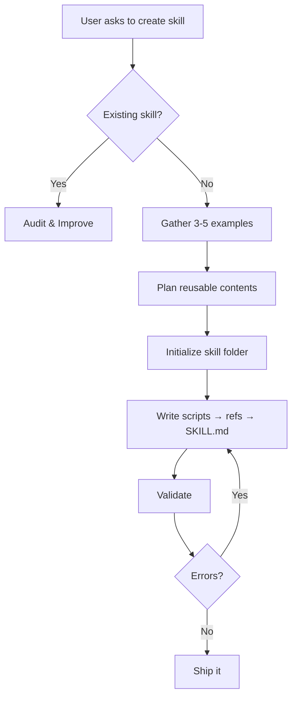
```mermaid
flowchart TD
  A[User asks to create skill] --> B{Existing skill?}
  B -->|Yes| C[Audit & Improve]
  B -->|No| D[Gather 3-5 examples]
  D --> E[Plan reusable contents]
  E --> F[Initialize skill folder]
  F --> G[Write scripts → refs → SKILL.md]
  G --> H[Validate]
  H --> I{Errors?}
  I -->|Yes| G
  I -->|No| J[Ship it]
```
````

**Direction options**: `TD` (top-down), `LR` (left-right), `BT` (bottom-top), `RL` (right-left)

**Node shapes**:
- `[text]` — rectangle
- `(text)` — rounded rectangle
- `{text}` — diamond (decision)
- `([text])` — stadium/pill
- `[[text]]` — subroutine
- `[(text)]` — cylinder (database)
- `((text))` — circle
- `>text]` — flag/asymmetric
- `[/text/]` — parallelogram
- `[\text\]` — reverse parallelogram
- `[/text\]` — trapezoid
- `[\text/]` — reverse trapezoid
- `{{text}}` — hexagon

**Edge styles**:
- `-->` solid arrow
- `---` solid line
- `-.->` dotted arrow
- `==>` thick arrow
- `--text-->` labeled edge
- `~~~` invisible link (for layout control)

---

### Sequence Diagram — Interactions & Protocols

**Use when**: A skill describes communication between agents, APIs, services, or any request/response protocol.

````markdown
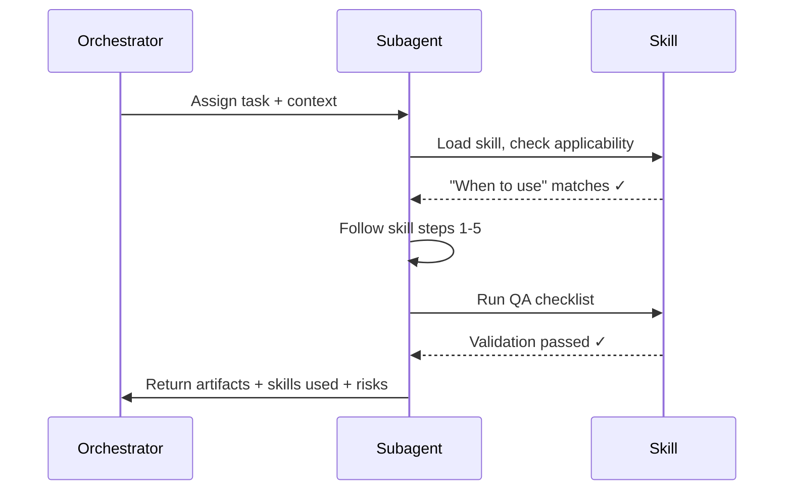
```mermaid
sequenceDiagram
  participant O as Orchestrator
  participant S as Subagent
  participant SK as Skill

  O->>S: Assign task + context
  S->>SK: Load skill, check applicability
  SK-->>S: "When to use" matches ✓
  S->>S: Follow skill steps 1-5
  S->>SK: Run QA checklist
  SK-->>S: Validation passed ✓
  S->>O: Return artifacts + skills used + risks
```
````

**Features**:
- `->` solid line, `->>` solid arrow, `-->` dotted line, `-->>` dotted arrow
- `activate` / `deactivate` for lifeline boxes
- `Note right of X: text` for annotations
- `alt` / `else` / `end` for conditional blocks
- `loop` / `end` for repetition
- `par` / `and` / `end` for parallel execution
- `critical` / `option` / `end` for critical sections
- `break` / `end` for break-out flows
- `rect rgb(...)` / `end` for colored background regions
- `autonumber` for automatic message numbering

---

### State Diagram — Lifecycle & Status Machines

**Use when**: A skill manages something with distinct states and transitions (build pipelines, document lifecycle, feature flags, deployment stages).

````markdown
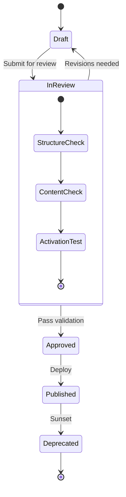
```mermaid
stateDiagram-v2
  [*] --> Draft
  Draft --> InReview: Submit for review
  InReview --> Approved: Pass validation
  InReview --> Draft: Revisions needed
  Approved --> Published: Deploy
  Published --> Deprecated: Sunset
  Deprecated --> [*]

  state InReview {
    [*] --> StructureCheck
    StructureCheck --> ContentCheck
    ContentCheck --> ActivationTest
    ActivationTest --> [*]
  }
```
````

**Features**:
- `[*]` for start/end states
- Nested states with `state Name { ... }`
- `<<choice>>` for conditional branching
- `<<fork>>` / `<<join>>` for parallel states
- Notes with `note right of StateName`

---

### Entity-Relationship Diagram — Data Models

**Use when**: A skill works with structured data, database schemas, API shapes, or any domain where entities have relationships.

````markdown
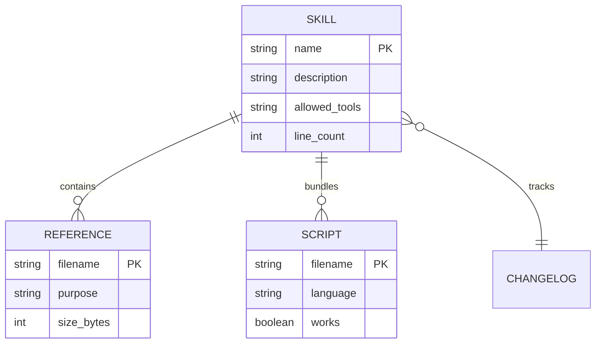
```mermaid
erDiagram
  SKILL ||--o{ REFERENCE : contains
  SKILL ||--o{ SCRIPT : bundles
  SKILL {
    string name PK
    string description
    string allowed_tools
    int line_count
  }
  REFERENCE {
    string filename PK
    string purpose
    int size_bytes
  }
  SCRIPT {
    string filename PK
    string language
    boolean works
  }
  SKILL }o--|| CHANGELOG : tracks
```
````

**Relationship cardinality**:
- `||--||` exactly one to exactly one
- `||--o{` one to zero-or-many
- `}o--o{` zero-or-many to zero-or-many
- `||--|{` one to one-or-many

---

### Gantt Chart — Timelines & Project Plans

**Use when**: A skill involves phased rollouts, migration plans, sprint planning, or any time-sequenced work.

````markdown
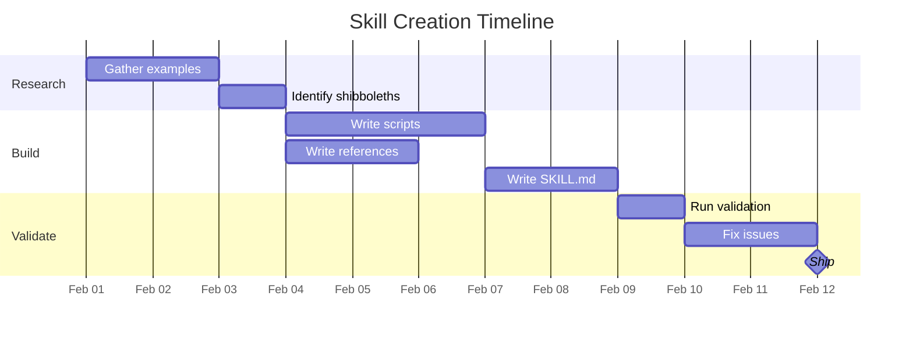
```mermaid
gantt
  title Skill Creation Timeline
  dateFormat YYYY-MM-DD
  axisFormat %b %d

  section Research
    Gather examples       :a1, 2026-02-01, 2d
    Identify shibboleths  :a2, after a1, 1d

  section Build
    Write scripts         :b1, after a2, 3d
    Write references      :b2, after a2, 2d
    Write SKILL.md        :b3, after b1, 2d

  section Validate
    Run validation        :c1, after b3, 1d
    Fix issues            :c2, after c1, 2d
    Ship                  :milestone, after c2, 0d
```
````

**Features**:
- `done`, `active`, `crit` tags for status/priority
- `milestone` for zero-duration markers
- Dependencies with `after taskId`
- Sections for logical grouping

---

### Mindmap — Concept Hierarchies

**Use when**: A skill covers a domain taxonomy, feature map, brainstorm output, or any hierarchical concept space.

````markdown
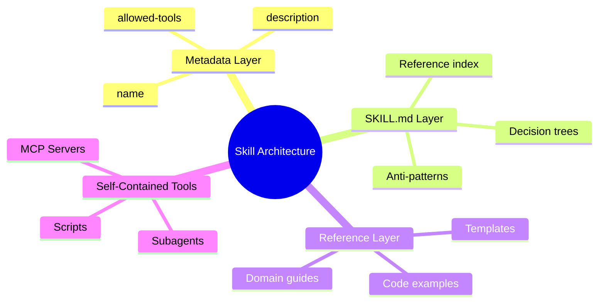
```mermaid
mindmap
  root((Skill Architecture))
    Metadata Layer
      name
      description
      allowed-tools
    SKILL.md Layer
      Decision trees
      Anti-patterns
      Reference index
    Reference Layer
      Domain guides
      Code examples
      Templates
    Self-Contained Tools
      Scripts
      MCP Servers
      Subagents
```
````

**Features**:
- Root node shapes: `((circle))`, `(rounded)`, `[square]`, `{{hexagon}}`
- Automatic layout based on indentation
- Icon support with `::icon(fa fa-book)`

---

### Timeline — Historical / Temporal Knowledge

**Use when**: A skill encodes temporal knowledge (framework evolution, API deprecations, "what changed when").

````markdown
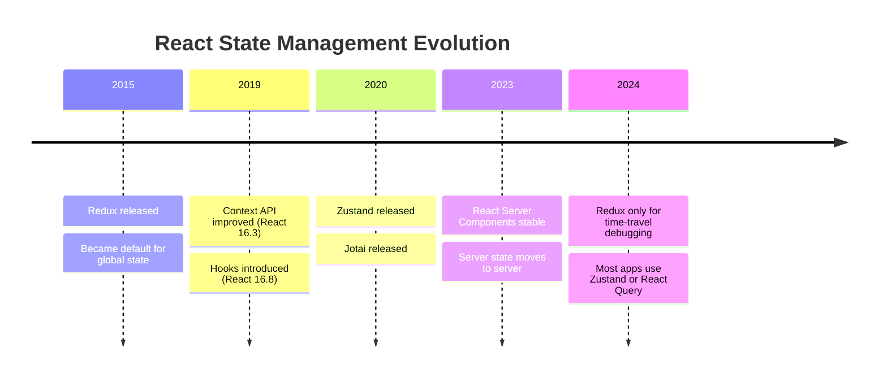
```mermaid
timeline
  title React State Management Evolution
  2015 : Redux released
       : Became default for global state
  2019 : Context API improved (React 16.3)
       : Hooks introduced (React 16.8)
  2020 : Zustand released
       : Jotai released
  2023 : React Server Components stable
       : Server state moves to server
  2024 : Redux only for time-travel debugging
       : Most apps use Zustand or React Query
```
````

This is particularly valuable for **shibboleth encoding** — the temporal evolution that LLMs get wrong.

---

### Pie Chart — Proportions & Distributions

**Use when**: Showing relative sizes, coverage breakdowns, or category distributions.

````markdown
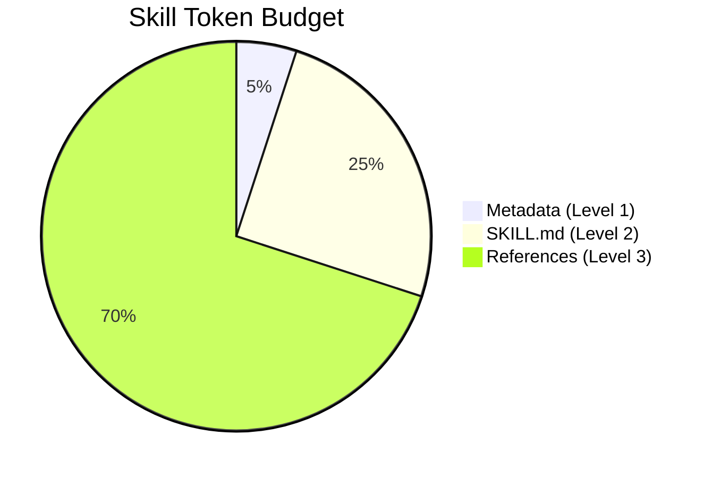
```mermaid
pie title Skill Token Budget
  "Metadata (Level 1)" : 5
  "SKILL.md (Level 2)" : 25
  "References (Level 3)" : 70
```
````

---

### Quadrant Chart — 2x2 Decision Matrices

**Use when**: A skill needs to position options along two axes (effort vs. impact, risk vs. reward, urgency vs. importance).

````markdown
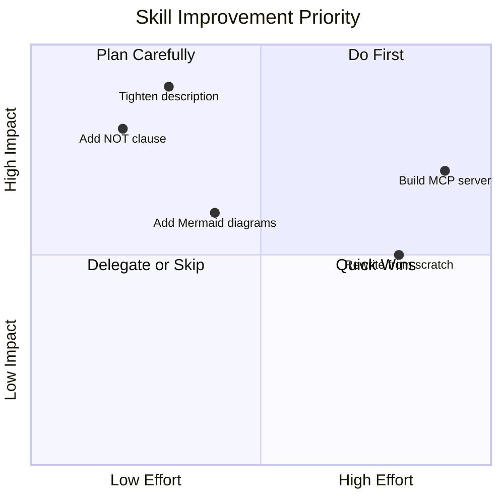
```mermaid
quadrantChart
  title Skill Improvement Priority
  x-axis Low Effort --> High Effort
  y-axis Low Impact --> High Impact
  quadrant-1 Do First
  quadrant-2 Plan Carefully
  quadrant-3 Delegate or Skip
  quadrant-4 Quick Wins
  Add NOT clause: [0.2, 0.8]
  Tighten description: [0.3, 0.9]
  Add Mermaid diagrams: [0.4, 0.6]
  Build MCP server: [0.9, 0.7]
  Rewrite from scratch: [0.8, 0.5]
```
````

---

### Git Graph — Branching & Merge Strategies

**Use when**: A skill involves version control workflows, release strategies, or branch management.

````markdown
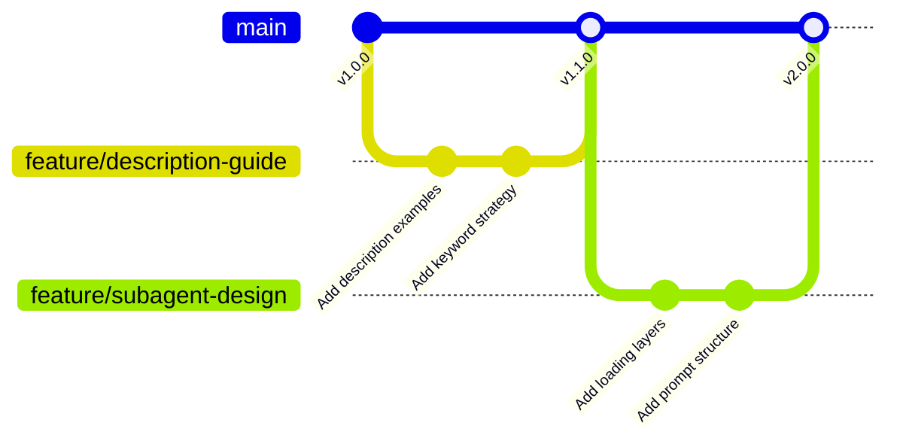
```mermaid
gitGraph
  commit id: "v1.0.0"
  branch feature/description-guide
  commit id: "Add description examples"
  commit id: "Add keyword strategy"
  checkout main
  merge feature/description-guide id: "v1.1.0"
  branch feature/subagent-design
  commit id: "Add loading layers"
  commit id: "Add prompt structure"
  checkout main
  merge feature/subagent-design id: "v2.0.0"
```
````

---

### Class Diagram — Object Models & Type Hierarchies

**Use when**: A skill involves type systems, class hierarchies, interfaces, or any OO/structural modeling.

````markdown
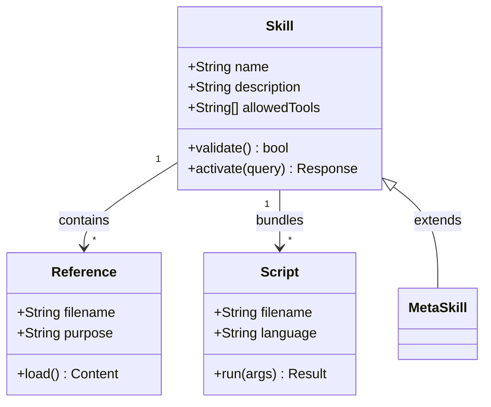
```mermaid
classDiagram
  class Skill {
    +String name
    +String description
    +String[] allowedTools
    +validate() bool
    +activate(query) Response
  }
  class Reference {
    +String filename
    +String purpose
    +load() Content
  }
  class Script {
    +String filename
    +String language
    +run(args) Result
  }
  Skill "1" --> "*" Reference : contains
  Skill "1" --> "*" Script : bundles
  Skill <|-- MetaSkill : extends
```
````

---

### User Journey — Experience Mapping

**Use when**: A skill models a user flow, onboarding experience, or multi-step interaction.

````markdown
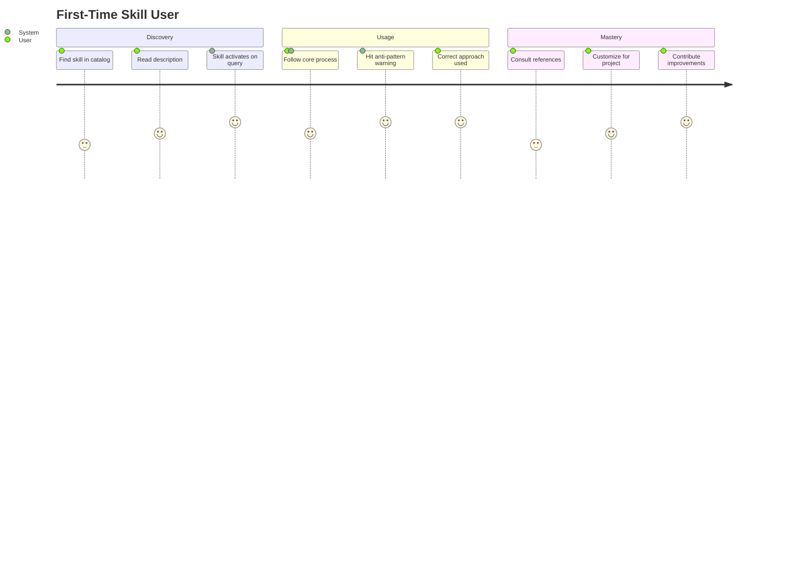
```mermaid
journey
  title First-Time Skill User
  section Discovery
    Find skill in catalog: 3: User
    Read description: 4: User
    Skill activates on query: 5: System
  section Usage
    Follow core process: 4: User, System
    Hit anti-pattern warning: 5: System
    Correct approach used: 5: User
  section Mastery
    Consult references: 3: User
    Customize for project: 4: User
    Contribute improvements: 5: User
```
````

Scores are satisfaction ratings (1-5). Actors are labeled after the colon.

---

### Sankey Diagram — Flow Quantities

**Use when**: Showing how quantities flow between categories (token budgets, request routing, resource allocation).

````markdown
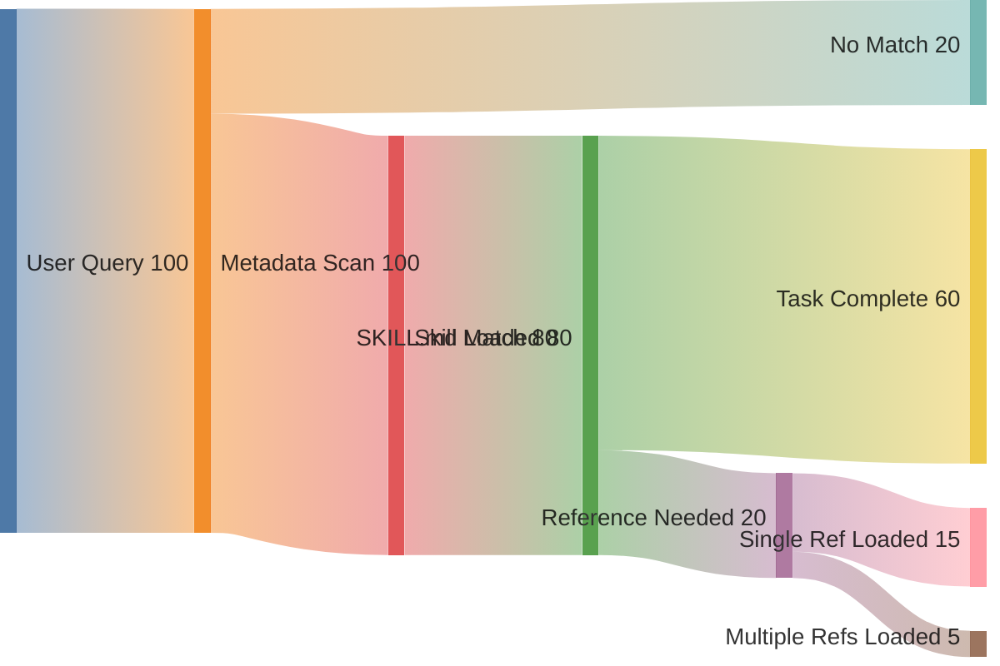
```mermaid
sankey-beta
  User Query,Metadata Scan,100
  Metadata Scan,Skill Match,80
  Metadata Scan,No Match,20
  Skill Match,SKILL.md Loaded,80
  SKILL.md Loaded,Task Complete,60
  SKILL.md Loaded,Reference Needed,20
  Reference Needed,Single Ref Loaded,15
  Reference Needed,Multiple Refs Loaded,5
```
````

---

### XY Chart — Data Visualization

**Use when**: Plotting metrics, benchmarks, performance data, or any numeric comparison.

````markdown
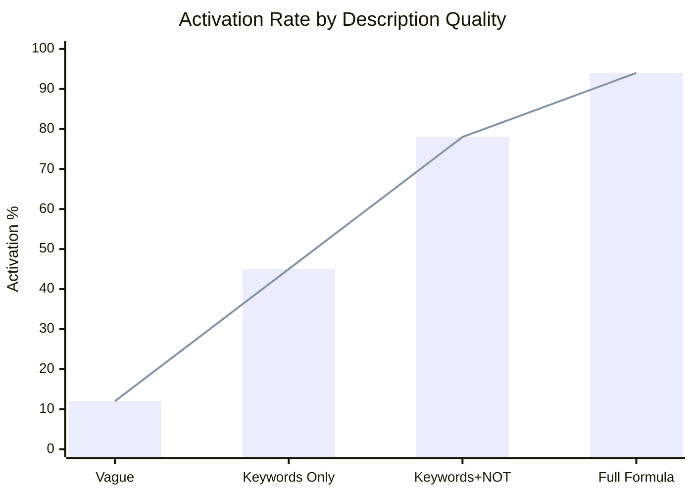
```mermaid
xychart-beta
  title "Activation Rate by Description Quality"
  x-axis ["Vague", "Keywords Only", "Keywords+NOT", "Full Formula"]
  y-axis "Activation %" 0 --> 100
  bar [12, 45, 78, 94]
  line [12, 45, 78, 94]
```
````

---

### Block Diagram — System Architecture

**Use when**: Modeling system components, infrastructure layouts, or architectural blocks.

````markdown
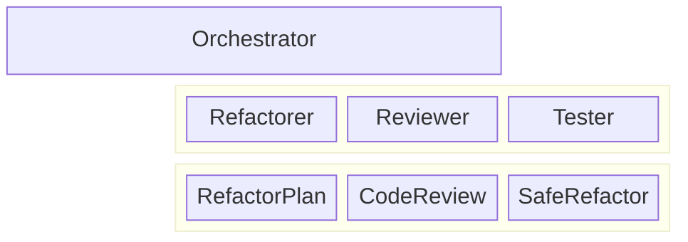
```mermaid
block-beta
  columns 3
  Orchestrator:3
  space
  block:subagents:3
    columns 3
    Refactorer Reviewer Tester
  end
  space
  block:skills:3
    columns 3
    RefactorPlan CodeReview SafeRefactor
  end
```
````

---

### Architecture Diagram — Infrastructure & Deployment

**Use when**: Modeling cloud architecture, service topology, or deployment infrastructure.

````markdown
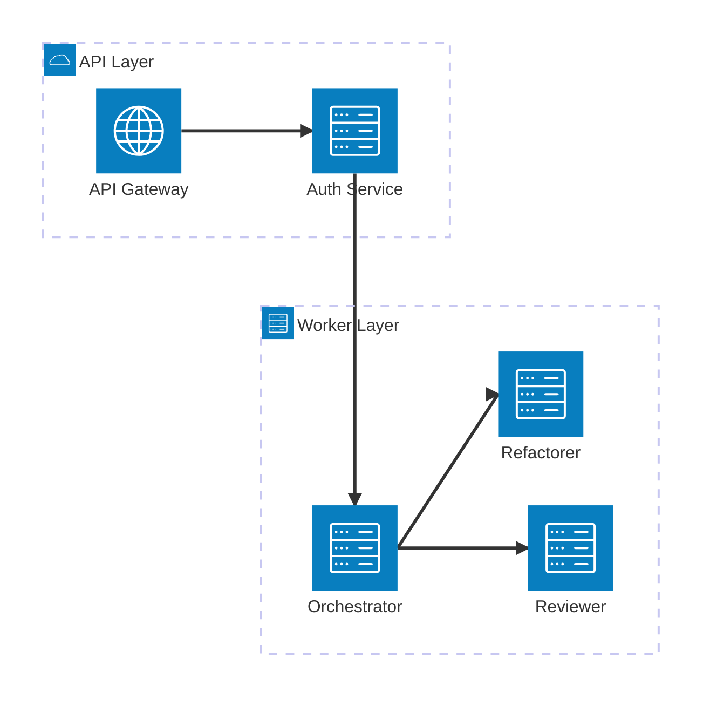
```mermaid
architecture-beta
  group api(cloud)[API Layer]
  group workers(server)[Worker Layer]

  service gateway(internet)[API Gateway] in api
  service auth(server)[Auth Service] in api
  service orchestrator(server)[Orchestrator] in workers
  service subagent1(server)[Refactorer] in workers
  service subagent2(server)[Reviewer] in workers

  gateway:R --> L:auth
  auth:B --> T:orchestrator
  orchestrator:R --> L:subagent1
  orchestrator:R --> L:subagent2
```
````

---

### Kanban — Task/Status Boards

**Use when**: Modeling workflow stages, task statuses, or any column-based status tracking.

````markdown
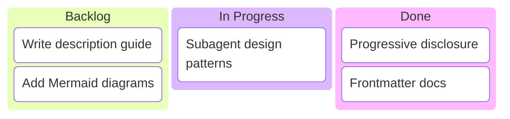
```mermaid
kanban
  column1[Backlog]
    task1[Write description guide]
    task2[Add Mermaid diagrams]
  column2[In Progress]
    task3[Subagent design patterns]
  column3[Done]
    task4[Progressive disclosure]
    task5[Frontmatter docs]
```
````

---

## Which Diagram Type for Which Skill Content?

| Skill Content | Best Diagram Type | Why |
|---------------|-------------------|-----|
| Decision trees / troubleshooting | **Flowchart** | Branching logic is what flowcharts do |
| Agent/API communication | **Sequence** | Shows request/response over time |
| Lifecycle / status transitions | **State** | Explicitly models valid transitions |
| Data models / schemas | **ER Diagram** | Purpose-built for entities + relationships |
| Framework evolution / temporal knowledge | **Timeline** | Chronological shibboleth encoding |
| Domain taxonomy / concept maps | **Mindmap** | Hierarchical at a glance |
| Priority / effort-vs-impact | **Quadrant** | 2x2 matrix is instantly parseable |
| Project phases / rollout plans | **Gantt** | Time-sequenced dependencies |
| Branching strategies | **Git Graph** | Models branch/merge visually |
| Type hierarchies / interfaces | **Class Diagram** | OO structural relationships |
| User experience flows | **User Journey** | Maps satisfaction across steps |
| Quantity flows / budgets | **Sankey** | Shows proportional flow between categories |
| Metrics / benchmarks | **XY Chart** | Numeric data visualization |
| System architecture | **Block** or **Architecture** | Component layout and connections |
| Task status tracking | **Kanban** | Column-based workflow visualization |
| Proportional breakdowns | **Pie** | Simple category proportions |

---

## Best Practices for Mermaid in Skills

### 1. Put Diagrams in the Right Layer

- **SKILL.md**: Include 1-3 key diagrams (decision trees, core workflow). These are loaded on activation and should be high-value, low-token.
- **References**: Include detailed diagrams (full ER models, comprehensive state machines, architecture layouts). These are loaded on demand.
- **Never**: Overload SKILL.md with 10 diagrams. That defeats progressive disclosure.

### 2. Use Mermaid for Decision Trees Instead of Prose

**Bad (prose)**:
> "First check if the skill exists. If it does, audit it. If not, gather examples, then plan contents, then initialize, then write, then validate."

**Good (flowchart)**:
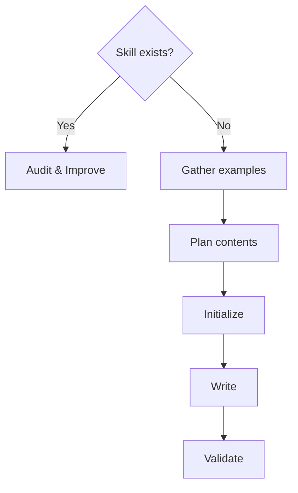
```mermaid
flowchart TD
  A{Skill exists?} -->|Yes| B[Audit & Improve]
  A -->|No| C[Gather examples]
  C --> D[Plan contents]
  D --> E[Initialize]
  E --> F[Write]
  F --> G[Validate]
```

The flowchart is ~40 tokens. The prose is ~35 tokens. The flowchart is instantly parseable. Always prefer the diagram.

### 3. Prefer Specific Diagram Types Over Generic Flowcharts

A sequence diagram for protocol interactions is more informative than a flowchart of the same protocol. A state diagram for lifecycle management is clearer than a flowchart with "go back to step 2" arrows. Choose the diagram type that matches the underlying structure.

### 4. Use YAML Frontmatter for Consistent Styling

If a skill produces multiple diagrams, use the same theme configuration so they look cohesive:

````markdown
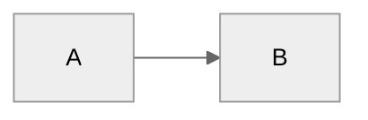
```mermaid
---
config:
  theme: neutral
  themeVariables:
    fontSize: "14px"
---
flowchart LR
  A --> B
```
````

### 5. Keep Diagrams Self-Contained

Each diagram should be understandable without reading the surrounding prose. Use descriptive node labels, not cryptic abbreviations:

- ✅ `A[Check description has NOT clause]`
- ❌ `A[Step 2.3]`

### 6. Code Blocks Are Visual Artifacts Too

Don't neglect inline code examples as visual artifacts. A 5-line code snippet is worth 50 words of description:

```yaml
# Good: concrete, copy-pasteable
description: CLIP semantic search for image-text matching.
  NOT for counting, spatial reasoning, or generation.
```

> Bad: "Write a description that mentions what the skill does, when it should be used, and includes a NOT clause with things it should not be used for."

---

## Encouraging Visual Artifacts in Skills You Create

When creating or auditing a skill, ask:

1. **Does this skill have a decision tree?** → Render it as a flowchart
2. **Does it describe a multi-step protocol?** → Render it as a sequence diagram
3. **Does it manage states/lifecycle?** → Render it as a state diagram
4. **Does it encode temporal knowledge?** → Render it as a timeline
5. **Does it model data relationships?** → Render it as an ER diagram
6. **Does it prioritize options on two axes?** → Render it as a quadrant chart
7. **Does it describe system architecture?** → Render it as a block/architecture diagram

If the answer to any of these is "yes" and the skill only uses prose, **that's an improvement opportunity**.
