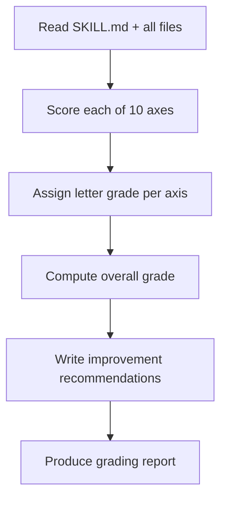

# Skill Grader

Structured evaluation rubric for Claude Agent Skills. Produces letter grades (A+ through F) on 10 axes plus an overall grade, with specific improvement recommendations for each axis.

Designed for sub-agents and non-expert reviewers who need a mechanical, repeatable process for assessing skill quality without deep domain expertise.

---

## When to Use

✅ **Use for**:
- Auditing a single skill's quality
- Comparing skills against each other
- Prioritizing which skills to improve first
- Quality control sweeps across a skill library
- Generating improvement roadmaps

❌ **NOT for**:
- Creating new skills (use `skill-architect`)
- Grading code quality or non-skill documents
- Evaluating agent performance (different from skill quality)

---

## Grading Process



### Step-by-Step

1. **Read the entire skill folder** — SKILL.md, all references, scripts, CHANGELOG, README
2. **Score each axis** — Use the rubric below (0-100 per axis)
3. **Convert to letter grade** — See grade scale
4. **Compute overall grade** — Weighted average (Description and Scope are 2x weight)
5. **Write 1-3 specific improvements** per axis scoring below B+
6. **Produce the grading report** in the output format below

---

## The 10 Evaluation Axes

### Axis 1: Description Quality (Weight: 2x)

Does the description follow `[What] [When] [Keywords]. NOT for [Exclusions]`?

| Grade | Criteria |
|-------|----------|
| A | Specific verb+noun, domain keywords users would type, 2-5 explicit NOT exclusions, 25-50 words |
| B | Has keywords and NOT clause, but slightly vague or missing synonym coverage |
| C | Too generic, missing NOT clause, or >100 words of process detail |
| D | Single vague sentence ("helps with X") or name/description mismatch |
| F | Missing or empty description |

### Axis 2: Scope Discipline (Weight: 2x)

Is the skill narrowly focused on one expertise type, or a catch-all?

| Grade | Criteria |
|-------|----------|
| A | One clear expertise domain, "When to Use" and "NOT for" sections both present and specific |
| B | Mostly focused, minor boundary ambiguity |
| C | Covers 2-3 related but distinct domains, should probably be split |
| D | Catch-all skill ("helps with anything related to X") |
| F | No scope boundaries defined at all |

### Axis 3: Progressive Disclosure

Does the skill follow the three-layer architecture (metadata → SKILL.md → references)?

| Grade | Criteria |
|-------|----------|
| A | SKILL.md <300 lines, heavy content in references, reference index in SKILL.md with 1-line descriptions |
| B | SKILL.md <500 lines, some references used, index present |
| C | SKILL.md >500 lines, or all content inlined with no references |
| D | SKILL.md >800 lines, or references exist but aren't indexed in SKILL.md |
| F | Single massive file with no structure |

### Axis 4: Anti-Pattern Coverage

Does the skill encode expert knowledge that prevents common mistakes?

| Grade | Criteria |
|-------|----------|
| A | 3+ anti-patterns with Novice/Expert/Timeline template, LLM-mistake notes |
| B | 1-2 anti-patterns with clear explanation |
| C | Anti-patterns mentioned but no structured template |
| D | No anti-patterns, just positive instructions |
| F | Contains advice that IS an anti-pattern (outdated, harmful) |

### Axis 5: Self-Contained Tools

Does the skill include working tools (scripts, MCPs, subagents)?

| Grade | Criteria |
|-------|----------|
| A | Working scripts with CLI interface, error handling, dependency docs; OR valid "no tools needed" justification |
| B | Scripts exist and work but lack error handling or docs |
| C | Scripts referenced but are templates/pseudocode |
| D | Phantom tools (SKILL.md references files that don't exist) |
| F | References non-existent tools AND no acknowledgment |

**Note**: Not every skill needs tools. A pure decision-tree skill can score A if tools aren't applicable.

### Axis 6: Activation Precision

Would the skill activate correctly on relevant queries and stay silent on irrelevant ones?

| Grade | Criteria |
|-------|----------|
| A | Description has specific keywords matching user language, clear NOT clause, no obvious false-positive vectors |
| B | Good keywords, minor false-positive risk |
| C | Generic keywords that overlap with other skills |
| D | No specific keywords, or NOT clause contradicts intended use |
| F | Description would cause constant false activation |

### Axis 7: Visual Artifacts

Does the skill use Mermaid diagrams, code examples, and tables effectively?

| Grade | Criteria |
|-------|----------|
| A | Decision trees as Mermaid flowcharts, tables for comparisons, code examples for concrete patterns |
| B | Some diagrams or tables, but key decision trees still in prose |
| C | Tables used but no Mermaid diagrams for processes |
| D | Prose-only, no visual structure |
| F | Wall of text with no formatting aids |

### Axis 8: Output Contracts

Does the skill define what it produces in a format consumable by other agents?

| Grade | Criteria |
|-------|----------|
| A | Explicit output format (JSON schema, markdown template, or structured sections), subagent-consumable |
| B | Output format implied but not explicitly documented |
| C | No output format, but content is structured enough to infer |
| D | Unstructured prose output expected |
| F | N/A (pure reference skill) — exempt from this axis |

### Axis 9: Temporal Awareness

Does the skill track when knowledge was current and what has changed?

| Grade | Criteria |
|-------|----------|
| A | Timelines in anti-patterns, "as of [date]" markers, CHANGELOG with dates |
| B | Some temporal context, CHANGELOG exists |
| C | No dates on knowledge, but CHANGELOG exists |
| D | No temporal context anywhere, knowledge could be stale |
| F | Contains demonstrably outdated advice without warning |

### Axis 10: Documentation Quality

README, CHANGELOG, and reference organization.

| Grade | Criteria |
|-------|----------|
| A | README with quick start, CHANGELOG with dated versions, references well-organized with clear filenames |
| B | README and CHANGELOG exist, references present |
| C | SKILL.md is the only file, but it's well-structured |
| D | No README, no CHANGELOG, disorganized references |
| F | SKILL.md is the only file and it's poorly structured |

---

## Grade Scale

| Letter | Score Range | Meaning |
|--------|------------|---------|
| A+ | 97-100 | Exemplary — sets the standard |
| A  | 93-96  | Excellent — minor improvements possible |
| A- | 90-92  | Very good — a few small gaps |
| B+ | 87-89  | Good — notable room for improvement |
| B  | 83-86  | Solid — several areas need work |
| B- | 80-82  | Above average — meaningful gaps |
| C+ | 77-79  | Average — significant improvements needed |
| C  | 73-76  | Below average — major gaps |
| C- | 70-72  | Barely adequate |
| D+ | 67-69  | Poor — fundamental issues |
| D  | 63-66  | Very poor — needs major rework |
| D- | 60-62  | Near-failing quality |
| F  | <60    | Failing — start over |

---

## Overall Grade Computation

Axes 1 (Description) and 2 (Scope) carry **2x weight**. All others carry 1x weight. If Axis 8 (Output Contracts) is marked exempt, remove it from the calculation.

```
Overall = (2×Axis1 + 2×Axis2 + Axis3 + Axis4 + Axis5 + Axis6 + Axis7 + Axis8 + Axis9 + Axis10) / 12
```

Convert the numeric average to a letter grade using the scale above.

---

## Output Format

Produce this exact structure:

```markdown
# Skill Grading Report: [skill-name]

**Graded**: [date]
**Overall Grade**: [letter] ([score]/100)

## Axis Grades

| # | Axis | Grade | Score | Key Finding |
|---|------|-------|-------|-------------|
| 1 | Description Quality | [grade] | [score] | [1-line finding] |
| 2 | Scope Discipline | [grade] | [score] | [1-line finding] |
| 3 | Progressive Disclosure | [grade] | [score] | [1-line finding] |
| 4 | Anti-Pattern Coverage | [grade] | [score] | [1-line finding] |
| 5 | Self-Contained Tools | [grade] | [score] | [1-line finding] |
| 6 | Activation Precision | [grade] | [score] | [1-line finding] |
| 7 | Visual Artifacts | [grade] | [score] | [1-line finding] |
| 8 | Output Contracts | [grade] | [score] | [1-line finding] |
| 9 | Temporal Awareness | [grade] | [score] | [1-line finding] |
| 10 | Documentation Quality | [grade] | [score] | [1-line finding] |

## Top 3 Improvements (Highest Impact)

1. **[Axis]: [Specific action]** — [Why this matters, expected grade improvement]
2. **[Axis]: [Specific action]** — [Why this matters, expected grade improvement]
3. **[Axis]: [Specific action]** — [Why this matters, expected grade improvement]

## Detailed Notes

### [Axis name] ([grade])
[2-3 sentences of specific feedback with examples from the skill]

[Repeat for each axis scoring below B+]
```

---

## Quick Grading (Abbreviated)

For rapid triage across many skills, produce only:

```markdown
| Skill | Overall | Desc | Scope | Disc | Anti | Tools | Activ | Visual | Output | Temp | Docs |
|-------|---------|------|-------|------|------|-------|-------|--------|--------|------|------|
| [name] | [grade] | ... | ... | ... | ... | ... | ... | ... | ... | ... | ... |
```

---

## Anti-Patterns in Grading

### Grade Inflation
**Wrong**: Giving B+ because "it's pretty good" without checking criteria.
**Right**: Match observations to the rubric table literally. If the description lacks a NOT clause, it cannot score above C on Axis 1.

### Missing Context
**Wrong**: Grading a pure decision-tree skill poorly on Axis 5 (tools) because it has no scripts.
**Right**: Mark Axis 5 as "A — tools not applicable for this skill type."

### Ignoring Phantoms
**Wrong**: Scoring Axis 5 as B because scripts are "referenced."
**Right**: Actually check if every referenced file exists. If `scripts/validate.py` is mentioned but doesn't exist, that's D.
