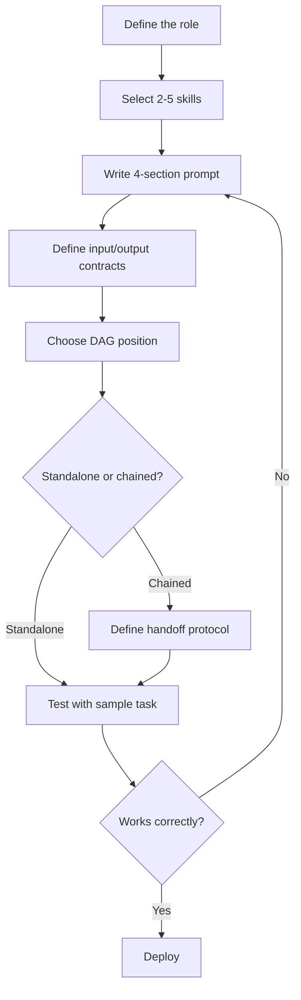
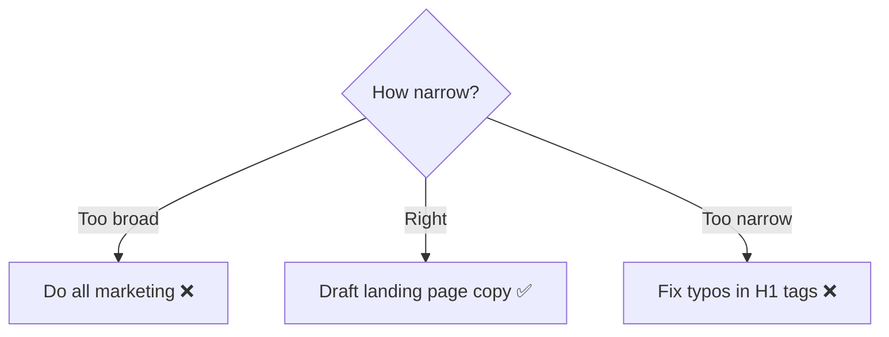
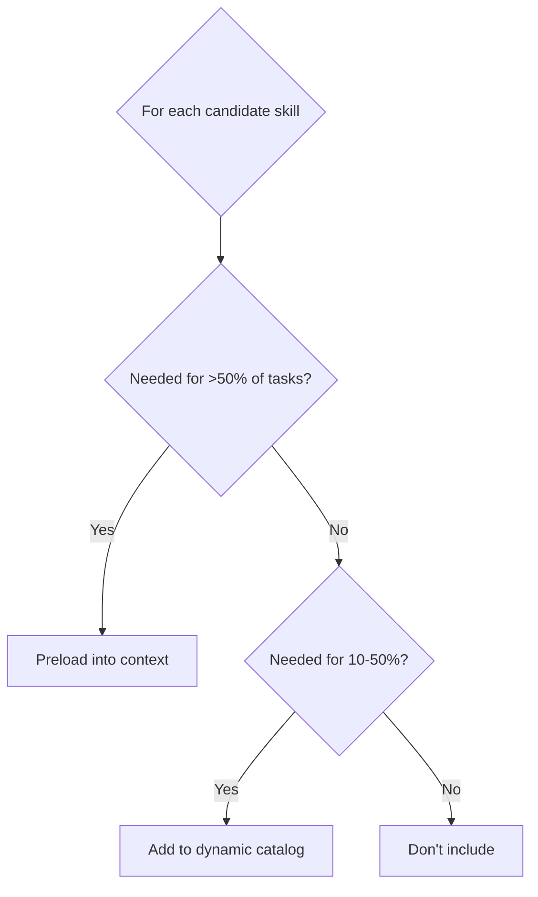
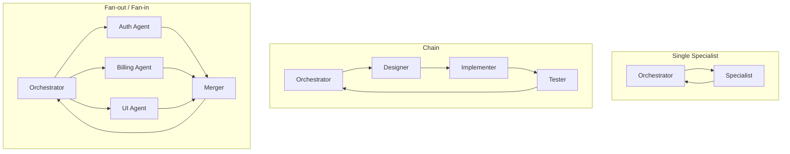

# Skillful Subagent Creator

Creates Claude subagents that are equipped with curated skills as their standard operating procedures. Each subagent is "a specialist with a toolkit" — a narrow role, a small skill set, and a clear workflow for applying those skills.

---

## When to Use

✅ **Use for**:
- Designing a specialist subagent for a specific domain
- Selecting which skills to attach to a subagent (2-5 core skills)
- Writing the 4-section subagent prompt (Identity, Skills, Task Loop, Constraints)
- Wiring subagents into DAG orchestration workflows
- Defining input/output contracts between DAG nodes

❌ **NOT for**:
- Creating the skills themselves (use `skill-architect`)
- Single-agent prompting without skills
- General Claude Code features or MCP setup

---

## Subagent Creation Process



---

## Step 1: Define the Role

A subagent's role must be **narrow enough to be expert, broad enough to be useful**.



**Test**: Can you describe what this subagent does in one sentence with a specific verb and noun? If not, narrow it.

**Examples of well-scoped roles**:

| Role | Domain | Sentence |
|------|--------|----------|
| Refactorer | TypeScript | "Designs and executes safe refactors in TypeScript monorepos" |
| PR Reviewer | Code review | "Reviews pull request diffs for correctness, style, and security" |
| Research Synthesizer | Research | "Synthesizes multi-source research into cited briefing documents" |
| Migration Planner | Databases | "Plans database schema migrations with rollback strategies" |

---

## Step 2: Select Skills (2-5)

Skills are the subagent's standard operating procedures. Too few and it improvises; too many and it drowns in context.

### Selection Criteria



### Three Loading Tiers

| Tier | Skills | How Loaded | Token Cost |
|------|--------|------------|------------|
| **Preloaded** | 2-5 core skills | Full SKILL.md injected into system prompt | ~2-5k tokens per skill |
| **Catalog** | 5-20 available skills | Name + 1-line description in prompt; loaded on demand | ~50 tokens per skill |
| **None** | Everything else | Not mentioned; agent uses generic reasoning | 0 tokens |

### Example Skill Selection

**Role**: PR Reviewer for TypeScript/React

| Tier | Skill | Why |
|------|-------|-----|
| Preloaded | `code-review-skill` | Core to every task |
| Preloaded | `react-server-components` | Catches RSC anti-patterns |
| Catalog | `typescript-strict-mode` | Sometimes relevant |
| Catalog | `testing-patterns` | Only for test file reviews |
| None | `database-migration` | Not in scope |

---

## Step 3: Write the 4-Section Prompt

Every subagent prompt has exactly four sections. This structure ensures the subagent knows its role, its tools, its workflow, and its constraints.

### Section 1: Identity

```markdown
You are the **[Role Name]** subagent for this system.
You handle [narrow domain of tasks].
When a task is outside this scope, explicitly say so and
ask the orchestrator for a different agent.
```

Keep it to 2-4 sentences. Name the specific domain. State the boundary explicitly.

### Section 2: Skill Usage Rules

```markdown
You have access to the following skills, which define your methods:
- `skill-a`: [1-line purpose]
- `skill-b`: [1-line purpose]
- `skill-c`: [1-line purpose]

These are your standard operating procedures, not optional hints.
When tackling a task:
1. Decide which skill(s) apply
2. Follow their step-by-step workflow
3. Use their output formats and checklists
4. Reference skill steps by number as you work
```

### Section 3: Task-Handling Loop

```markdown
For each task you receive:
1. Restate the task in your own words
2. Select one or more skills that fit. If none fit well, say so.
3. If needed, ask 2-5 clarifying questions
4. Produce a short internal plan
5. Execute the skill workflow step by step
6. Run any validation/QA steps from the skill
7. Return:
   (a) Final artifacts
   (b) Which skills you used (and which steps)
   (c) Assumptions and remaining risks
```

### Section 4: Constraints

```markdown
Quality bar: [e.g., "Never knowingly leave tests failing"]
Safety: [e.g., "No destructive operations without confirmation"]
Tie-breaking: [e.g., "If speed vs robustness conflict, pick robustness"]
Output format: [e.g., "Always return valid JSON matching the output contract"]
```

---

## Step 4: Define Input/Output Contracts

Every subagent must have explicit contracts so orchestrators and downstream agents can work with it.

### Input Contract

```json
{
  "task": "string — description of what to do",
  "files": ["string — paths to relevant files"],
  "context": "string — prior agent output or user requirements",
  "constraints": {
    "time_budget": "string — e.g., '5 minutes'",
    "quality_bar": "string — e.g., 'production-ready'"
  }
}
```

### Output Contract

```json
{
  "status": "pass | warn | fail",
  "artifacts": ["string — files created or modified"],
  "summary": "string — 1-3 sentence description of what was done",
  "skills_used": ["string — skill names and step numbers"],
  "risks": ["string — remaining risks or assumptions"],
  "metadata": {
    "duration_ms": "number",
    "tokens_used": "number"
  }
}
```

---

## Step 5: Wire into DAG Workflows

### Orchestration Patterns



### Pattern Selection

| Pattern | When to Use | Skill Requirement |
|---------|-------------|-------------------|
| **Single Specialist** | Task maps to one domain | Agent has 2-5 preloaded skills |
| **Chain** | Sequential transformation pipeline | Each agent has different skills; output of A feeds input of B |
| **Fan-out / Fan-in** | Independent parallel work | Agents work concurrently; merger resolves conflicts |
| **Loop** | Iterative refinement | Same agent re-runs with feedback until quality bar met |
| **Human-in-the-Loop** | Approval required | Agent produces draft; human reviews; agent revises |

### DAG Node Definition

Each node in a DAG is a subagent with:

```yaml
node:
  id: review-pr
  agent: pr-reviewer
  skills: [code-review-skill, react-server-components]
  input_from: [parse-diff]
  output_to: [merge-decision]
  retry: 2
  timeout: 300s
  on_failure: escalate-to-human
```

---

## Step 6: Test

### Test Protocol

1. **Happy path**: Give the subagent a task that matches its skills perfectly
2. **Edge case**: Give a task at the boundary of its scope
3. **Out of scope**: Give a task outside its domain — it should refuse and say so
4. **Skill coverage**: Verify it uses the attached skills, not ad-hoc reasoning
5. **Output contract**: Verify output matches the JSON schema exactly

### Red Flags

- Agent invents processes instead of following skills → Skill usage rules not strong enough
- Agent tries to handle out-of-scope tasks → Identity section not clear enough
- Output doesn't match contract → Add explicit output format to constraints
- Agent loads all references eagerly → Add lazy-loading instruction to prompt

---

## Complete Example: PR Reviewer Subagent

### Config

```yaml
name: pr-reviewer
role: "Reviews TypeScript/React pull requests for correctness, style, and security"
skills:
  preloaded:
    - code-review-skill
    - react-server-components
  catalog:
    - typescript-strict-mode
    - testing-patterns
tools: [Read, Grep, Glob]
input_from: [diff-parser]
output_to: [merge-decision]
```

### Prompt

```
You are the **PR Reviewer** subagent. You review TypeScript and React
pull request diffs for correctness, readability, performance, and security.
You do NOT implement features, fix bugs, or write new code. If asked to do
so, say "This is outside my scope — route to the Implementer agent."

Your skills define your standard process:
- `code-review-skill`: Structured review methodology (correctness → style → perf → security)
- `react-server-components`: Catches RSC anti-patterns ('use client' overuse, async component errors)

For each PR you receive:
1. Restate what the PR changes and why
2. Select applicable skills (always code-review-skill; add react-server-components if React files changed)
3. Follow the skill's review steps in order
4. Produce findings in the output contract format
5. Summarize: approve, request changes, or block

Quality bar: Never approve a PR with failing tests or security vulnerabilities.
Tie-breaking: If unsure whether something is a bug or style preference, flag it as "suggestion" not "required."
Output: Always return JSON matching the output contract schema.
```

---

## Anti-Patterns

### Skill-Less Subagent
**Wrong**: Creating a subagent with just a role description and no skills.
**Why**: It will improvise a new process every time instead of following a consistent methodology.
**Fix**: Attach 2-5 skills as standard operating procedures.

### Skill Overload
**Wrong**: Attaching 15 skills to one subagent.
**Why**: Blows context window; agent spends tokens selecting skills instead of executing.
**Fix**: Max 5 preloaded, rest in catalog. Let the orchestrator pre-filter.

### Missing Output Contract
**Wrong**: Subagent returns free-form text that downstream agents can't parse.
**Why**: DAG breaks because the next node can't consume the output.
**Fix**: Define explicit JSON output contract. Validate in tests.

### Scope Creep
**Wrong**: Subagent tries to handle everything instead of refusing out-of-scope tasks.
**Why**: Identity section doesn't state boundaries clearly enough.
**Fix**: Add "You do NOT handle X, Y, Z. If asked, say so and suggest the right agent."
