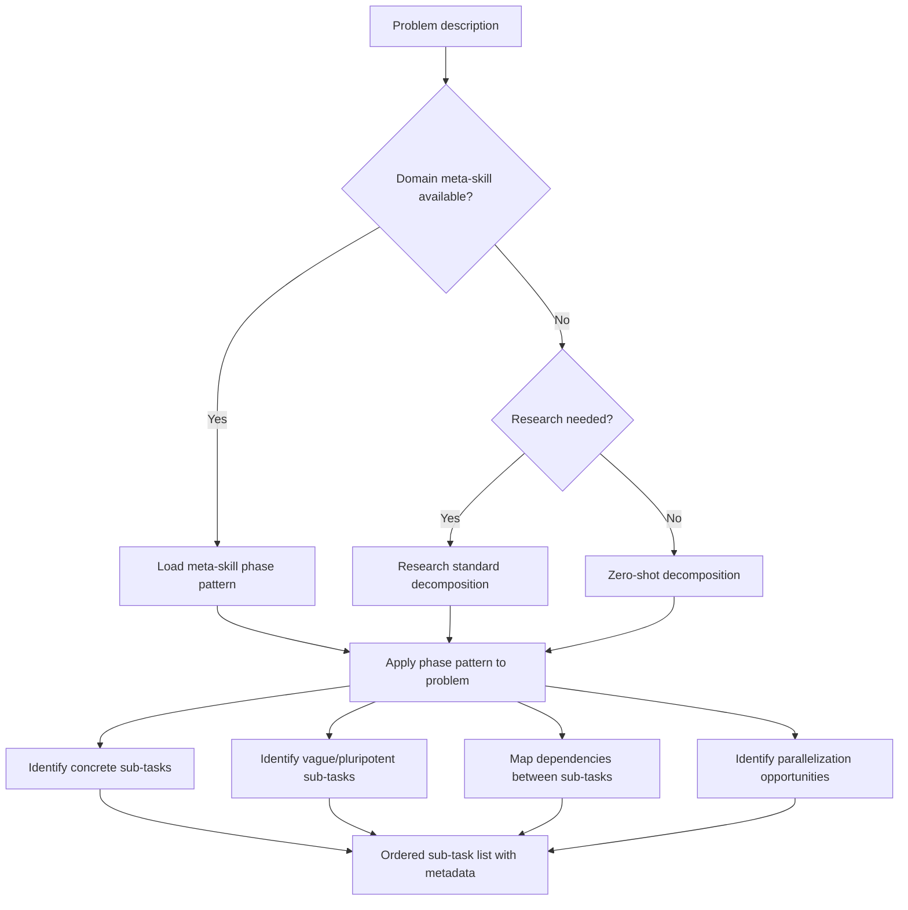

# Task Decomposer

Breaks natural-language problems into sub-tasks suitable for DAG nodes. The first step of the meta-DAG: before you can build or execute a DAG, you need to understand what the pieces are.

---

## When to Use

✅ **Use for**:
- Breaking a vague problem into concrete sub-tasks
- Identifying phases, dependencies, and parallelization opportunities
- Determining which sub-tasks are concrete vs. vague (pluripotent)
- Selecting the appropriate domain meta-skill for decomposition

❌ **NOT for**:
- Building the DAG structure from sub-tasks (use `dag-planner`)
- Executing the tasks (use `dag-runtime`)
- Assigning skills to tasks (use `dag-skills-matcher`)

---

## Decomposition Process



### Step 1: Domain Detection

Classify the problem into a domain to select the right meta-skill:

| Domain Signals | Meta-Skill |
|---------------|-----------|
| "build", "implement", "code", "app", "website" | `software-project-decomposition` |
| "research", "analyze", "report", "synthesize" | `research-synthesis-decomposition` |
| "design", "UI", "wireframe", "prototype" | `product-design-decomposition` |
| "strategy", "market", "business", "revenue" | `business-strategy-decomposition` |
| "data", "model", "train", "predict" | `ml-project-decomposition` |

If no meta-skill matches, fall back to zero-shot decomposition.

### Step 2: Phase Identification

Apply the meta-skill's phase pattern. Not all phases apply to every problem.

**Decision**: For each phase in the pattern, ask: "Does this problem need this phase?"
- **Yes, and I can specify it now** → Concrete sub-task
- **Yes, but I can't specify it until prior phases complete** → Vague/pluripotent node
- **No** → Skip this phase

### Step 3: Sub-Task Specification

For each concrete sub-task:
```yaml
sub_task:
  id: unique-name
  description: "What this sub-task produces (1-2 sentences)"
  type: concrete | vague
  depends_on: [upstream-sub-task-ids]
  parallelizable_with: [sibling-sub-task-ids]
  estimated_complexity: simple | moderate | complex
  suggested_model_tier: 1 | 2 | 3
  suggested_skills: [skill-names if known]
  output_description: "What the output looks like"
```

For each vague/pluripotent sub-task:
```yaml
sub_task:
  id: unique-name
  description: "What this phase will address (1-2 sentences)"
  type: vague
  depends_on: [upstream-sub-task-ids]
  potential_paths:
    - "Path A: [exciting possibility 1]"
    - "Path B: [exciting possibility 2]"
    - "Path C: [exciting possibility 3]"
  expansion_trigger: on_upstream_complete
```

### Step 4: Dependency Mapping

For each pair of sub-tasks, determine:
- **Data dependency**: Does B need A's output? → Edge from A to B
- **Knowledge dependency**: Does B need to know what A discovered? → Edge from A to B
- **No dependency**: A and B are independent → Parallelizable

### Step 5: Output

Produce a structured decomposition:
```yaml
decomposition:
  problem: "original problem description"
  domain: "detected domain"
  meta_skill_used: "meta-skill name or 'zero-shot'"
  phases:
    - phase: 1
      sub_tasks: [concrete tasks for this phase]
    - phase: 2
      sub_tasks: [mix of concrete and vague tasks]
  total_concrete: 5
  total_vague: 3
  estimated_waves: 4
  estimated_cost: "$0.08 - $0.25"
```

---

## Decomposition Heuristics

### Granularity

- **Too fine**: "Step 1: Open the file. Step 2: Read line 1." → Merge into one node
- **Too coarse**: "Step 1: Build the entire app." → Split into design, implement, test, deploy
- **Right**: Each sub-task is completable by one agent with 1-3 skills in one LLM call

### Dependency Minimization

Fewer dependencies = more parallelism = faster execution. Prefer:
- Independent parallel tracks over long sequential chains
- Fan-out patterns (one source, many consumers) over daisy chains
- Late merging (combine results at the end, not incrementally)

### Vagueness is OK

Don't force specificity where it doesn't exist yet. A vague node saying "Build the solution (details TBD after design phase)" is more honest and more useful than a fake-specific node that will be wrong.

---

## Anti-Patterns

### Premature Specificity
**Wrong**: Specifying exact implementation details for phases that depend on undone research.
**Right**: Mark dependent phases as vague/pluripotent. Show potential paths.

### Sequential Everything
**Wrong**: A linear chain of 10 tasks with no parallelism.
**Right**: Look for independent tracks. Research and content writing can often happen in parallel.

### Missing the Meta-Skill
**Wrong**: Decomposing a bridge design project like a software project.
**Right**: Detect the domain, load the appropriate meta-skill, follow its phase pattern.
