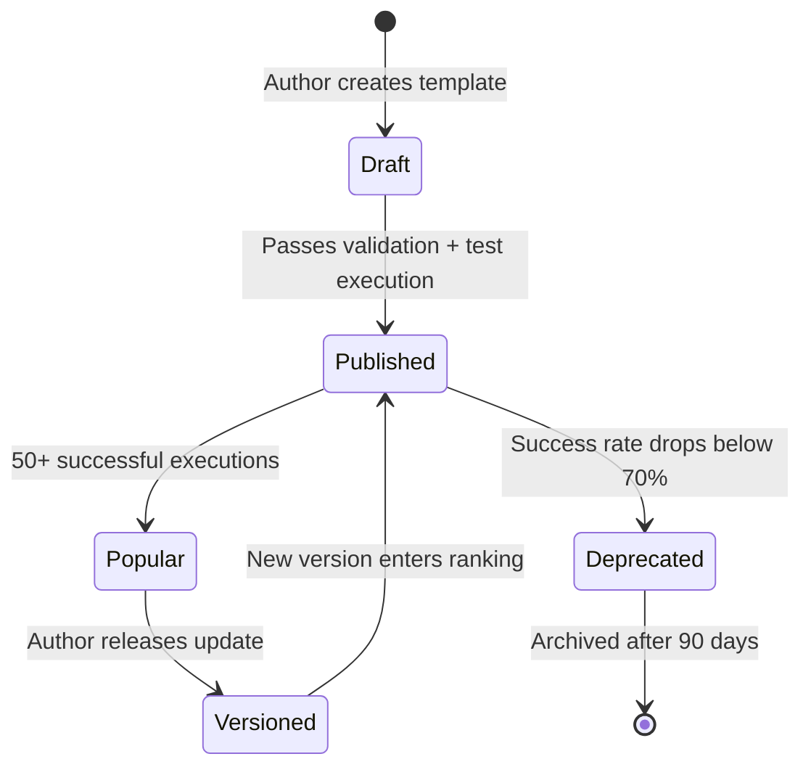

# Template DAG Library

Curates reusable DAG templates — parameterized workflows with pre-assigned skills, model tiers, human gates, and cost estimates. The "app store" of winDAGs.

---

## When to Use

✅ **Use for**:
- Creating new reusable DAG templates
- Browsing the template gallery for a matching template
- Parameterizing a template for a specific user's problem
- Analyzing template performance from execution history
- Versioning and upgrading templates

❌ **NOT for**:
- Building one-off DAGs from scratch (use `task-decomposer` + `dag-planner`)
- Executing DAGs (use `dag-runtime`)
- Creating individual skills (use `skill-architect`)

---

## Template Structure

```yaml
template:
  name: portfolio-website-builder
  version: 2.1
  domain: software-engineering
  description: "Builds a professional portfolio website through interview, research, design, and implementation"
  estimated_cost: "$0.10 - $0.25"
  estimated_time: "3-8 minutes"
  success_rate: 0.91  # From execution history
  
  parameters:
    - name: user_context
      type: string
      description: "Brief description of who the user is and what they want"
      required: true
    - name: style_preference
      type: enum
      values: [modern, minimal, bold, playful, corporate]
      default: modern
    - name: deploy_target
      type: enum
      values: [vercel, netlify, github-pages, none]
      default: vercel
  
  nodes:
    - id: interview
      role: "Interview user about goals, experience, and preferences"
      skills: [career-biographer]
      model_tier: 2
      type: agent
    
    - id: research
      role: "Research industry portfolio examples and competitive landscape"
      skills: [research-analyst, competitive-cartographer]
      model_tier: 2
      type: agent
      depends_on: [interview]
      parallel_with: [content]
    
    - id: content
      role: "Write portfolio copy from interview data"
      skills: [cv-creator, technical-writer]
      model_tier: 2
      type: agent
      depends_on: [interview]
      parallel_with: [research]
    
    - id: design
      role: "Create design system from research + user preferences"
      skills: [vibe-matcher, design-system-generator, web-design-expert]
      model_tier: 2
      type: agent
      depends_on: [research, content]
    
    - id: build
      role: "Implement the portfolio as a web application"
      skills: [frontend-architect, nextjs-app-router-expert]
      model_tier: 2
      type: agent
      depends_on: [design]
    
    - id: review
      type: human-gate
      depends_on: [build]
    
    - id: deploy
      role: "Deploy to target platform"
      skills: [vercel-deployment]
      model_tier: 1
      type: agent
      depends_on: [review]
```

---

## Template Gallery

### Software Engineering

| Template | Nodes | Skills Used | Est. Cost |
|----------|-------|-------------|-----------|
| Portfolio Website Builder | 7 | 9 skills | $0.10-0.25 |
| Codebase Refactor | 6 | 4 skills | $0.12-0.20 |
| PR Review Pipeline | 4 | 3 skills | $0.03-0.06 |
| Technical Docs Generator | 5 | 3 skills | $0.06-0.10 |
| Bug Investigation | 4 | 3 skills | $0.04-0.08 |
| API Design + Implementation | 8 | 5 skills | $0.20-0.35 |

### Research & Writing

| Template | Nodes | Skills Used | Est. Cost |
|----------|-------|-------------|-----------|
| Research Synthesis Report | 5 | 2 skills | $0.08-0.15 |
| Competitive Analysis | 6 | 3 skills | $0.10-0.18 |
| Blog Post from Topic | 4 | 2 skills | $0.04-0.08 |

### Personal Productivity

| Template | Nodes | Skills Used | Est. Cost |
|----------|-------|-------------|-----------|
| Vibe Code Project Triage | 5 | 3 skills | $0.03-0.06 |
| Resume + Cover Letter | 4 | 3 skills | $0.04-0.08 |
| Learning Plan for New Skill | 5 | 2 skills | $0.06-0.10 |

---

## Template Lifecycle



---

## Anti-Patterns

### Template Without Test Execution
**Wrong**: Publishing a template that has never been executed end-to-end.
**Right**: Every template must pass at least one successful dry-run execution before publishing.

### Hardcoded User-Specific Details
**Wrong**: A template that assumes the user is a web developer in Portland.
**Right**: Parameterize everything user-specific. The template is the structure; parameters are the content.

### Too Many Parameters
**Wrong**: 20 parameters that overwhelm the user before execution starts.
**Right**: 2-5 required parameters, sensible defaults for everything else. Most users should be able to run the template with minimal input.
