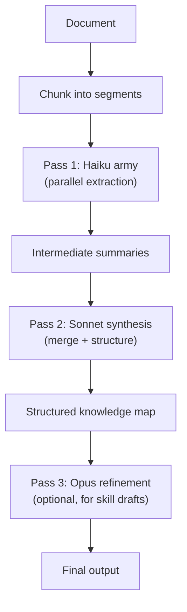

# Very Long Text Summarization

Processes texts too large for a single context window using hierarchical multi-pass extraction with armies of cheap models. Produces structured knowledge maps, indexed summaries, and skill drafts — not just prose compression.

---

## When to Use

✅ **Use for**:
- Professional handbooks and textbooks (100-1000+ pages)
- Career biographies and memoirs (extracting expertise patterns)
- Large codebases (architecture-level understanding)
- Research paper collections (synthesizing findings across papers)
- Any text exceeding a single context window (~100K tokens)

❌ **NOT for**:
- Short documents (<10 pages) — just read them directly
- Real-time conversation summarization (use auto-compact patterns)
- Code documentation generation (use `technical-writer`)
- Simple TL;DR requests (not worth the multi-pass overhead)

---

## Architecture: Three-Pass Hierarchical Extraction



### Pass 1: Chunked Extraction (Haiku Army)

Split the document into overlapping chunks (~4K tokens each, 500 token overlap). Deploy one Haiku call per chunk in parallel. Each extracts:

```yaml
extraction_template:
  summary: "2-3 sentence summary of this section"
  key_claims: ["list of factual claims or assertions"]
  processes: ["any step-by-step procedures described"]
  decisions: ["any decision points or heuristics mentioned"]
  failures: ["any failures, mistakes, or anti-patterns described"]
  aha_moments: ["any insights, realizations, or conceptual breakthroughs"]
  metaphors: ["any metaphors or mental models used"]
  temporal: ["any 'things changed when...' or 'before X, after Y' patterns"]
  quotes: ["notable direct quotes worth preserving"]
  references: ["any citations, links, or cross-references"]
```

**Cost**: ~$0.001 per chunk. A 300-page book (~150K tokens) = ~38 chunks = ~$0.04 total for Pass 1.

**Parallelism**: All chunks run simultaneously. A 300-page book completes Pass 1 in ~3 seconds (wall clock), not 3 minutes.

### Pass 2: Synthesis (Sonnet)

Feed all Pass 1 extractions into one or more Sonnet calls. Sonnet merges, deduplicates, and structures the knowledge.

```yaml
synthesis_template:
  document_summary: "1-2 paragraph executive summary"
  
  knowledge_map:
    core_concepts:
      - concept: "name"
        definition: "what it means in this domain"
        relationships: ["connects to concept X because..."]
    
    processes:
      - name: "process name"
        steps: ["ordered steps"]
        decision_points: ["where choices are made"]
        common_mistakes: ["what goes wrong"]
    
    expertise_patterns:
      - pattern: "what experts do differently"
        novice_mistake: "what novices do instead"
        aha_moment: "the insight that bridges the gap"
    
    temporal_evolution:
      - period: "date range"
        paradigm: "what was believed/practiced"
        change_trigger: "what caused the shift"
    
    key_metaphors:
      - metaphor: "how practitioners think about X"
        maps_to: "the underlying structure it represents"
  
  index:
    - topic: "topic name"
      chunk_ids: [3, 7, 12]  # Which original chunks cover this
      summary: "1 sentence"
```

**Cost**: ~$0.02-0.05 depending on extraction volume. The index preserves traceability back to specific book sections.

### Pass 3: Refinement (Opus, Optional)

For skill-draft output mode: Opus takes the knowledge map and produces a SKILL.md following the skill-architect template. This is the "crystallize skill from handbook" pipeline.

**Cost**: ~$0.10. Only run when the output is a skill draft.

---

## Chunking Strategy

### Semantic Chunking (Preferred)

Split on document structure — chapter boundaries, section headings, paragraph breaks. Preserves semantic coherence within each chunk.

```python
def semantic_chunk(text: str, max_tokens: int = 4000, overlap: int = 500) -> list[str]:
    """Split text on structural boundaries with overlap."""
    # Split on headings, then merge short sections
    sections = split_on_headings(text)  # ##, ###, etc.
    
    chunks = []
    current = ""
    
    for section in sections:
        if count_tokens(current + section) > max_tokens:
            chunks.append(current)
            # Overlap: keep the last ~500 tokens
            current = get_last_n_tokens(current, overlap) + section
        else:
            current += section
    
    if current:
        chunks.append(current)
    
    return chunks
```

### Fixed-Size Chunking (Fallback)

For unstructured text without headings. Split on paragraph boundaries, targeting ~4K tokens with 500-token overlap.

### Why Overlap?

Concepts that span chunk boundaries need to appear in both chunks to be extracted. Without overlap, you lose cross-boundary knowledge.

---

## Output Modes

### Mode 1: Summary

Produces a structured summary with executive overview, key concepts, and index.

**Use for**: Quick understanding of a long document. Reading a handbook before a meeting.

### Mode 2: Knowledge Map

Produces the full knowledge map: concepts, processes, expertise patterns, temporal evolution, metaphors. Machine-readable (YAML/JSON) for downstream processing.

**Use for**: Feeding into skill creation, domain meta-skill development, or cross-document analysis.

### Mode 3: Skill Draft

Produces a SKILL.md following the skill-architect template, with the handbook's expertise encoded as decision trees, anti-patterns, and shibboleths.

**Use for**: Converting professional handbooks into Claude skills. The KE pipeline.

---

## Cost Model

| Document Size | Pages | Chunks | Pass 1 (Haiku) | Pass 2 (Sonnet) | Pass 3 (Opus) | Total |
|--------------|-------|--------|----------------|-----------------|---------------|-------|
| Article | 10 | 4 | $0.004 | $0.01 | — | $0.014 |
| Chapter | 30 | 10 | $0.01 | $0.02 | — | $0.03 |
| Handbook | 300 | 38 | $0.04 | $0.05 | $0.10 | $0.19 |
| Textbook | 800 | 100 | $0.10 | $0.10 | $0.10 | $0.30 |
| Encyclopedia | 2000+ | 250+ | $0.25 | $0.20 | $0.10 | $0.55 |

Processing time is dominated by the longest single Haiku call (~2-3s). With full parallelism, even a 2000-page text completes Pass 1 in under 5 seconds.

---

## Anti-Patterns

### Single-Pass Summarization
**Wrong**: Feed the entire document into one Opus call.
**Why**: Exceeds context window, or attention dilution produces weak extraction on such long input.
**Right**: Hierarchical multi-pass. Cheap parallel extraction → expensive synthesis.

### Summarization Without Structure
**Wrong**: Produce a 2-paragraph prose summary of a 300-page handbook.
**Why**: The structure IS the knowledge. A flat summary loses the decision trees, failure patterns, and temporal evolution that make skills valuable.
**Right**: Structured knowledge map with indexed access back to source sections.

### Skipping Overlap
**Wrong**: Chunk on hard boundaries with no overlap.
**Why**: Cross-boundary concepts get split and lost.
**Right**: 500-token overlap between chunks. Each chunk includes the tail of the previous chunk.

### Ignoring Source Traceability
**Wrong**: Produce extractions without tracking which chunk they came from.
**Why**: When a claim seems wrong, you need to verify it against the source. Without traceability, you can't.
**Right**: Every extraction carries a `chunk_id` linking back to the original text segment.
