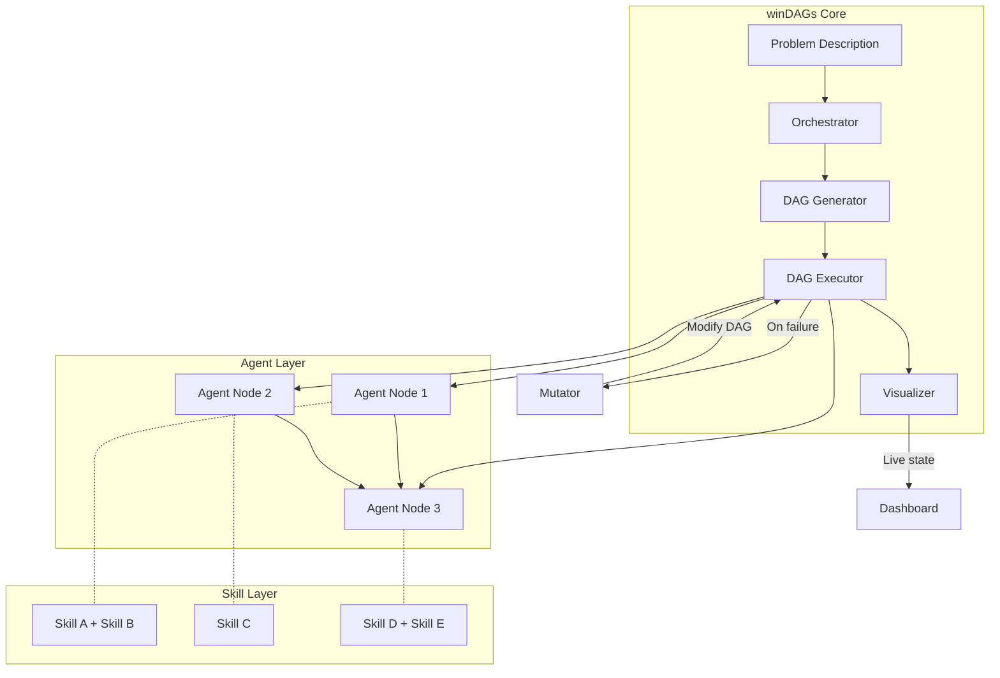
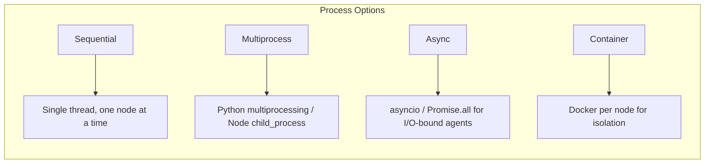
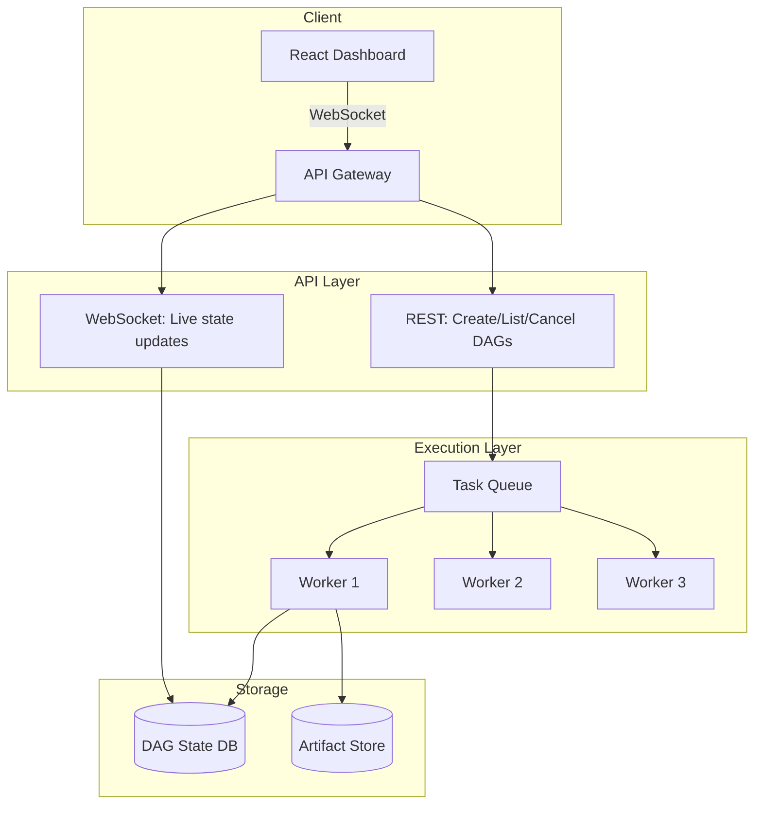
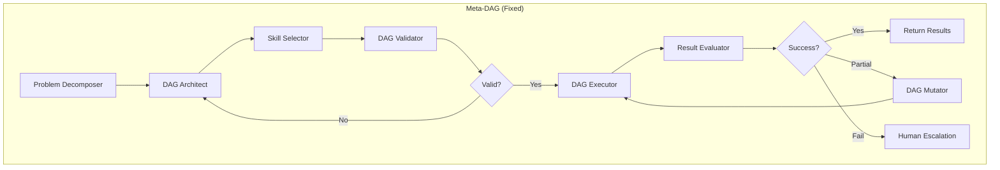
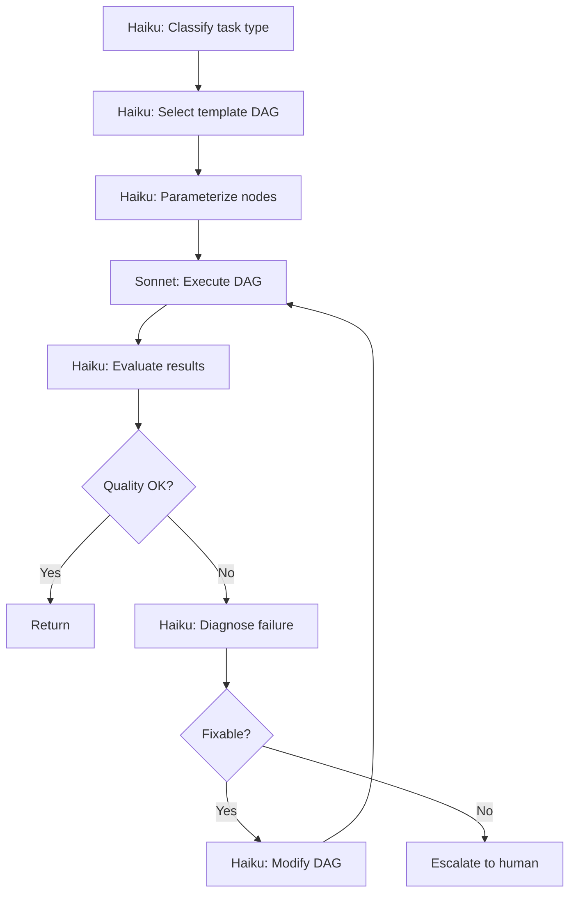
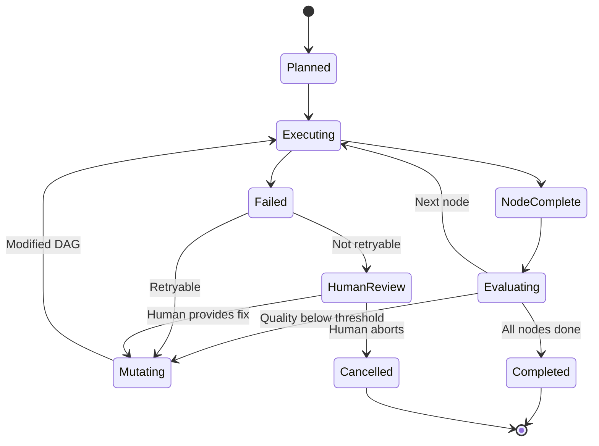
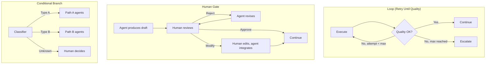
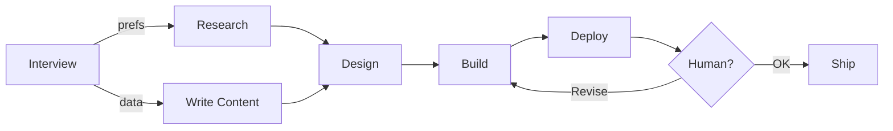

# winDAGs Architect

Architecture skill for building **winDAGs.ai** — a system that solves arbitrary problems with directed acyclic graphs of skillful agents. Each node is an agent equipped with curated skills; each edge is a data dependency or control flow. The system can build DAGs, execute DAGs, mutate DAGs mid-execution, and visualize the whole thing beautifully.

---

## When to Use

✅ **Use for**:
- Designing agent DAG architectures for complex problem-solving
- Implementing local or web-based DAG execution engines
- Building meta-DAGs (using an agent DAG to create another agent DAG)
- Making DAGs dynamic (mutation during execution)
- Adding human-in-the-loop control structures
- Choosing and implementing DAG visualization

❌ **NOT for**:
- Single-agent prompting (no DAG needed)
- Creating individual skills (use `skill-architect`)
- Creating individual subagents (use `skillful-subagent-creator`)
- Rendering static diagrams (use `mermaid-graph-renderer`)

---

## System Architecture Overview



---

## 1. Local Execution

### Runtime Process Model

winDAGs runs locally using available process executors. Each agent node executes as an isolated unit with defined inputs/outputs.



### Node Definition Schema

```yaml
node:
  id: "analyze-codebase"
  agent:
    role: "Codebase Analyst"
    skills:
      preloaded: [code-review-skill, architecture-patterns]
      catalog: [testing-patterns]
    tools: [Read, Grep, Glob]
    model: "claude-sonnet"  # or inherit from DAG default
  input:
    from_nodes: ["parse-requirements"]
    schema:
      requirements: "string"
      file_paths: "string[]"
  output:
    schema:
      analysis: "object"
      recommendations: "string[]"
      risk_score: "number"
    to_nodes: ["plan-refactor", "generate-tests"]
  execution:
    timeout: 300s
    retries: 2
    on_failure: "escalate"  # or "skip", "retry", "mutate-dag"
  resources:
    max_tokens: 100000
    cost_budget: "$0.50"
```

### DAG Definition Schema

```yaml
dag:
  name: "refactor-codebase"
  description: "Analyze, plan, execute, and verify a codebase refactor"
  default_model: "claude-sonnet"
  
  nodes:
    - id: parse-requirements
      # ...node definition
    - id: analyze-codebase
      input.from_nodes: [parse-requirements]
    - id: plan-refactor
      input.from_nodes: [analyze-codebase]
    - id: execute-refactor
      input.from_nodes: [plan-refactor]
    - id: verify-tests
      input.from_nodes: [execute-refactor]
    - id: human-review
      type: human-in-the-loop
      input.from_nodes: [verify-tests]
      outcomes: [approve, reject, modify]
  
  edges:
    - from: parse-requirements → to: analyze-codebase
    - from: analyze-codebase → to: plan-refactor
    - from: plan-refactor → to: execute-refactor
    - from: execute-refactor → to: verify-tests
    - from: verify-tests → to: human-review
    - from: human-review[reject] → to: plan-refactor  # Loop back
  
  execution:
    mode: async  # sequential | async | multiprocess | container
    max_parallel: 3
    total_timeout: 1800s
    cost_budget: "$5.00"
```

### Execution Engine

```python
# Core execution loop (pseudocode)
async def execute_dag(dag: DAG, context: Context) -> Result:
    topo_order = topological_sort(dag.nodes, dag.edges)
    completed = {}
    
    for batch in parallel_batches(topo_order):
        tasks = []
        for node in batch:
            inputs = gather_inputs(node, completed)
            tasks.append(execute_node(node, inputs, context))
        
        results = await asyncio.gather(*tasks, return_exceptions=True)
        
        for node, result in zip(batch, results):
            if isinstance(result, Exception):
                action = handle_failure(node, result, dag)
                if action == "mutate":
                    dag = mutate_dag(dag, node, result)
                    return await execute_dag(dag, context)  # Re-execute
                elif action == "escalate":
                    return await human_review(dag, node, result)
            else:
                completed[node.id] = result
                emit_state_update(node.id, "completed", result)
    
    return aggregate_results(completed)
```

---

## 2. Web Service Deployment

### Architecture



### API Design

```
POST   /api/dags              Create a new DAG from problem description
GET    /api/dags/:id          Get DAG definition and current state
POST   /api/dags/:id/execute  Start execution
DELETE /api/dags/:id/execute  Cancel execution
PATCH  /api/dags/:id/nodes/:n Mutate a node mid-execution
POST   /api/dags/:id/review   Submit human-in-the-loop decision
WS     /api/dags/:id/stream   Live execution state stream
```

### Embedded Template DAGs

For recurring problem types, pre-build optimized DAGs:

| Template | Problem Type | Nodes |
|----------|-------------|-------|
| `portfolio-builder` | "Build a beautiful portfolio website" | Interview → Design → Implement → Deploy |
| `codebase-refactor` | "Refactor this codebase" | Analyze → Plan → Execute → Test → Review |
| `vibe-code-triage` | "Which projects should I focus on?" | Scan → Score → Rank → Report |
| `research-synthesis` | "Research X and write a report" | Decompose → Search → Synthesize → Cite |

Templates are parameterized — the user provides context, the system fills in agent configs and skill selections.

---

## 3. Meta-DAGs: DAGs Creating DAGs

The core innovation: winDAGs itself runs as a DAG of agents that creates and executes other DAGs.



### Meta-DAG Agent Roles

| Agent | Skills | Purpose |
|-------|--------|---------|
| **Problem Decomposer** | domain-analysis, task-decomposition | Break problem into sub-problems suitable for agent nodes |
| **DAG Architect** | skillful-subagent-creator, windags-architect | Design the DAG topology: which agents, which edges |
| **Skill Selector** | skill-grader, skill-architect | Choose optimal skills for each agent node |
| **DAG Validator** | windags-architect | Check DAG is acyclic, contracts align, costs within budget |
| **DAG Executor** | (runtime, not skill-based) | Execute the generated DAG |
| **Result Evaluator** | skill-grader | Grade the output quality, identify gaps |
| **DAG Mutator** | windags-architect | Modify the DAG to address failures or gaps |

### The Haiku Loop

For deterministic orchestration, use a fixed loop of lightweight agents (Haiku-class) that are fast, cheap, and predictable:



The Haiku agents are cheap (~$0.001 per call) and fast (~200ms). Only the actual DAG execution uses Sonnet/Opus. This keeps the meta-layer cost <1% of total execution cost.

---

## 4. Dynamic DAGs

### Mutation During Execution

DAGs can modify themselves based on runtime results:



### Mutation Types

| Type | Trigger | Action |
|------|---------|--------|
| **Add node** | Gap detected in output | Insert new agent between existing nodes |
| **Remove node** | Node is redundant | Skip node, connect predecessors to successors |
| **Replace node** | Agent failed repeatedly | Swap agent with different skills/model |
| **Add edge** | New dependency discovered | Connect previously independent nodes |
| **Fork** | Ambiguous approach | Split into parallel paths, pick best result |
| **Loop back** | Quality below threshold | Re-execute subset of DAG with modified context |

### Beyond DAGs: Control Structures

Real workflows aren't always acyclic. winDAGs supports these non-DAG patterns:



---

## 5. Visualization

This is the central part of the tool. The DAG must be rendered beautifully before, during, and after execution.

### Technology Stack

**Primary: ReactFlow + ELKjs**

ReactFlow (v12.4+, MIT) is the clear leader for DAG visualization with live state updates. ELKjs provides professional auto-layout.

| Feature | ReactFlow + ELKjs |
|---------|-------------------|
| Rendering | React components (SVG + HTML) |
| Layout | ELKjs layered algorithm with edge routing |
| Performance | Viewport virtualization (only renders visible nodes) |
| Live updates | Native Zustand integration, `onNodesChange` callbacks |
| Interactivity | Drag, zoom, pan, select, connect |
| Custom nodes | Full React component per node type |
| Bundle | ~350 KB + ~500 KB (ELK) |

### Node State Visualization

Adopt Temporal's color + animation vocabulary as the universal status language:

| State | Color | Visual |
|-------|-------|--------|
| Pending | Gray | Solid border |
| Scheduled | Blue outline | Dashed border |
| Running | Blue fill | Animated pulse |
| Completed | Green fill | Solid, checkmark icon |
| Failed | Red fill | Solid, X icon |
| Retrying | Orange fill | Animated spin |
| Paused (human gate) | Purple outline | Pulsing border |
| Skipped | Gray, dimmed | Reduced opacity |
| Mutated | Yellow border | Glow effect |

### Three Visualization Modes

Inspired by Temporal's three-view approach:

**1. Graph Mode (Before + During + After)**

The primary view. Shows the DAG topology with live-updating node states.

```typescript
// Custom agent node with live state
const AgentNode = ({ data }: NodeProps) => {
  const { status, agentRole, skills, output, cost, duration } = data;
  return (
    <div className={`agent-node status-${status}`}>
      <StatusIndicator status={status} />
      <div className="role">{agentRole}</div>
      <div className="skills">{skills.join(', ')}</div>
      {output && <div className="output-preview">{output.summary}</div>}
      <div className="meta">
        <span>{duration}ms</span>
        <span>${cost.toFixed(3)}</span>
      </div>
    </div>
  );
};
```

**2. Timeline Mode (During + After)**

Gantt-chart view showing when each node ran, how long it took, and parallelism.

Inspired by Temporal's Timeline View: each node occupies a row, line length proportional to clock duration. Running nodes show animated progress. Shows where time is being spent and which nodes ran concurrently.

**3. Detail Mode (After)**

Deep inspection of individual node results: full input/output, skills used, token consumption, cost, latency, errors. Like LangGraph Studio's state inspector — you can examine the exact AgentState at each node.

### Visualization Anti-Patterns to Learn From

| Tool | Strength to Copy | Weakness to Avoid |
|------|-------------------|-------------------|
| **Temporal** | Color + animation vocabulary, three view modes, inline child expansion | Complex event model (overkill for agent DAGs) |
| **Dagster** | Asset health badges, partition timeline bars, scaled to 10K+ nodes | Asset-centric model doesn't map to agent DAGs |
| **Prefect** | Radar diagram for branch visualization, run scatter plots | Graphviz-based static DAGs lack interactivity |
| **LangGraph Studio** | Time-travel debugging, state editing at checkpoints | No standard color palette for node states |
| **CrewAI** | Simple HTML flow plots, router visualization | No runtime state colors, text streaming only |

### The Gold Standard

Combine the best from each:
- **Temporal's** status colors + animation patterns
- **Dagster's** badge system for multi-dimensional node health
- **LangGraph Studio's** state inspection + time-travel model
- **ReactFlow's** React-native rendering + ELKjs layout
- **Prefect's** run-history scatter plot for execution trends over time

---

## 6. Putting It All Together

### Example: "Build a Portfolio Website"



---

## 7. Skill Lifecycle: Self-Evaluation → Ranking → Revolution

Every DAG execution generates quality signals that feed back into the skill library. Four evaluators score each node: **self-evaluation** (agent grades itself, cheap but biased), **peer evaluation** (Haiku + skill-grader judges output), **downstream evaluation** (next node reports whether input was usable), and **human evaluation** (approval gates, gold standard). Weighted aggregate: human > downstream > peer > self.

Signals feed an **Elo ranking** per skill per domain. Skills with high downstream acceptance on cheap models rank highest. Declining skills get flagged for improvement or replacement. When anomalies accumulate past a threshold (a **Kuhnian crisis** — the paradigm shifted but the skill didn't), the system seeks or crystallizes a replacement. New skills enter unranked and must earn their way up.

This lifecycle is the core network effect. See `references/skill-lifecycle.md` and `references/business-model.md`.

---

## Reference Files

Consult for deep dives:

| File | Consult When |
|------|-------------|
| `references/progressive-revelation.md` | Vague nodes, sub-DAG expansion, context management across waves, domain meta-skills |
| `references/business-model.md` | Monetization (open core + cloud + marketplace); skill marketplace network effects; go-to-market |
| `references/skill-lifecycle.md` | Lifecycle states with Thompson sampling; four evaluators; drift detection; Kuhnian revolution |
| `references/llm-routing.md` | Choosing which model per DAG node; tier-based, adaptive, cascading, and RouteLLM approaches; cost model |
| `references/sdk-implementation.md` | Implementing on Claude SDK, OpenAI, Ollama; LLM-agnostic provider layer; streaming; Temporal durable execution |
| `references/skills-vs-research.md` | Understanding when skill libraries help vs. on-the-fly research agents; cost model; hybrid architecture |
| `references/skill-gap-analysis.md` | Auditing the 180-skill library for winDAGs; consolidation plan for 26 dag-* skills; 15 missing skills enumerated by priority |
| `references/user-experience.md` | Persistence, saved runs, pluripotent nodes, cost projections, versioned skills, export formats, template gallery |
| `references/visualization-research.md` | Choosing visualization libraries; UX patterns from Temporal/Dagster/Prefect/LangGraph/CrewAI; ReactFlow components |
| `references/execution-engines.md` | Execution engine design; topological scheduling; failure handling; DAG mutation; cost tracking |
