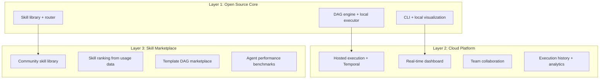
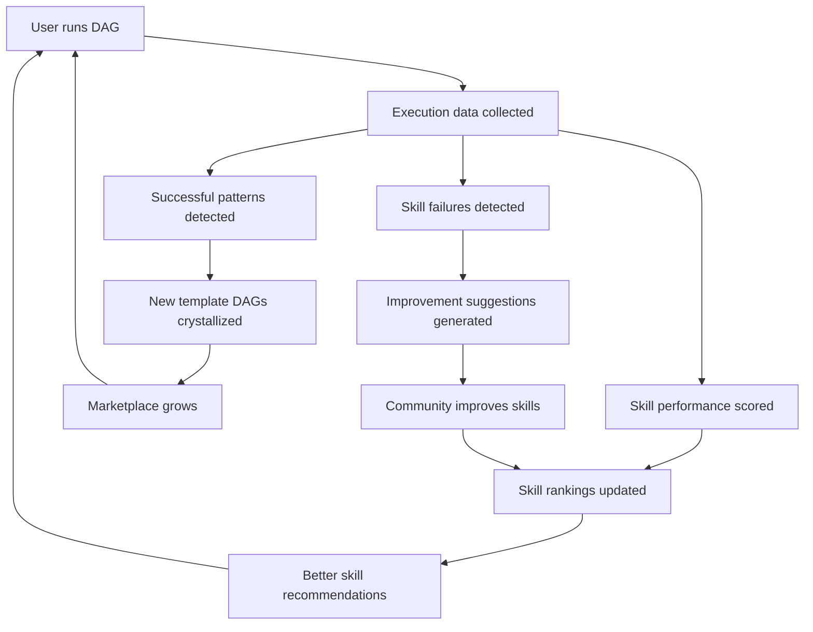

# winDAGs Business Model & Network Effects

How winDAGs makes money, gets better as people use it, and builds a defensible moat through a skill marketplace with centralized ranking.

---

## The Three-Layer Business

winDAGs isn't one product — it's three layers, each with a different business model:



---

## Layer 1: Open Source Core (Free)

**What's free**: The DAG execution engine, skill loading, LLM routing, local execution, CLI, and the base skill library. Users bring their own API keys.

**Why free**: This is the developer adoption layer. It needs to be free to build the community that generates the data that makes Layers 2 and 3 valuable. This is the Docker/Kubernetes/Terraform playbook: open core, paid cloud.

**What you ship**:
- `windags` CLI: `windags run problem.yaml`, `windags viz`, `windags grade-skills`
- Python/TypeScript SDK: `from windags import DAG, Node, execute`
- Base skill library (~50 curated skills from some_claude_skills)
- Local ReactFlow visualization (dev mode)
- `windags init` scaffolds a new DAG project

**Revenue**: $0. But every local execution generates data (which skills were used, which succeeded, which models performed well) that feeds Layer 3 if the user opts in.

---

## Layer 2: Cloud Platform (Paid SaaS)

**What's paid**: Hosted execution (no infra setup), production-grade visualization, team features, execution history.

### Pricing Model

| Tier | Price | Includes |
|------|-------|---------|
| **Free** | $0/mo | 50 DAG executions/month, 1 user, community skills only |
| **Pro** | $29/mo | 500 executions, 5 users, execution analytics, priority support |
| **Team** | $99/mo | 5,000 executions, 20 users, custom skills, SSO, audit logs |
| **Enterprise** | Custom | Unlimited, on-prem option, SLA, dedicated support, custom templates |

**Note**: Users still pay their own LLM API costs. winDAGs charges for orchestration, visualization, and analytics — not the LLM calls themselves. This avoids the "reselling tokens at a markup" trap.

### Why People Pay

| Feature | Free (Local) | Cloud (Paid) |
|---------|-------------|-------------|
| Execution | Local process | Temporal-backed durable execution |
| Visualization | Dev-mode ReactFlow | Production dashboard with auth |
| History | Local logs | Full execution history + replay |
| Collaboration | Single user | Team sharing, permissions, comments |
| Templates | Base library | Marketplace access + custom |
| Monitoring | Console output | Alerts, cost dashboards, SLOs |
| Human gates | CLI prompts | Web-based approval workflows |

---

## Layer 3: Skill Marketplace (The Flywheel)

This is where winDAGs gets better as people use it. The marketplace is the network effect.

### How It Works



### What's in the Marketplace

| Asset | Creator | Revenue Split |
|-------|---------|--------------|
| **Skills** | Community + winDAGs team | 70% creator / 30% platform |
| **Template DAGs** | Community + winDAGs team | 70% creator / 30% platform |
| **Agent configurations** | Community | 70% creator / 30% platform |
| **Skill bundles** | Curated by winDAGs | Free (drives adoption) |

### Skill Ranking (Centralized, Usage-Driven)

Every skill execution generates a signal:

```python
@dataclass
class SkillExecutionSignal:
    skill_name: str
    dag_template: str
    node_role: str
    model_used: str
    
    # Outcome signals
    downstream_accepted: bool      # Did the next node accept this output?
    output_contract_valid: bool    # Did output match schema?
    human_approved: bool | None    # If human gate followed, did they approve?
    self_score: float | None       # Agent's self-evaluation (0-1)
    peer_score: float | None       # Downstream agent's evaluation (0-1)
    
    # Efficiency signals
    tokens_used: int
    cost_usd: float
    duration_ms: int
    retries: int
    model_tier_used: int           # 1=cheap, 2=balanced, 3=premium
```

These signals feed a **skill Elo rating** system (borrowed from chess / Chatbot Arena):
- Skills that consistently produce accepted output on cheap models rank higher
- Skills that cause downstream failures or human rejections rank lower
- Skills are ranked per-domain (a skill might be A-tier for code review but C-tier for copywriting)

### Template DAG Rankings

Same principle applied to whole DAG templates:
- "Portfolio Builder v3" might have a 92% success rate across 500 executions
- "Portfolio Builder v2" only 78% — it gets deprioritized in recommendations
- A new "Portfolio Builder v4" starts unranked and must earn its way up

### The Network Effect

```
More users → more execution data → better skill rankings → better recommendations
→ better outcomes → more users → ...
```

This is a genuine data network effect:
- **Skill quality signal** gets stronger with more executions
- **Template DAG recommendations** get better with more diverse use cases
- **LLM routing** gets smarter with more model performance data
- **New users benefit immediately** from aggregate quality signals

The moat isn't the software (it's open source) — it's the **execution data and skill rankings** that only exist on the centralized platform.

### Lessons from Developer Marketplace Research

**npm pattern (dependency graph lock-in)**: npm's network effects come from transitive dependencies — a single `npm install` pulls hundreds of packages, creating a multiplicative value graph. winDAGs' equivalent: skills depend on other skills (a DAG template uses 5-10 skills), creating the same multiplicative lock-in. The more skills in the ecosystem, the more useful every DAG template becomes.

**VS Code pattern (strategic complement)**: VS Code's marketplace exists to sell Azure, Copilot, and GitHub Enterprise — the marketplace itself is free. winDAGs should follow the same pattern: the skill marketplace is free; revenue comes from the cloud execution platform.

**Terraform pattern (state-based lock-in)**: Terraform's lock-in comes from state files — once you manage infrastructure through Terraform, migrating requires reconstructing state for every resource. winDAGs' equivalent: execution history, skill rankings, and template DAG configurations create organizational switching costs that increase with usage.

**The infrastructure trap**: npm became critical infrastructure but couldn't sustain itself as a standalone business (Microsoft acquired it). winDAGs must avoid this by monetizing the cloud layer early, not waiting until the open source becomes too critical to charge for.

**Community trust**: HashiCorp's BSL license change and the OpenTofu fork demonstrate that developer communities will fork alternatives if they perceive overreach. winDAGs' open source core must remain genuinely open. The paid layer must offer genuine additional value (durability, visualization, team features), not artificial restrictions on the free tier.

---

## Competitive Positioning

### Who This Competes With

| Competitor | Their Focus | winDAGs Differentiation |
|-----------|------------|------------------------|
| **LangGraph** | Agent state machines | winDAGs is DAG-first, not graph-first; skills are first-class citizens |
| **CrewAI** | Multi-agent crews | winDAGs has skill-equipped agents, not just role-prompted agents |
| **Temporal** | Durable execution | winDAGs USES Temporal but adds the AI layer (skills, routing, visualization) |
| **n8n / Zapier** | No-code automation | winDAGs is agent-native, not webhook-native; handles ambiguity |
| **Prefect / Dagster** | Data pipelines | winDAGs is for agent workflows, not ETL; nodes are LLM calls, not Python functions |

### The Wedge

winDAGs' unique position: **the skill library is the product, the DAG is the delivery mechanism, and the marketplace is the moat.**

No other platform treats skills as first-class, rankable, composable assets that get better with usage data. LangGraph has "tools." CrewAI has "agents with roles." But nobody has a ranked, community-driven skill marketplace where every execution improves the next one.

---

## Go-to-Market

### Phase 1: Developer Tool (Months 1-3)

Open source the core. Target developers who are already building multi-agent systems and are frustrated with LangGraph's complexity or CrewAI's lack of observability.

- Launch on Hacker News, Reddit r/LocalLLaMA, r/ClaudeCode
- Ship `windags` CLI + Python SDK
- Include 50 curated skills from some_claude_skills
- Focus on: "Your agent DAG, visualized and graded"

### Phase 2: Cloud Platform (Months 4-6)

Launch the hosted platform for teams who want production execution without managing infrastructure.

- Temporal-backed durable execution
- Team dashboards with execution history
- Human-in-the-loop approval workflows
- Usage-based pricing

### Phase 3: Marketplace (Months 7-12)

Open the skill and template marketplace once you have enough usage data to power rankings.

- Community skill submissions
- Automated skill grading (using skill-grader)
- Template DAG recommendations based on problem description
- Revenue sharing with skill creators

### Phase 4: Enterprise (Year 2)

On-prem deployment, SOC 2, SSO, custom skill libraries, SLA guarantees.

---

## Revenue Projections (Conservative)

| Phase | Users | Revenue/mo | Source |
|-------|-------|-----------|--------|
| Phase 1 | 500 devs | $0 | Open source adoption |
| Phase 2 | 100 paying teams | $5K | Pro/Team subscriptions |
| Phase 3 | 500 paying teams + marketplace | $25K | Subscriptions + marketplace fees |
| Phase 4 | 50 enterprise + 1000 teams | $150K+ | Enterprise contracts + subscriptions |

These are deliberately conservative. The upside case depends entirely on whether the skill marketplace achieves network effects — if it does, growth compounds.
