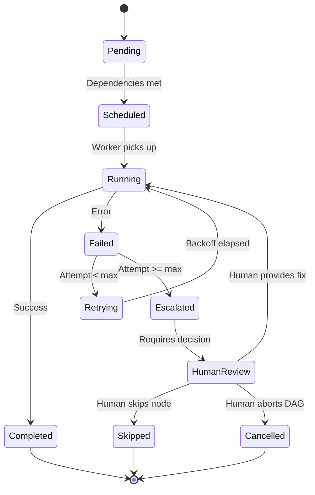

# Execution Engine Design

How to implement the DAG execution engine for winDAGs, covering process models, scheduling, failure handling, and mutation.

---

## Execution Model Comparison

| Model | Parallelism | Isolation | Overhead | Best For |
|-------|-------------|-----------|----------|----------|
| **Sequential** | None | None | Lowest | Debugging, simple chains |
| **Asyncio (Python)** | I/O-bound concurrent | None | Low | API-calling agents |
| **Promise.all (Node)** | I/O-bound concurrent | None | Low | API-calling agents |
| **Multiprocess** | True parallel (CPU) | Process-level | Medium | CPU-bound agents |
| **Docker containers** | True parallel | Full isolation | High | Untrusted code, security boundaries |
| **Worker pool + queue** | Distributed | Full | Highest | Web service deployment |

### For Local Execution

Use **asyncio** (Python) or **Promise.all** (Node.js) since agents are I/O-bound (waiting on LLM API calls):

```python
import asyncio
from collections import defaultdict

async def execute_dag(dag: dict) -> dict:
    """Execute a DAG with maximum parallelism."""
    nodes = {n['id']: n for n in dag['nodes']}
    edges = dag['edges']
    
    # Build dependency graph
    deps = defaultdict(set)  # node_id -> set of predecessor node_ids
    for edge in edges:
        deps[edge['to']].add(edge['from'])
    
    completed = {}
    in_progress = set()
    
    while len(completed) < len(nodes):
        # Find ready nodes (all deps completed)
        ready = [
            nid for nid, node_deps in deps.items()
            if nid not in completed
            and nid not in in_progress
            and node_deps.issubset(completed.keys())
        ]
        
        # Also include nodes with no deps that haven't started
        for nid in nodes:
            if nid not in completed and nid not in in_progress and nid not in deps:
                ready.append(nid)
        
        if not ready and in_progress:
            # Wait for in-progress nodes
            await asyncio.sleep(0.1)
            continue
        
        if not ready and not in_progress:
            raise RuntimeError("Deadlock: no ready nodes and none in progress")
        
        # Execute ready nodes concurrently
        tasks = {}
        for nid in ready:
            in_progress.add(nid)
            inputs = {dep: completed[dep] for dep in deps.get(nid, set())}
            tasks[nid] = asyncio.create_task(
                execute_node(nodes[nid], inputs)
            )
        
        # Wait for at least one to complete
        done, _ = await asyncio.wait(
            tasks.values(),
            return_when=asyncio.FIRST_COMPLETED
        )
        
        for task in done:
            nid = next(k for k, v in tasks.items() if v == task)
            in_progress.discard(nid)
            try:
                completed[nid] = task.result()
            except Exception as e:
                completed[nid] = handle_failure(nodes[nid], e)
    
    return completed
```

### For Web Service

Use a **worker pool with task queue** (Redis/RabbitMQ/SQS):

```
Client → API → Task Queue → Worker Pool → Result Store
                    ↓
              State Updates → WebSocket → Client Dashboard
```

Technologies:
- **Temporal** (Python/Go/Java/TS): **Recommended.** Most robust for durable agent workflows. Each DAG node is an Activity with automatic retries, heartbeats, and deterministic replay. Human-in-the-loop via Signals. Full implementation in `references/sdk-implementation.md`.
- **Celery** (Python): Mature, widely used, Redis/RabbitMQ backends. Simpler than Temporal but no durable replay.
- **Bull/BullMQ** (Node.js): Redis-backed, good for TypeScript. No durable replay.
- **Custom**: asyncio + Redis pubsub for lightweight deployments. Good for prototyping, not production.

---

## Topological Scheduling

### Kahn's Algorithm (Standard)

```python
from collections import deque

def topological_sort_parallel(nodes: list, edges: list) -> list[list[str]]:
    """Return nodes grouped into parallel execution batches."""
    in_degree = {n['id']: 0 for n in nodes}
    successors = defaultdict(list)
    
    for edge in edges:
        in_degree[edge['to']] += 1
        successors[edge['from']].append(edge['to'])
    
    queue = deque([nid for nid, deg in in_degree.items() if deg == 0])
    batches = []
    
    while queue:
        batch = list(queue)
        queue.clear()
        batches.append(batch)
        
        for nid in batch:
            for succ in successors[nid]:
                in_degree[succ] -= 1
                if in_degree[succ] == 0:
                    queue.append(succ)
    
    return batches
```

Each batch can execute fully in parallel. Batches execute sequentially.

### Priority Scheduling

When you have a cost/time budget, prioritize nodes by:
1. Critical path length (longest path to sink)
2. Fan-out degree (nodes that unblock the most successors)
3. Estimated cost (cheap nodes first to fail fast)

---

## Failure Handling

### Failure Response Matrix

| Failure Type | Default Action | Alternative Actions |
|-------------|---------------|-------------------|
| API timeout | Retry (up to 3x with backoff) | Skip, escalate |
| Model refused | Try different model | Rephrase prompt, escalate |
| Output contract violation | Retry with stricter prompt | Mutate node skills, escalate |
| Quality below threshold | Loop back with feedback | Add review node, escalate |
| Cost budget exceeded | Pause execution | Downgrade model, escalate |
| Circular dependency detected | Abort DAG | Remove offending edge |

### Retry Strategy

```python
async def execute_with_retry(node: dict, inputs: dict, max_retries: int = 3) -> dict:
    for attempt in range(max_retries + 1):
        try:
            result = await execute_node(node, inputs)
            validate_output(result, node['output']['schema'])
            return result
        except RetryableError as e:
            if attempt < max_retries:
                wait = 2 ** attempt  # exponential backoff
                await asyncio.sleep(wait)
                continue
            raise
        except NonRetryableError:
            raise
```

### DAG Mutation on Failure

When a node fails beyond retry limits:

```python
def mutate_dag_on_failure(dag: dict, failed_node: str, error: Exception) -> dict:
    """Modify the DAG to recover from a node failure."""
    new_dag = deep_copy(dag)
    node = find_node(new_dag, failed_node)
    
    if isinstance(error, OutputContractViolation):
        # Add a validator node between the failed node and its successors
        validator = create_validator_node(node)
        insert_node_after(new_dag, failed_node, validator)
    
    elif isinstance(error, QualityBelowThreshold):
        # Add a revision loop
        add_loop_edge(new_dag, failed_node, feedback=str(error))
    
    elif isinstance(error, ModelRefused):
        # Swap to a different model
        node['agent']['model'] = next_model(node['agent']['model'])
    
    elif isinstance(error, CostExceeded):
        # Downgrade remaining nodes to cheaper model
        for n in remaining_nodes(new_dag, failed_node):
            n['agent']['model'] = 'claude-haiku'
    
    return new_dag
```

---

## State Machine for Node Execution



---

## Cost Tracking

Every node should track:

```python
@dataclass
class NodeMetrics:
    input_tokens: int = 0
    output_tokens: int = 0
    total_cost_usd: float = 0.0
    duration_ms: int = 0
    retries: int = 0
    model_used: str = ""

@dataclass
class DAGMetrics:
    total_cost_usd: float = 0.0
    total_duration_ms: int = 0
    nodes_completed: int = 0
    nodes_failed: int = 0
    nodes_skipped: int = 0
    wall_clock_ms: int = 0  # Actual elapsed time (parallel execution)
    mutations_applied: int = 0
```

Display cost per-node and cumulative on the visualization dashboard.
