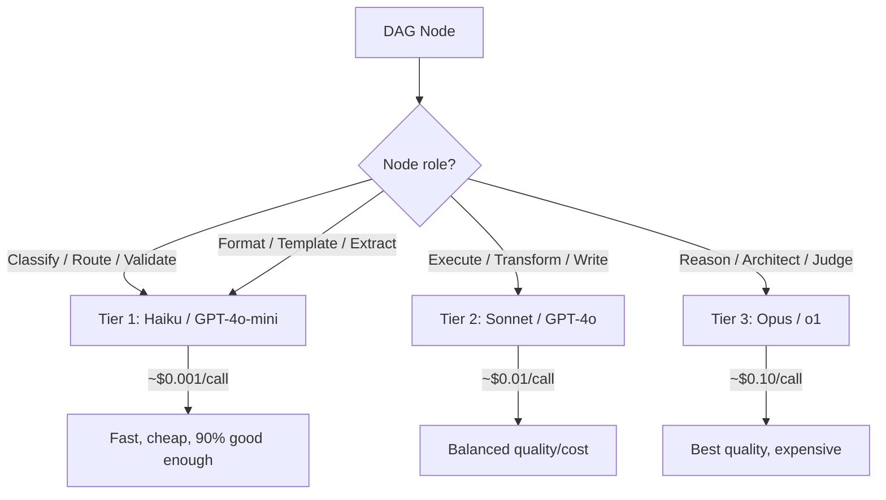
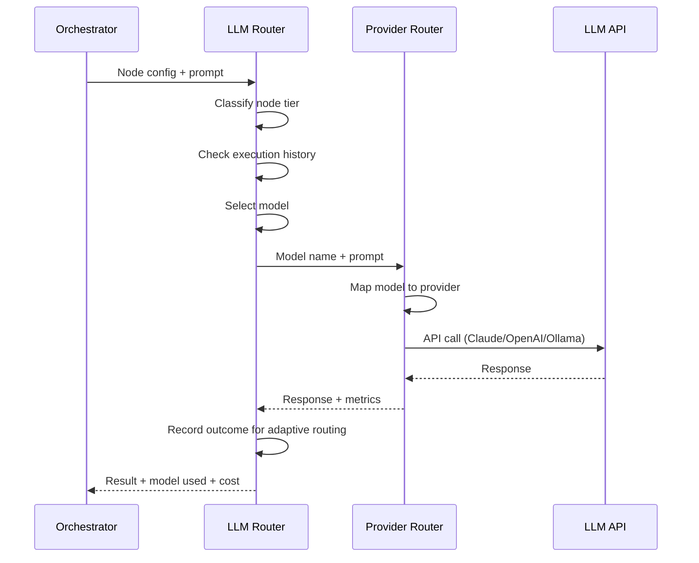

# LLM Routing: Choosing the Right Model Per DAG Node

How to decide which LLM (and which provider) to use for each node in a winDAGs execution. This is the single biggest cost lever — intelligent routing can cut costs 45-85% while maintaining 95%+ of top-model quality.

---

## The Problem

Powerful models (Claude Opus, GPT-4, o1) produce the best responses but cost 10-75x more than cheap models (Haiku, GPT-4o-mini, Llama-3-8B). In a 10-node DAG, if every node uses Sonnet, total cost might be $0.15. If you route 6 nodes to Haiku and keep 4 on Sonnet, cost drops to $0.07 — a 53% reduction with minimal quality loss, because those 6 nodes were doing simple classification, formatting, or validation work.

---

## Three Routing Approaches (From Research)

### 1. RouteLLM: Binary Strong/Weak Classification (Open Source)

UC Berkeley's approach: for each query, predict whether the "strong" model is needed, or the "weak" model suffices.

**How it works**: Train a classifier on human preference data (Chatbot Arena — hundreds of thousands of A/B comparisons). The classifier produces a probability score. A configurable threshold α converts it to a binary decision.

**Four classifier variants**:

| Router | Method | Best For |
|--------|--------|----------|
| **SW Ranking** | Embed query, cosine similarity to past successes, weighted Elo | Good general-purpose, fast |
| **Matrix Factorization** | Collaborative filtering on (query × model) matrix | Best transfer learning |
| **BERT Classifier** | Fine-tuned BERT predicting strong-model win probability | Most accurate |
| **Causal LLM** | Fine-tuned LM predicting better model | Leverages language understanding |

**Results**: 85% cost reduction on MT Bench, 45% on MMLU, 35% on GSM8K — while maintaining 95% of GPT-4 quality.

**For winDAGs**: Best starting point. Open source (MIT license). The binary framing maps cleanly to "use cheap model for this node vs. expensive model." Add the threshold α as a configurable parameter per DAG template.

```python
# RouteLLM integration for winDAGs
from routellm.controller import Controller

client = Controller(
    routers=["mf"],  # matrix factorization router
    strong_model="claude-sonnet-4.5",
    weak_model="claude-haiku-4.5",
)

async def route_and_execute(node: dict, prompt: str) -> dict:
    """Route to optimal model based on query complexity."""
    # RouteLLM decides: strong or weak?
    response = client.chat.completions.create(
        model="router-mf-0.11593",  # threshold baked into model name
        messages=[{"role": "user", "content": prompt}],
    )
    return response
```

### 2. Unify.ai: Neural Scoring with Quality/Speed/Cost Sliders

**How it works**: A BERT-like scoring model predicts response quality for each candidate LLM *without actually calling it*. Combines predicted quality with real-time cost and latency data (updated every few hours across all continents). Developers control weighting via sliders.

**Unique advantages**:
- Multi-model routing (not just binary strong/weak)
- Live cross-provider benchmarks (accounts for real-time provider performance)
- Custom router training on your own prompt data
- Quality/speed/cost sliders for tuning per use case

**For winDAGs**: Most developer-friendly for production. Use the unified API and tune per DAG template:
- Portfolio builder DAG: weight quality high (user-facing output)
- Codebase triage DAG: weight speed high (many quick classifications)
- Research synthesis DAG: weight quality high (accuracy matters)

### 3. Martian: Mechanistic Interpretability ("Model Mapping")

**How it works**: Converts LLMs from opaque weight matrices into interpretable representations. Embeds models into a vector space that preserves expected performance characteristics. Predicts how well a model handles a prompt without running it.

**Unique advantage**: Theoretically deepest understanding of model capabilities. Claims to outperform GPT-4 on 91.8% of OpenAI's own eval suite while reducing cost ~20%.

**For winDAGs**: Most ambitious but most proprietary. Consider as a future integration, not the starting point.

---

## winDAGs Routing Strategy

### Tier-Based Routing (Simple, Effective)

The simplest approach: classify each DAG node into a tier based on its role, and assign a model class.



### Node Role → Model Tier Mapping

| Node Role | Tier | Why | Example Models |
|-----------|------|-----|---------------|
| Task classifier | 1 (cheap) | Deterministic categorization | Haiku, GPT-4o-mini, Llama-3-8B |
| Input validator | 1 (cheap) | Schema checking, format validation | Haiku, GPT-4o-mini |
| Output formatter | 1 (cheap) | Structured output, templating | Haiku, GPT-4o-mini |
| Data extractor | 1 (cheap) | Pulling structured data from text | Haiku, GPT-4o-mini |
| Content writer | 2 (balanced) | Creative text, documentation | Sonnet, GPT-4o |
| Code implementer | 2 (balanced) | Writing/modifying code | Sonnet, GPT-4o |
| Code reviewer | 2 (balanced) | Analyzing diffs, finding bugs | Sonnet, GPT-4o |
| Research synthesizer | 2 (balanced) | Combining multiple sources | Sonnet, GPT-4o |
| Problem decomposer | 3 (premium) | Breaking ambiguous problems into sub-tasks | Opus, o1 |
| Architecture designer | 3 (premium) | System design, complex reasoning | Opus, o1 |
| Quality evaluator | 3 (premium) | Judging output quality, meta-reasoning | Opus, o1 |
| DAG architect (meta) | 3 (premium) | Designing the DAG itself | Opus, o1 |

### Adaptive Routing (Advanced)

Start with tier-based routing, then adapt based on execution history:

```python
class AdaptiveRouter:
    """Starts with tier-based routing, adapts from execution history."""
    
    def __init__(self):
        self.tier_defaults = {
            'classify': 'haiku',
            'validate': 'haiku',
            'format': 'haiku',
            'write': 'sonnet',
            'implement': 'sonnet',
            'review': 'sonnet',
            'reason': 'opus',
            'architect': 'opus',
        }
        self.history: list[dict] = []
    
    def route(self, node: dict) -> str:
        """Select model for a DAG node."""
        role = node['agent']['role_type']
        
        # Check history: has this node type failed on cheaper models?
        past_failures = [
            h for h in self.history
            if h['role_type'] == role and h['status'] == 'failed'
        ]
        past_successes = [
            h for h in self.history
            if h['role_type'] == role and h['status'] == 'completed'
        ]
        
        default_model = self.tier_defaults.get(role, 'sonnet')
        
        # If cheap model failed on this role type, upgrade
        if past_failures and all(f['model'] == default_model for f in past_failures):
            return self._upgrade(default_model)
        
        # If expensive model consistently succeeds, try downgrading
        if len(past_successes) > 5 and all(s['model'] == default_model for s in past_successes):
            downgraded = self._downgrade(default_model)
            if downgraded:
                return downgraded
        
        return default_model
    
    def _upgrade(self, model: str) -> str:
        upgrades = {'haiku': 'sonnet', 'sonnet': 'opus'}
        return upgrades.get(model, model)
    
    def _downgrade(self, model: str) -> str | None:
        downgrades = {'opus': 'sonnet', 'sonnet': 'haiku'}
        return downgrades.get(model)
    
    def record(self, role_type: str, model: str, status: str, quality: float):
        self.history.append({
            'role_type': role_type,
            'model': model,
            'status': status,
            'quality': quality,
        })
```

### Cascading Router (Try Cheap First)

For nodes where you're unsure, try the cheap model first and escalate only if quality is below threshold:

```python
async def cascading_execute(node: dict, inputs: dict, quality_threshold: float = 0.7) -> dict:
    """Try cheap model first, escalate to expensive if quality is low."""
    
    # Try Haiku first
    cheap_result = await execute_with_model(node, inputs, model='haiku')
    
    # Quick quality check (also using Haiku — costs ~$0.001)
    quality = await quick_quality_score(cheap_result, node['output']['schema'])
    
    if quality >= quality_threshold:
        return cheap_result  # Good enough! Saved $0.009
    
    # Escalate to Sonnet
    return await execute_with_model(node, inputs, model='sonnet')
```

**Trade-off**: Cascading adds latency (~1s for the cheap attempt + quality check) but can save 50-80% on nodes where the cheap model succeeds. Best for nodes where you're genuinely unsure which tier is needed.

---

## Cost Model

### Per-Call Costs (Early 2026 Pricing)

| Model | Input (per 1M tokens) | Output (per 1M tokens) | Typical node cost |
|-------|----------------------|------------------------|-------------------|
| Claude Haiku 3.5 | $0.80 | $4.00 | ~$0.001 |
| Claude Sonnet 4 | $3.00 | $15.00 | ~$0.01 |
| Claude Opus 4 | $15.00 | $75.00 | ~$0.10 |
| GPT-4o-mini | $0.15 | $0.60 | ~$0.0005 |
| GPT-4o | $2.50 | $10.00 | ~$0.008 |
| o1 | $15.00 | $60.00 | ~$0.08 |
| Llama 3 70B (local) | Free | Free | ~$0.00 |

### Example: 10-Node DAG Cost Comparison

| Strategy | Node Model Mix | Total Cost |
|----------|---------------|------------|
| All Opus | 10× Opus | $1.00 |
| All Sonnet | 10× Sonnet | $0.10 |
| Tier-based | 4× Haiku + 4× Sonnet + 2× Opus | $0.24 |
| Tier-based + cascading | 6× Haiku + 3× Sonnet + 1× Opus | $0.14 |
| RouteLLM (α=0.7) | Dynamic | ~$0.08 |

Intelligent routing saves 76-92% compared to "always use the best model."

---

## Integration with winDAGs

### Where Routing Happens



### Router as a Preloaded Skill

The LLM Router itself can be encoded as a skill attached to the orchestrator agent:

```yaml
# In the orchestrator's skill config
skills:
  preloaded:
    - llm-router  # Decides model per node
    - task-decomposer  # Breaks problems into sub-tasks
    - output-contract-enforcer  # Validates node outputs
```

The skill encodes the tier mapping, the adaptive history pattern, and the cascading logic as the orchestrator's standard operating procedure for model selection.

---

## Recommendations

### Phase 1 (Now): Tier-Based Static Routing
Assign model tiers by node role. Simple, predictable, no infrastructure needed. Gets you 60-70% of the cost savings.

### Phase 2 (After First 100 DAG Runs): Adaptive Routing
Record execution history. Let the router learn which roles succeed on cheaper models and which need upgrades. Gets you to 75-85% savings.

### Phase 3 (At Scale): RouteLLM Integration
Integrate RouteLLM's matrix factorization router for per-query dynamic routing. Train on your own DAG execution data. Gets you to 85-92% savings.

### Phase 4 (Optional): Unify.ai or Custom Neural Router
If you need multi-provider routing with live benchmark data and domain-specific custom training. Only worth it at high volume (>10K DAG executions/month).
