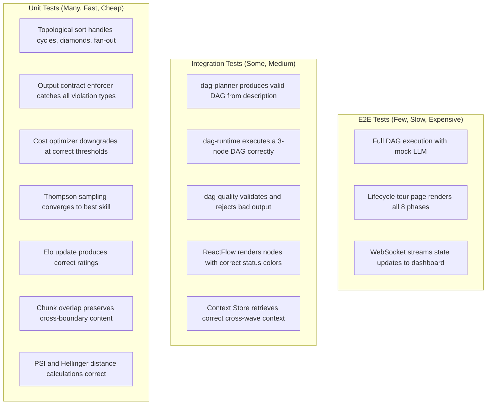

# winDAGs Observability, Testing, and Debugging

The complete plan for making winDAGs trustworthy: telemetry that catches problems before users do, tests that prove correctness at every layer, debugging tools that show the truth, and dashboards that don't lie.

---

## Design Philosophy

The distill.py bug — errors silently swallowed, wrong model IDs unreported — is the exact failure mode this plan prevents. The core principle:

**Every operation must be observable, every failure must be loud, and every assumption must be tested.**

Three rules:
1. **No silent failures.** Every error prints immediately, with context. Suppressed errors are bugs in the infrastructure, not features.
2. **Telemetry before features.** Instrument first, build second. If you can't measure it, you can't trust it.
3. **Tests prove contracts.** Every interface between components has tests that prove inputs and outputs match their schemas.

---

## The Five Layers of Observability

```mermaid
flowchart TD
  subgraph "Layer 1: Agent Telemetry"
    AT[Token usage, latency, cost per call]
    AM[Model ID, skill loaded, prompt size]
    AQ[Self-eval score, contract compliance]
  end
  
  subgraph "Layer 2: DAG Execution Telemetry"
    DT[Node state transitions with timestamps]
    DW[Wave timing, parallelism achieved]
    DC[Cumulative cost, budget remaining]
    DM[Mutations applied, retries, escalations]
  end
  
  subgraph "Layer 3: Skill Lifecycle Telemetry"
    SE[Elo changes per execution]
    SD[Drift detection signals (PSI, Hellinger)]
    ST[Thompson sampling draws and outcomes]
  end
  
  subgraph "Layer 4: Infrastructure Telemetry"
    IT[API latency, error rates, rate limits]
    IW[WebSocket connection health]
    IQ[Task queue depth, worker utilization]
  end
  
  subgraph "Layer 5: User Experience Telemetry"
    UH[Human gate response times]
    UT[Template selection patterns]
    UC[Cost satisfaction (actual vs estimated)]
  end
```

---

## Layer 1: Agent Telemetry

Every LLM call produces a structured trace event:

```typescript
interface AgentTraceEvent {
  // Identity
  dag_id: string;
  node_id: string;
  execution_id: string;
  timestamp: number;
  
  // Model
  model_requested: string;   // What we asked for
  model_actual: string;      // What the API returned (may differ)
  model_tier: 1 | 2 | 3;
  
  // Skill
  skills_loaded: string[];
  skill_tokens: number;      // How many tokens the skill consumed
  
  // Performance
  input_tokens: number;
  output_tokens: number;
  thinking_tokens: number;   // Extended thinking, if used
  latency_ms: number;
  time_to_first_token_ms: number;
  
  // Cost
  cost_usd: number;
  cost_breakdown: {
    input: number;
    output: number;
    thinking: number;
  };
  
  // Quality
  output_contract_valid: boolean;
  self_eval_score: number | null;
  
  // Errors
  error: string | null;
  error_type: 'none' | 'timeout' | 'rate_limit' | 'model_refused' | 
              'contract_violation' | 'api_error' | 'unknown';
  retry_count: number;
}
```

### What to alert on

| Signal | Threshold | Action |
|--------|-----------|--------|
| Error rate > 10% across last 20 calls | Warning | Check model availability, rate limits |
| Average latency > 10s | Warning | Check model load, consider downgrade |
| Contract violation rate > 5% | Critical | Skill's output format may be wrong |
| Cost per node > 3x historical average | Warning | Prompt may be bloated or retrying |
| Self-eval diverges from downstream eval by > 0.3 | Info | Sycophancy drift detected |

---

## Layer 2: DAG Execution Telemetry

```typescript
interface DAGExecutionTrace {
  dag_id: string;
  template_name: string;
  template_version: string;
  execution_id: string;
  
  // Timeline
  started_at: number;
  completed_at: number | null;
  wall_clock_ms: number;
  
  // Nodes
  total_nodes: number;
  completed_nodes: number;
  failed_nodes: number;
  skipped_nodes: number;
  
  // Waves
  waves: {
    wave_number: number;
    nodes: string[];
    parallelism: number;       // How many ran concurrently
    max_parallelism: number;   // How many could have
    duration_ms: number;
  }[];
  
  // Cost
  total_cost_usd: number;
  budget_usd: number;
  cost_by_tier: { tier1: number; tier2: number; tier3: number };
  
  // Mutations
  mutations_applied: number;
  mutation_log: { type: string; node_id: string; reason: string; timestamp: number }[];
  
  // Quality
  overall_quality_score: number;
  human_gates_passed: number;
  human_gates_rejected: number;
  
  // Outcome
  status: 'completed' | 'failed' | 'cancelled' | 'timeout';
  final_error: string | null;
}
```

### DAG-Level Dashboard Widgets

**Execution Timeline (Gantt)**
- X-axis: wall-clock time
- Rows: one per node
- Colors: pending (gray) → running (blue, animated) → completed (green) → failed (red)
- Shows parallelism visually: concurrent nodes overlap horizontally
- Shows where time is spent: long bars = bottlenecks

**Cost Waterfall**
- Stacked bar per node showing cost contribution
- Color by model tier (Haiku=light, Sonnet=medium, Opus=dark)
- Running total line overlay
- Budget line with "remaining" annotation

**Quality Funnel**
- Shows how many nodes passed each quality gate:
  Schema validation → Content validation → Confidence threshold → Downstream acceptance
- Drop-off at each stage reveals where quality degrades

---

## Layer 3: Skill Lifecycle Telemetry

```typescript
interface SkillMetricsSnapshot {
  skill_name: string;
  domain: string;
  period: 'hourly' | 'daily' | 'weekly';
  timestamp: number;
  
  // Volume
  executions: number;
  
  // Quality
  avg_quality_score: number;
  downstream_acceptance_rate: number;
  contract_compliance_rate: number;
  
  // Efficiency
  avg_tokens_used: number;
  avg_cost_per_use: number;
  pct_haiku_success: number;  // Can it work on cheap models?
  
  // Ranking
  elo: number;
  elo_delta: number;          // Change since last period
  thompson_alpha: number;
  thompson_beta: number;
  
  // Drift
  psi_score: number;          // Population Stability Index
  hellinger_distance: number;
  drift_status: 'stable' | 'warning' | 'crisis';
}
```

### Skill Health Dashboard

**Leaderboard View**
```
Domain: Code Review                        Period: Last 30 days
━━━━━━━━━━━━━━━━━━━━━━━━━━━━━━━━━━━━━━━━━━━━━━━━━━━━━━━━━━━
#  Skill                    Elo    Δ    Accept%  Haiku%  Cost
1  code-review-skill       1847  +12    94%      62%    $0.008
2  react-server-comp       1723   +5    89%      31%    $0.012
3  typescript-strict       1698   -3    85%      78%    $0.004
4  testing-patterns        1612  -18    72%      45%    $0.009  ⚠️
━━━━━━━━━━━━━━━━━━━━━━━━━━━━━━━━━━━━━━━━━━━━━━━━━━━━━━━━━━━
```

**Drift Monitor**
- Sparkline per skill showing Elo trend (last 90 days)
- PSI heatmap: green (stable) → yellow (warning) → red (crisis)
- Alert badges for skills entering "Declining" or "Challenged" lifecycle states

---

## Layer 4: Infrastructure Telemetry

### API Health

| Metric | Source | Alert |
|--------|--------|-------|
| Claude API latency p50/p95/p99 | Each call's `latency_ms` | p95 > 15s |
| Rate limit hits | 429 response codes | Any in 5-minute window |
| API error rate | 5xx responses | > 1% in 10 minutes |
| WebSocket disconnection rate | `onclose` events | > 3 in 1 minute |
| Task queue depth | Queue size metric | > 100 pending tasks |
| Worker utilization | Active/total workers | > 90% sustained |

### Health Check Endpoints

```
GET /health              → {"status": "ok", "uptime": 3600}
GET /health/api          → {"claude": "ok", "openai": "ok", "latency_ms": 234}
GET /health/queue        → {"depth": 12, "workers": 4, "active": 3}
GET /health/websocket    → {"connections": 47, "rooms": 12}
```

---

## Layer 5: User Experience Telemetry

| Metric | What It Reveals |
|--------|----------------|
| Time from problem input to first node completion | Is decomposition too slow? |
| Human gate response time | Are we presenting too much/little info? |
| Human gate rejection rate | Are agents producing bad output? |
| Cost actual vs. estimated | Are our estimates calibrated? |
| Template re-use rate | Which templates are sticky? |
| Session abandonment point | Where do users give up? |

---

## Testing Strategy

### Test Pyramid



### Contract Tests (The Glue)

Every interface between components has a contract test:

```typescript
// dag-planner output → dag-runtime input
test('planner output satisfies runtime input contract', () => {
  const dag = dagPlanner.plan("Build a portfolio website");
  
  // Structure
  expect(dag.nodes).toBeInstanceOf(Map);
  expect(dag.edges).toBeInstanceOf(Map);
  expect(dag.config).toBeDefined();
  
  // Every node has required fields
  for (const [id, node] of dag.nodes) {
    expect(node.id).toBeTruthy();
    expect(node.type).toMatch(/^(agent|vague|human-gate)$/);
    expect(node.dependencies).toBeInstanceOf(Array);
  }
  
  // DAG is acyclic
  expect(() => topologicalSort(dag)).not.toThrow();
  
  // Edges reference existing nodes
  for (const [from, tos] of dag.edges) {
    expect(dag.nodes.has(from)).toBe(true);
    for (const to of tos) {
      expect(dag.nodes.has(to)).toBe(true);
    }
  }
});

// Node output → downstream node input
test('node output satisfies downstream input contract', () => {
  const output = { status: 'pass', summary: 'Analysis complete', data: { ... } };
  const schema = downstreamNode.inputSchema;
  
  const validation = outputContractEnforcer.validate(output, schema);
  expect(validation.valid).toBe(true);
  expect(validation.errors).toHaveLength(0);
});
```

### Mock LLM for Testing

Don't call real APIs in tests. Use a deterministic mock:

```typescript
class MockLLMProvider implements LLMProvider {
  private responses: Map<string, string> = new Map();
  
  // Pre-program responses by prompt substring
  whenPromptContains(substring: string, response: string) {
    this.responses.set(substring, response);
  }
  
  async complete(system, messages, model, maxTokens) {
    const prompt = messages.map(m => m.content).join(' ');
    
    for (const [substring, response] of this.responses) {
      if (prompt.includes(substring)) {
        return {
          content: response,
          model,
          input_tokens: prompt.length / 4,
          output_tokens: response.length / 4,
          cost_usd: 0,
        };
      }
    }
    
    // Default: return a valid but minimal response
    return {
      content: JSON.stringify({ status: 'pass', summary: 'Mock response' }),
      model,
      input_tokens: 100,
      output_tokens: 50,
      cost_usd: 0,
    };
  }
}
```

### Playwright E2E Tests for the Dashboard

```typescript
// Lifecycle tour renders all phases
test('lifecycle tour shows all 8 phases', async ({ page }) => {
  await page.goto('/dag/lifecycle');
  
  // All phase buttons visible
  for (let i = 1; i <= 8; i++) {
    await expect(page.locator(`button:has-text("${i}.")`)).toBeVisible();
  }
  
  // Click through each phase
  for (let i = 1; i <= 8; i++) {
    await page.click(`button:has-text("${i}.")`);
    await page.waitForTimeout(500);
    
    // DAG canvas rendered
    await expect(page.locator('canvas')).toBeVisible();
    
    // Cost ticker updated
    const cost = await page.locator('text=$').textContent();
    expect(cost).toBeTruthy();
  }
});

// WebSocket state updates reach the dashboard
test('node state changes reflect in visualization', async ({ page }) => {
  await page.goto('/dag/monitor');
  
  // Simulate a WebSocket message
  await page.evaluate(() => {
    window.postMessage({
      type: 'node_state',
      node_id: 'research',
      status: 'completed',
    }, '*');
  });
  
  // Verify the node visually changed
  // (specific assertion depends on rendering implementation)
});
```

---

## Debugging Tools

### 1. DAG Replay Debugger (Skill: dag-replay-debugger)

Time-travel through any completed execution:
- Inspect any node's full state (inputs, system prompt, output, evaluator scores)
- Replay from any checkpoint with modified inputs, skills, or models
- Execution diff: compare two traces side-by-side to find where they diverged

### 2. Agent Trace Inspector

For live debugging during development:

```typescript
// Enable verbose tracing
const tracer = new AgentTracer({ verbose: true });

tracer.on('call_start', (event) => {
  console.log(`🔵 ${event.node_id} → ${event.model} (${event.skills_loaded.join(', ')})`);
  console.log(`   Prompt: ${event.input_tokens} tokens`);
});

tracer.on('call_complete', (event) => {
  console.log(`🟢 ${event.node_id} completed in ${event.latency_ms}ms ($${event.cost_usd.toFixed(4)})`);
  console.log(`   Contract valid: ${event.output_contract_valid}`);
});

tracer.on('call_error', (event) => {
  console.error(`🔴 ${event.node_id} FAILED: ${event.error}`);
  console.error(`   Type: ${event.error_type}, Retry: ${event.retry_count}`);
  // ALWAYS print errors immediately. Never swallow them.
});
```

### 3. Cost Audit Trail

Every dollar spent is traceable:

```
Execution: dag-abc123 | Portfolio Builder v2.1
────────────────────────────────────────────────
Node            Model              Tokens    Cost
────────────────────────────────────────────────
interview       sonnet-4.5         3,421    $0.020
research        haiku-4.5            812    $0.001
content         sonnet-4.5         2,876    $0.018
design          sonnet-4.5         3,102    $0.020
build           sonnet-4.5         5,448    $0.040
review          (human gate)           0    $0.000
deploy          haiku-4.5            345    $0.001
────────────────────────────────────────────────
Total                             16,004    $0.100
Budget                                      $0.250
Savings vs all-Sonnet                       $0.060 (38%)
```

---

## Dashboard Wireframes

### Main Dashboard: DAG Execution Monitor

```
┌─────────────────────────────────────────────────────────────────────┐
│  winDAGs                                          [User] [Settings]│
├────────┬────────────────────────────────────────────────────────────┤
│        │  Portfolio Builder v2.1                    Status: Running │
│ Recent │  ┌─────────────────────────────────────────────────────┐  │
│ Runs   │  │                                                     │  │
│        │  │          ┌──────┐   ┌──────┐                       │  │
│ ✓ #47  │  │  ┌────┐  │Resrch│   │Design│  ┌─────┐  ┌────┐    │  │
│ ✓ #46  │  │  │Intv│──│ ✓    │──▸│ ●●●  │─▸│Build│─▸│Revw│    │  │
│ ✗ #45  │  │  │ ✓  │  └──────┘   └──────┘  │     │  │    │    │  │
│ ✓ #44  │  │  └────┘  ┌──────┐              └─────┘  └────┘    │  │
│        │  │          │Contnt│                                   │  │
│        │  │          │ ✓    │                                   │  │
│        │  │          └──────┘                                   │  │
│        │  └─────────────────────────────────────────────────────┘  │
│        │                                                            │
│        │  Cost: $0.059 / $0.250          Time: 12s elapsed          │
│        │  ████████░░░░░░░░░░░░  24%      Wave 3/5                  │
│        │                                                            │
│        │  ┌─ Timeline ──────────────────────────────────────────┐  │
│        │  │ interview  ████████                                 │  │
│        │  │ research   ░░░░░░░░████                             │  │
│        │  │ content    ░░░░░░░░████████                         │  │
│        │  │ design     ░░░░░░░░░░░░░░░░●●●●                    │  │
│        │  │ build      ░░░░░░░░░░░░░░░░░░░░░░░░                │  │
│        │  │ review     ░░░░░░░░░░░░░░░░░░░░░░░░                │  │
│        │  │ deploy     ░░░░░░░░░░░░░░░░░░░░░░░░                │  │
│        │  └─────────────────────────────────────────────────────┘  │
└────────┴────────────────────────────────────────────────────────────┘
```

Legend: ✓ = completed (green), ●●● = running (blue pulse), ░ = pending, ✗ = failed (red)

### Node Detail Panel (Click on a node)

```
┌─────────────────────────────────────────────────┐
│  Node: design                       Status: 🔵  │
├─────────────────────────────────────────────────┤
│  Model: claude-sonnet-4.5                       │
│  Skills: vibe-matcher, design-system-generator  │
│  Duration: 4.2s | Cost: $0.020                  │
│  Tokens: 3,102 in / 1,847 out                  │
│                                                 │
│  ▸ Input (from research + content)    [Expand]  │
│  ▸ System Prompt (3,421 tokens)       [Expand]  │
│  ▸ Output                             [Expand]  │
│  ▸ Evaluator Scores                   [Expand]  │
│    Self: 0.85  Peer: —  Downstream: pending     │
│                                                 │
│  [Replay]  [Edit & Replay]  [View Trace]        │
└─────────────────────────────────────────────────┘
```

### Skill Health Dashboard

```
┌─────────────────────────────────────────────────────────────────────┐
│  Skill Health Monitor                              Period: 30 days │
├─────────────────────────────────────────────────────────────────────┤
│                                                                     │
│  Domain: Code Review                                                │
│  ┌─────────────────────────────────────────────────────────────┐   │
│  │ #  Skill                  Elo   Trend   Accept  Drift       │   │
│  │ 1  code-review-skill     1847  ▁▂▃▄▅▆  94%     ● stable   │   │
│  │ 2  react-server-comp     1723  ▁▂▃▃▄▅  89%     ● stable   │   │
│  │ 3  typescript-strict     1698  ▅▄▃▃▃▂  85%     ◐ warning  │   │
│  │ 4  testing-patterns      1612  ▆▅▄▃▂▁  72%     ○ crisis   │   │
│  └─────────────────────────────────────────────────────────────┘   │
│                                                                     │
│  Alerts:                                                            │
│  ⚠  testing-patterns: PSI=0.28 (crisis threshold). Elo -18 in     │
│     30 days. Consider: improve or find replacement.                 │
│                                                                     │
│  Thompson Sampling Distribution:                                    │
│  ┌─────────────────────────────────────────────────────────────┐   │
│  │  code-review ██████████████████████████████████  68%        │   │
│  │  react-srv   █████████████████                   22%        │   │
│  │  ts-strict   █████                                8%        │   │
│  │  testing     ██                                   2%        │   │
│  └─────────────────────────────────────────────────────────────┘   │
│  Traffic allocation reflects Thompson sampling posteriors.          │
└─────────────────────────────────────────────────────────────────────┘
```

### Cost Explorer

```
┌─────────────────────────────────────────────────────────────────────┐
│  Cost Explorer                                    Last 7 days      │
├─────────────────────────────────────────────────────────────────────┤
│                                                                     │
│  Daily Spend                                                        │
│  $0.80 │     ╭─╮                                                   │
│  $0.60 │  ╭──╯ ╰──╮        ╭──╮                                   │
│  $0.40 │──╯        ╰──╮ ╭──╯  ╰──╮                                │
│  $0.20 │              ╰─╯        ╰──                               │
│  $0.00 ├───┬───┬───┬───┬───┬───┬───                               │
│         Mon Tue Wed Thu Fri Sat Sun                                 │
│                                                                     │
│  By Model Tier                    By Template                       │
│  ┌─────────────────────┐         ┌─────────────────────────┐      │
│  │ Haiku   ██  12%     │         │ Portfolio    ████  35%  │      │
│  │ Sonnet  ████████ 71%│         │ Refactor     ███   22%  │      │
│  │ Opus    ██  17%     │         │ PR Review    ██    15%  │      │
│  └─────────────────────┘         │ Research     ██    12%  │      │
│                                  │ Other        ██    16%  │      │
│  Savings: $4.20 vs all-Opus     └─────────────────────────┘      │
│  Routing efficiency: 84%                                           │
└─────────────────────────────────────────────────────────────────────┘
```

---

## Data Visualization Design Principles

Drawing from `data-viz-2025`, `reactive-dashboard-performance`, and Tufte:

### 1. Maximize Data-Ink Ratio

Every pixel should encode information. No chartjunk, no decorative borders, no 3D effects on 2D data. The Win31 aesthetic helps here — it's naturally low-decoration.

### 2. Small Multiples Over Complex Charts

Instead of one overcrowded DAG visualization for 20 nodes, show small multiples: one per wave, each clean and simple. Let the user drill into detail.

### 3. Color Encodes Status, Not Decoration

The 9-color status vocabulary (pending=gray, running=blue, completed=green, failed=red, retrying=orange, paused=purple, skipped=dimgray, mutated=yellow, scheduled=light blue) is the ONLY color language. Everything else is grayscale.

### 4. Animation Encodes Liveness

- Pulsing = running (the system is actively working)
- Dashed animation = data flowing along an edge
- Glow fade-in = just completed
- Shake = just failed

Animation means "something is happening now." Static means "this is settled."

### 5. Progressive Disclosure in Dashboards Too

- **Overview**: DAG graph with colored nodes (status at a glance)
- **Click node**: Detail panel (model, skills, timing, cost)
- **Expand section**: Full inputs/outputs, system prompt, evaluator scores
- **Replay**: Time-travel into the execution

Don't show everything at once. Let curiosity pull the user deeper.

### 6. Sparklines for Trends

Elo trends, cost trends, quality trends — all as inline sparklines in tables. Edward Tufte's invention. Maximum information in minimum space. No axis labels needed; the trend direction and shape are what matter.

### 7. Honest Axes

- Cost axes start at $0.00, not at the minimum value
- Percentage axes go 0-100%, not 70-100% (which would exaggerate small differences)
- Time axes are linear, not compressed

Dashboards that lie about scale create false confidence.
