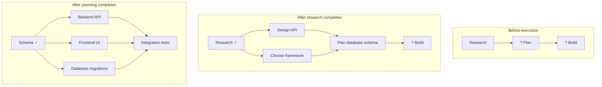
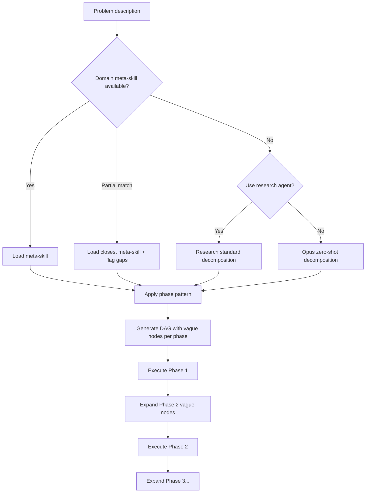

# Progressive DAG Revelation: Controlled Ignorance and Domain Meta-Skills

How winDAGs handles problems where the full DAG can't be known upfront — where Phase N's structure only becomes clear after executing Phases 1 through N-1. Includes the technical machinery for vague nodes, sub-DAG expansion, cross-wave context management, and domain-specific meta-skills that teach the orchestrator how to decompose problems in unfamiliar domains.

---

## The Problem: You Can't Plan What You Don't Understand

A staff software engineer knows that a large project unfolds in phases: research → brainstorm → plan → prioritize → build → polish → dogfood → launch → iterate. They know Phase 3 (plan) can't be specified until Phase 1 (research) produces findings. They know Phase 5 (build) might fork into parallel tracks based on Phase 4 (prioritize).

But a bridge designer knows a different unfolding: site survey → geotechnical analysis → load calculation → structural design → materials selection → construction sequencing → inspection protocol. The phases, their ordering, and their dependencies are domain-specific knowledge.

winDAGs must handle both cases — and every domain it doesn't yet know about.

---

## Vague Nodes: Placeholders for Unknown Future Work

### The `?` Node Type

A DAG can contain **vague nodes** — placeholders that represent work the system knows must happen but can't yet specify. A vague node has:

- A **role description** (what kind of work, approximately)
- A **dependency list** (which upstream nodes must complete first)
- **No specific agent, skills, or output contract** (these are determined later)

```yaml
nodes:
  - id: research
    type: agent
    agent: { role: "Research the problem space", skills: [research-analyst] }
    
  - id: plan-from-research
    type: vague                        # ← Placeholder
    description: "Plan the implementation approach based on research findings"
    depends_on: [research]
    expansion_trigger: on_upstream_complete
    
  - id: build
    type: vague
    description: "Build the solution"
    depends_on: [plan-from-research]
    expansion_trigger: on_upstream_complete
```

### Expansion: Vague Nodes Become Sub-DAGs

When a vague node's upstream dependencies complete, the **DAG Expander** (a meta-agent in the orchestrator) inspects the upstream outputs and converts the vague node into a concrete sub-DAG.



### The Expansion Algorithm

```python
async def expand_vague_node(
    dag: DAG,
    vague_node_id: str,
    upstream_outputs: dict[str, Any],
    all_context: ContextStore,
) -> list[Node]:
    """Convert a vague node into a concrete sub-DAG based on upstream results."""
    
    vague = dag.get_node(vague_node_id)
    
    # Gather context: upstream outputs + global DAG context
    context = all_context.get_relevant_context(
        for_node=vague_node_id,
        include_waves=list(range(1, vague.wave + 1)),  # Waves 1..N-1
    )
    
    # Select the appropriate domain meta-skill (see below)
    meta_skill = select_domain_meta_skill(vague.description, context)
    
    # The DAG Expander agent decomposes the vague node
    expansion = await execute_with_model(
        model='claude-sonnet-4.5',
        system=build_expander_prompt(meta_skill, context),
        prompt=f"""
        This vague node must now be expanded into concrete sub-tasks.
        
        Vague node: {vague.description}
        Upstream outputs available:
        {json.dumps({k: summarize(v) for k, v in upstream_outputs.items()})}
        
        Produce a sub-DAG: a list of concrete nodes with agents, skills,
        dependencies (among themselves and on upstream nodes), and
        output contracts. Each node must be specific enough to execute.
        
        If any sub-tasks are still too vague to specify, mark them as
        type: vague with their own expansion_trigger.
        """,
    )
    
    sub_nodes = parse_sub_dag(expansion)
    
    # Rewire: replace the vague node with the sub-DAG in the parent DAG
    dag.replace_node_with_subdag(vague_node_id, sub_nodes)
    
    return sub_nodes
```

### Implementation Patterns from Workflow Orchestrators

The vague-node expansion pattern maps to proven production mechanisms:

- **Temporal**: Dynamic child workflows via imperative code. A workflow spawns children in a loop whose count and shape are determined at runtime. Each child gets its own event history for durability. For very large fan-outs (>2K children), use continue-as-new to checkpoint progress and reset the event history. winDAGs' vague node expansion maps directly to Temporal's child workflow pattern.
- **Prefect**: `task.map()` over iterables — spawns one task run per element at runtime. Returns `PrefectFutureList` for downstream dependencies. Good for data-parallel fan-outs but limited for arbitrary DAG shapes (all mapped tasks share the same dependency structure).
- **Dagster**: `DynamicPartitionsDefinition` — partition keys added at runtime via sensors. Declarative and incremental (you declare that new partitions exist; Dagster materializes them). Best when dynamic work maps to data partitions, not arbitrary agent tasks.

**winDAGs synthesis**: Use Temporal's child workflow model for the execution engine (full durability, arbitrary DAG shapes). Use Dagster's partition model as inspiration for template DAGs with parameterized slots. Use Prefect's `.map()` as the ergonomic API for simple fan-out nodes.

### Recursive Expansion

Vague nodes can expand into sub-DAGs that themselves contain vague nodes. This is how the system handles arbitrary depth of unknown structure:

```
Initial DAG: [Research] → [? Plan] → [? Build] → [? Launch]

After Research:
  [Research ✓] → [Design API, Choose Stack] → [? Build] → [? Launch]

After Design + Choose:
  [Design ✓] → [Backend, Frontend, DB] → [? QA] → [? Launch]

After Build:
  [Build ✓] → [Unit Tests, Integration Tests, Load Test] → [? Launch]

After QA:
  [QA ✓] → [Staging Deploy, Smoke Test, User Review] → [Production Deploy]
```

Each expansion adds specificity. The system never plans further ahead than its current knowledge allows. This is **controlled ignorance** — the DAG unfolds as understanding grows.

---

## Context Management: Who Knows What and When

### The Context Store

Every DAG execution maintains a **Context Store** — a structured log of what each node produced, what it depended on, and why it's valuable to downstream nodes.

```python
@dataclass
class ContextEntry:
    node_id: str
    wave: int                         # Which execution wave this node ran in
    role: str                         # What this node's job was
    output_summary: str               # Compressed summary (not full output)
    output_full: Any                  # Full output (loaded on demand)
    dependencies_used: list[str]      # Which upstream nodes it consumed
    relevance_tags: list[str]         # Domain tags for filtering
    token_cost_if_loaded: int         # How many tokens the full output would consume

class ContextStore:
    entries: dict[str, ContextEntry]  # node_id → entry
    
    def get_relevant_context(
        self,
        for_node: str,
        include_waves: list[int],
        max_tokens: int = 8000,
    ) -> str:
        """Build a context window for a downstream node."""
        
        # Filter: only entries from requested waves
        candidates = [e for e in self.entries.values() if e.wave in include_waves]
        
        # Rank by relevance to the requesting node
        ranked = rank_by_relevance(candidates, for_node)
        
        # Pack into token budget: summaries first, full outputs only if budget allows
        context_parts = []
        tokens_used = 0
        
        for entry in ranked:
            summary_tokens = count_tokens(entry.output_summary)
            if tokens_used + summary_tokens <= max_tokens:
                context_parts.append(
                    f"[Wave {entry.wave}] {entry.role}: {entry.output_summary}"
                )
                tokens_used += summary_tokens
        
        return "\n\n".join(context_parts)
```

### Who Manages Context?

The orchestrator maintains the Context Store with a **zoomed-out, context-safe view**:

- **Orchestrator** owns the Context Store. It writes entries as nodes complete. It reads entries when expanding vague nodes or when downstream nodes request context from earlier waves.
- **Nodes** receive a filtered context window — only the entries relevant to their task, compressed to fit within their token budget. They never see the full store.
- **The DAG Expander** (a meta-agent within the orchestrator) gets a richer view — summaries from all prior waves — because it needs broad context to make good expansion decisions.

### Context from Wave 1 at Wave N

A node in Wave 5 may need context from Wave 1 (the original research), not just Wave 4. The Context Store supports this explicitly via the `include_waves` parameter. The orchestrator decides which waves are relevant based on:

1. **Direct dependencies**: Always included (the edge in the DAG).
2. **Transitive dependencies**: Included if the node's description references concepts from earlier waves.
3. **Global context**: A compressed summary of the overall problem and progress so far, always included as a preamble (~200 tokens).

### Context Compression

Full node outputs are expensive to carry forward. The Context Store uses **progressive summarization**:

- **Wave N-1 outputs**: Available in full (recent, likely needed).
- **Wave N-2 outputs**: Available as summaries (1-2 paragraphs each).
- **Waves 1 through N-3**: Available as one-line entries only.
- **Any wave**: Full output loadable on demand if the node explicitly requests it.

This mirrors how human teams work: recent decisions are fresh in memory, older decisions are remembered as key takeaways, and ancient decisions are available in meeting notes if you go look.

### Context Engineering Best Practices (From Framework Research)

LangGraph, AutoGen, CrewAI, and OpenAI Swarm converge on four context management strategies. The Context Store should support all four:

**1. Write context** (persist outside the window): Scratchpads, checkpoint files, state objects. Anthropic's own multi-agent researcher saves plans to memory when approaching 200K tokens. The Context Store's `output_full` field serves this role.

**2. Select context** (retrieve only what's relevant): Embedding search, keyword/grep, knowledge graph retrieval, with re-ranking for relevance. The Context Store's `rank_by_relevance()` implements this. RAG for tool/skill descriptions improves selection accuracy by 3x.

**3. Compress context** (reduce token cost): Recursive summarization, tool-result clearing, trained pruners. The Context Store's progressive summarization (full → summary → one-line) implements this. Auto-compact should trigger at ~80% of the node's token budget.

**4. Isolate context** (separate across agents): Each DAG node gets its own context window. The orchestrator maintains the global view; nodes see only filtered slices. Multi-agent architectures outperform single-agent despite 15x higher token usage (Anthropic research) because each agent's focused context produces better reasoning.

### Layered Memory Architecture

```
L1 (Active Context):  Current node's working memory — in the LLM context window
L2 (Session Cache):   Context Store entries for the current DAG execution
L3 (Long-term Store): Cross-execution memories — successful patterns, skill rankings, user preferences
```

L1 is populated from L2 via the `get_relevant_context()` method. L3 feeds the meta-DAG's skill selection and domain meta-skill choices.

---

## Domain Meta-Skills: Knowing How to Decompose

### The Problem

The orchestrator needs to know that software projects unfold as research → plan → build → test → deploy. But it doesn't innately know that bridge design unfolds as site survey → geotechnical → load calc → structural design → materials → construction sequencing. Or that drug discovery unfolds as target identification → hit finding → lead optimization → preclinical → clinical trials.

These **domain-specific decomposition patterns** are themselves a form of expert knowledge — the same kind of knowledge that skills encode.

### The Solution: Meta-Skills

A meta-skill is a skill that teaches the orchestrator how to decompose problems in a specific domain. It doesn't solve the problem — it tells the system what phases to expect, what each phase produces, and what the dependencies are.

```yaml
# Example: software-project-decomposition meta-skill
---
name: software-project-decomposition
description: Decomposes software engineering projects into phased DAGs.
  Use when the problem is building, refactoring, or redesigning software.
  NOT for non-software domains (bridges, drug discovery, marketing campaigns).
---

# Software Project Decomposition

## Phase Pattern

Every software project follows a variation of this phase structure.
Not all phases apply to every project; the orchestrator selects
which phases are relevant based on the problem description.

### Phase 1: Discovery (Always)
- **Purpose**: Understand the problem space.
- **Outputs**: Requirements, constraints, existing system analysis.
- **Node types**: Research, interview, analysis.
- **Vague until**: Never — this phase is always concrete.

### Phase 2: Design (If non-trivial)
- **Purpose**: Architecture, API design, data modeling.
- **Outputs**: Design docs, schemas, interface contracts.
- **Node types**: Architecture design, schema design, API design.
- **Vague until**: Phase 1 completes (can't design what you don't understand).

### Phase 3: Plan & Prioritize (If multi-track)
- **Purpose**: Break design into buildable chunks, order them.
- **Outputs**: Task list, dependency graph, priority ranking.
- **Vague until**: Phase 2 completes.

### Phase 4: Build (Always)
- **Purpose**: Implementation.
- **Outputs**: Working code, tests, documentation.
- **Node types**: Implement, test, document. Often parallelizable.
- **Vague until**: Phase 3 completes (or Phase 2 if no planning phase).

### Phase 5: Quality (If user-facing)
- **Purpose**: Polish, bug fixing, performance, accessibility.
- **Vague until**: Phase 4 completes.

### Phase 6: Launch (If deploying)
- **Purpose**: Deployment, monitoring, user communication.
- **Vague until**: Phase 5 completes (or Phase 4 if no QA phase).

### Phase 7: Iterate (If ongoing)
- **Purpose**: Collect user data, improve, repeat.
- **Vague until**: Phase 6 completes.

## Decision Tree: Which Phases Apply?

- Greenfield app: All 7 phases
- Refactor: Phases 1, 2, 4, 5
- Bug fix: Phases 1, 4, 5
- Research/prototype: Phases 1, 2, 4
```

### Other Domain Meta-Skills Needed

| Domain | Meta-Skill | Phase Pattern |
|--------|-----------|--------------|
| Software engineering | `software-project-decomposition` | Discovery → Design → Plan → Build → QA → Launch → Iterate |
| Data science / ML | `ml-project-decomposition` | Problem formulation → Data acquisition → EDA → Feature engineering → Model selection → Training → Evaluation → Deployment → Monitoring |
| Research / writing | `research-synthesis-decomposition` | Question formulation → Source discovery → Reading → Synthesis → Drafting → Revision → Citation verification |
| Product design | `product-design-decomposition` | User research → Persona development → Ideation → Wireframing → Visual design → Prototyping → User testing → Iteration |
| Business strategy | `business-strategy-decomposition` | Market analysis → Competitive landscape → Value proposition → Revenue model → Financial projections → Go-to-market plan |
| Physical engineering | `engineering-design-decomposition` | Requirements → Feasibility study → Conceptual design → Detailed design → Analysis/simulation → Prototyping → Testing → Manufacturing |

### Sourcing Meta-Skills

Three approaches, in order of reliability:

1. **Extract from expert users**: When an expert in domain X uses winDAGs and structures their DAG manually, crystallize that phase pattern into a meta-skill. This is the highest-quality source because it encodes real practitioner knowledge.

2. **Research agents**: For domains with no expert users yet, dispatch a research agent to discover the standard decomposition. "What are the phases of a drug discovery project?" produces a reasonable starting point. Grade it with skill-grader and refine from execution data.

3. **LLM zero-shot reasoning**: For truly novel domains, the orchestrator falls back to generic reasoning. Sonnet or Opus can produce a plausible decomposition for most domains, but without a meta-skill the quality and consistency will be lower.

### How the Orchestrator Uses Meta-Skills



---

## KADs and Knowledge Engineering

**Knowledge Acquisition and Documentation (KAD)** and traditional **knowledge engineering** (expert systems, ontologies, inference engines) share significant conceptual overlap with winDAGs' skill architecture:

| KE Concept | winDAGs Equivalent |
|-----------|-------------------|
| Knowledge base | Skill library |
| Production rules | Decision trees in SKILL.md |
| Inference engine | DAG executor + LLM reasoning |
| Knowledge acquisition sessions | Skill crystallization from execution traces |
| Ontology | Domain meta-skills (decomposition patterns) |
| Explanation facility | Execution trace + evaluator scores |

**What to borrow**:
- **Structured knowledge acquisition**: KE's methods for extracting expert knowledge (protocol analysis, repertory grids, card sorting) could improve how we crystallize skills from expert users.
- **Ontological organization**: KE's hierarchical ontologies could inform how we organize the skill catalog (domains → sub-domains → specific skills) rather than a flat list.
- **Conflict resolution**: KE's strategies for handling contradictory rules (priority ordering, specificity matching) map to Thompson sampling's approach to competing skills.

**What to skip**:
- **Formal logic / rule systems**: LLMs handle the flexible reasoning that made traditional expert systems brittle. We don't need IF-THEN-ELSE production rules; we need skills that guide LLM reasoning.
- **Complete domain modeling**: KE aimed for complete formal models. winDAGs operates under controlled ignorance — partial knowledge is fine because the LLM fills gaps.

The key insight: winDAGs is a **knowledge engineering system that uses LLMs as the inference engine instead of a formal logic system**. The skills are the knowledge base. The DAG is the reasoning trace. The evaluators are the validation layer. It's expert systems redesigned for the LLM era.
