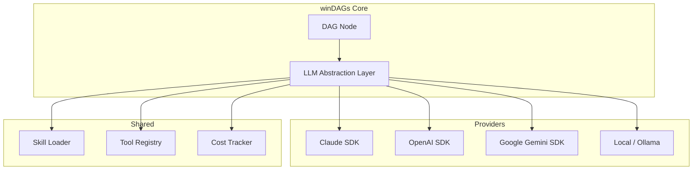

# SDK Implementation: Claude and LLM-Agnostic Patterns

How to implement winDAGs on top of Claude's SDKs, and how to make it work with non-Anthropic LLMs.

---

## Architecture: The LLM Abstraction Layer

winDAGs should not be coupled to any single LLM provider. Each DAG node calls an LLM through an abstraction layer that handles provider-specific details.



---

## Implementation on Claude

### Option 1: Messages API (Most Flexible)

Each DAG node is a `messages.create()` call with the skill injected as a system prompt.

```python
import anthropic

client = anthropic.Anthropic()

async def execute_node_claude(node: dict, inputs: dict) -> dict:
    """Execute a single DAG node using Claude Messages API."""
    
    # Load skill content as system prompt
    skill_content = load_skill(node['agent']['skills']['preloaded'])
    
    # Build the system prompt: identity + skills + task loop + constraints
    system_prompt = build_subagent_prompt(
        role=node['agent']['role'],
        skills=skill_content,
        constraints=node['execution'].get('constraints', {}),
    )
    
    # Build the user message with task + inputs from upstream nodes
    user_message = format_task_with_inputs(
        task=node.get('task_template', 'Execute your role'),
        inputs=inputs,
        output_schema=node['output']['schema'],
    )
    
    # Call Claude
    response = await client.messages.create(
        model=node['agent'].get('model', 'claude-sonnet-4.5-20250514'),
        max_tokens=node['resources'].get('max_tokens', 8192),
        system=system_prompt,
        messages=[{"role": "user", "content": user_message}],
        # Enable tool use if the node needs tools
        tools=build_tool_definitions(node['agent'].get('tools', [])),
    )
    
    # Parse structured output
    result = parse_output(response, node['output']['schema'])
    
    return {
        "status": "completed",
        "output": result,
        "metadata": {
            "model": response.model,
            "input_tokens": response.usage.input_tokens,
            "output_tokens": response.usage.output_tokens,
            "cost_usd": calculate_cost(response),
        }
    }
```

### How Skills Get Injected

The skill SKILL.md content becomes part of the system prompt:

```python
def build_subagent_prompt(role: str, skills: list[str], constraints: dict) -> str:
    """Build the 4-section subagent prompt with skills injected."""
    
    sections = []
    
    # Section 1: Identity
    sections.append(f"""You are the **{role}** agent in a workflow DAG.
You handle tasks within your specific domain.
If a task is outside your scope, say so explicitly.""")
    
    # Section 2: Skill Usage Rules (skills injected here)
    skill_text = "\n\n".join([
        f"### Skill: {name}\n{load_skill_content(name)}"
        for name in skills
    ])
    sections.append(f"""Your skills define your standard operating procedures:

{skill_text}

When tackling a task:
1. Decide which skill(s) apply
2. Follow their step-by-step workflow
3. Use their output formats and checklists
4. Reference skill steps by number as you work""")
    
    # Section 3: Task-Handling Loop
    sections.append("""For each task:
1. Restate the task in your own words
2. Select applicable skills
3. Execute the skill workflow step by step
4. Return structured output matching the required schema""")
    
    # Section 4: Constraints
    if constraints:
        constraint_text = "\n".join(f"- {k}: {v}" for k, v in constraints.items())
        sections.append(f"Constraints:\n{constraint_text}")
    
    return "\n\n---\n\n".join(sections)
```

### Option 2: Claude Code Subagents (For Local Execution)

When running locally via Claude Code, each DAG node can be a subagent spawned with the `Task` tool:

```markdown
# In the orchestrator's prompt:

For each node in the DAG, spawn a subagent using Task:
- Set the task description to include the node's role and inputs
- The subagent inherits the project's skill library
- Collect results and pass to downstream nodes
```

This uses Claude Code's native subagent mechanism, where each subagent is a forked context with access to the skill library.

**Advantage**: No SDK setup needed; skills are loaded by the runtime.
**Limitation**: Sequential by default (Claude Code doesn't natively parallelize subagents). For true parallelism, use the Messages API.

### Option 3: Extended Thinking + Tool Use (For Complex Nodes)

For nodes that need deep reasoning (the "Opus nodes" in the meta-DAG):

```python
response = await client.messages.create(
    model="claude-opus-4.6-20250514",
    max_tokens=16384,
    thinking={
        "type": "enabled",
        "budget_tokens": 10000,  # Let it think deeply
    },
    system=system_prompt,
    messages=[{"role": "user", "content": complex_task}],
    tools=tool_definitions,
)
```

### Streaming for Live Visualization

Use streaming to update the DAG visualization in real-time as a node executes:

```python
async def execute_node_streaming(node, inputs, on_update):
    """Execute node with streaming for live visualization."""
    
    async with client.messages.stream(
        model=node['agent']['model'],
        system=build_subagent_prompt(node),
        messages=[{"role": "user", "content": format_task(node, inputs)}],
    ) as stream:
        # Update visualization as tokens arrive
        async for event in stream:
            if event.type == "content_block_delta":
                on_update(node['id'], "running", event.delta.text)
            elif event.type == "message_stop":
                final = await stream.get_final_message()
                on_update(node['id'], "completed", final)
```

---

## LLM-Agnostic Implementation

### The Provider Interface

```python
from abc import ABC, abstractmethod
from dataclasses import dataclass

@dataclass
class LLMResponse:
    content: str
    model: str
    input_tokens: int
    output_tokens: int
    cost_usd: float
    tool_calls: list[dict] | None = None

class LLMProvider(ABC):
    @abstractmethod
    async def complete(
        self,
        system: str,
        messages: list[dict],
        model: str,
        max_tokens: int,
        tools: list[dict] | None = None,
        stream: bool = False,
    ) -> LLMResponse:
        ...
    
    @abstractmethod
    def calculate_cost(self, model: str, input_tokens: int, output_tokens: int) -> float:
        ...
```

### Claude Provider

```python
class ClaudeProvider(LLMProvider):
    def __init__(self):
        self.client = anthropic.AsyncAnthropic()
    
    async def complete(self, system, messages, model, max_tokens, tools=None, stream=False):
        kwargs = dict(model=model, max_tokens=max_tokens, system=system, messages=messages)
        if tools:
            kwargs['tools'] = self._convert_tools(tools)
        
        response = await self.client.messages.create(**kwargs)
        
        return LLMResponse(
            content=self._extract_text(response),
            model=response.model,
            input_tokens=response.usage.input_tokens,
            output_tokens=response.usage.output_tokens,
            cost_usd=self.calculate_cost(model, response.usage.input_tokens, response.usage.output_tokens),
            tool_calls=self._extract_tool_calls(response),
        )
    
    PRICING = {  # per million tokens, as of early 2026
        "claude-haiku-4.5": {"input": 0.80, "output": 4.00},
        "claude-sonnet-4.5": {"input": 3.00, "output": 15.00},
        "claude-opus-4.6": {"input": 15.00, "output": 75.00},
    }
    
    def calculate_cost(self, model, input_tokens, output_tokens):
        p = self.PRICING.get(model, self.PRICING["claude-sonnet-4.5"])
        return (input_tokens * p["input"] + output_tokens * p["output"]) / 1_000_000
```

### OpenAI Provider

```python
class OpenAIProvider(LLMProvider):
    def __init__(self):
        from openai import AsyncOpenAI
        self.client = AsyncOpenAI()
    
    async def complete(self, system, messages, model, max_tokens, tools=None, stream=False):
        oai_messages = [{"role": "system", "content": system}] + messages
        kwargs = dict(model=model, max_tokens=max_tokens, messages=oai_messages)
        if tools:
            kwargs['tools'] = self._convert_tools(tools)
        
        response = await self.client.chat.completions.create(**kwargs)
        choice = response.choices[0]
        
        return LLMResponse(
            content=choice.message.content or "",
            model=response.model,
            input_tokens=response.usage.prompt_tokens,
            output_tokens=response.usage.completion_tokens,
            cost_usd=self.calculate_cost(model, response.usage.prompt_tokens, response.usage.completion_tokens),
            tool_calls=self._extract_tool_calls(choice),
        )
```

### Local/Ollama Provider

```python
class OllamaProvider(LLMProvider):
    def __init__(self, base_url="http://localhost:11434"):
        self.base_url = base_url
    
    async def complete(self, system, messages, model, max_tokens, tools=None, stream=False):
        import httpx
        async with httpx.AsyncClient() as client:
            response = await client.post(f"{self.base_url}/api/chat", json={
                "model": model,
                "messages": [{"role": "system", "content": system}] + messages,
                "stream": False,
            })
            data = response.json()
        
        return LLMResponse(
            content=data["message"]["content"],
            model=model,
            input_tokens=data.get("prompt_eval_count", 0),
            output_tokens=data.get("eval_count", 0),
            cost_usd=0.0,  # Local = free
        )
```

### Provider Router (Model Selection Per Node)

```python
class ProviderRouter:
    """Routes each DAG node to the optimal provider based on model name."""
    
    def __init__(self):
        self.providers = {
            "claude": ClaudeProvider(),
            "openai": OpenAIProvider(),
            "ollama": OllamaProvider(),
        }
    
    MODEL_ROUTING = {
        "claude-haiku": "claude",
        "claude-sonnet": "claude",
        "claude-opus": "claude",
        "gpt-4o": "openai",
        "gpt-4o-mini": "openai",
        "o1": "openai",
        "llama3": "ollama",
        "mistral": "ollama",
        "qwen": "ollama",
    }
    
    def get_provider(self, model: str) -> LLMProvider:
        for prefix, provider_name in self.MODEL_ROUTING.items():
            if model.startswith(prefix):
                return self.providers[provider_name]
        raise ValueError(f"Unknown model: {model}")
    
    async def execute(self, model, system, messages, max_tokens, tools=None):
        provider = self.get_provider(model)
        return await provider.complete(system, messages, model, max_tokens, tools)
```

---

## Skill Loading Across Providers

Skills are provider-agnostic — they're just markdown text injected into the system prompt. The same skill works identically on Claude, GPT-4o, or Llama:

```python
def load_skill_for_node(node: dict) -> str:
    """Load skill content for any LLM provider."""
    skill_texts = []
    for skill_name in node['agent']['skills'].get('preloaded', []):
        skill_path = find_skill(skill_name)  # .claude/skills/{name}/SKILL.md
        content = read_file(skill_path)
        skill_texts.append(content)
    return "\n\n---\n\n".join(skill_texts)
```

**The skill library is the same regardless of provider.** What changes is:
- **Context window size** (affects how many skills can be preloaded)
- **Instruction following quality** (Claude/GPT-4o follow skills well; smaller models may drift)
- **Tool use capability** (not all models support function calling)

### Provider-Specific Considerations

| Consideration | Claude | GPT-4o | Llama 3 (local) |
|--------------|--------|--------|-----------------|
| Context window | 200K | 128K | 8-128K |
| Skill adherence | Excellent | Good | Variable |
| Tool use | Native | Native | Limited |
| Cost per node | $0.003-0.15 | $0.002-0.06 | Free |
| Latency | 1-10s | 1-8s | 2-30s |
| Best DAG role | Complex reasoning, meta-DAG | Mid-tier nodes | Simple/cheap nodes |

### Mixed-Provider DAGs

The most cost-effective architecture uses different models per node:

```yaml
dag:
  nodes:
    - id: classify-task
      agent:
        model: claude-haiku  # Fast, cheap: $0.001
        skills: [task-classifier]
    - id: deep-analysis
      agent:
        model: claude-opus   # Deep reasoning: $0.10
        skills: [research-analyst, domain-expert]
    - id: format-output
      agent:
        model: gpt-4o-mini   # Good at formatting: $0.002
        skills: [technical-writer]
    - id: validate
      agent:
        model: llama3-70b    # Free validation: $0.00
        skills: [output-validator]
```

---

## Tool Use Across Providers

winDAGs nodes may need tools (file read, web search, code execution). The tool interface must be provider-agnostic:

```python
@dataclass
class ToolDefinition:
    name: str
    description: str
    parameters: dict  # JSON Schema
    
    def to_claude(self) -> dict:
        return {
            "name": self.name,
            "description": self.description,
            "input_schema": self.parameters,
        }
    
    def to_openai(self) -> dict:
        return {
            "type": "function",
            "function": {
                "name": self.name,
                "description": self.description,
                "parameters": self.parameters,
            }
        }
```

---

## Durable Execution with Temporal

For production web service deployments, Temporal provides durable execution where every agent action is an Activity with automatic retries, fault tolerance, and full state persistence. If a worker crashes mid-DAG, execution resumes from the last completed Activity without re-executing completed nodes.

### Why Temporal for winDAGs

- **Persistent state** for long-running or multi-step DAGs
- **Automatic retries** with configurable exponential backoff per Activity
- **Deterministic replay** — on crash, Temporal replays the workflow's progress from event history without re-executing completed Activities
- **Human-in-the-loop** via Signals for approval gates
- **Observability** via Queries to inspect DAG state without affecting execution
- **Multi-agent coordination** via Child Workflows for parallel node execution

### Core Pattern: DAG Nodes as Activities

Each DAG node becomes a Temporal Activity. The DAG Workflow orchestrates them in topological order with parallel batches:

```python
from temporalio import workflow, activity
from temporalio.common import RetryPolicy
from datetime import timedelta

@activity.defn
async def execute_dag_node(node_config: dict, inputs: dict) -> dict:
    """Each DAG node is a Temporal Activity — retryable, observable, durable."""
    router = ProviderRouter()
    skill_content = load_skill_for_node(node_config)
    system_prompt = build_subagent_prompt(node_config, skill_content)
    
    # Heartbeat for long-running nodes (enables fast failure detection)
    activity.heartbeat(f"Executing {node_config['id']} with {node_config['agent']['model']}")
    
    response = await router.execute(
        model=node_config['agent']['model'],
        system=system_prompt,
        messages=[{"role": "user", "content": format_task(node_config, inputs)}],
        max_tokens=node_config['resources'].get('max_tokens', 8192),
    )
    
    return {
        "status": "completed",
        "output": response.content,
        "metadata": {
            "model": response.model,
            "input_tokens": response.input_tokens,
            "output_tokens": response.output_tokens,
            "cost_usd": response.cost_usd,
        }
    }
```

### DAG Workflow with Parallel Batches

```python
@workflow.defn
class DAGWorkflow:
    def __init__(self):
        self._completed = {}
        self._current_batch = []
        self._human_approval = None
    
    @workflow.run
    async def run(self, dag_config: dict) -> dict:
        batches = topological_sort_parallel(dag_config)
        
        for batch in batches:
            self._current_batch = [n['id'] for n in batch]
            
            # Check for human gate nodes
            human_gates = [n for n in batch if n.get('type') == 'human-in-the-loop']
            agent_nodes = [n for n in batch if n.get('type') != 'human-in-the-loop']
            
            # Execute agent nodes in parallel
            if agent_nodes:
                results = await asyncio.gather(*[
                    workflow.execute_activity(
                        execute_dag_node,
                        args=[node, self._gather_inputs(node)],
                        start_to_close_timeout=timedelta(
                            seconds=node['execution'].get('timeout', 300)
                        ),
                        heartbeat_timeout=timedelta(seconds=30),
                        retry_policy=self._retry_policy_for(node),
                    )
                    for node in agent_nodes
                ])
                for node, result in zip(agent_nodes, results):
                    self._completed[node['id']] = result
            
            # Handle human gates (wait for Signal)
            for gate in human_gates:
                self._human_approval = None
                await workflow.wait_condition(lambda: self._human_approval is not None)
                self._completed[gate['id']] = self._human_approval
        
        return self._completed
    
    @workflow.signal
    async def human_decision(self, decision: dict):
        """Receive human approval/rejection via Signal."""
        self._human_approval = decision
    
    @workflow.query
    def get_progress(self) -> dict:
        """Query DAG progress without interrupting execution."""
        return {
            "completed": list(self._completed.keys()),
            "current_batch": self._current_batch,
            "total_completed": len(self._completed),
        }
    
    def _retry_policy_for(self, node: dict) -> RetryPolicy:
        """Per-node retry policy based on node type."""
        model = node['agent'].get('model', 'claude-sonnet')
        
        if 'haiku' in model:
            # Cheap model: retry aggressively
            return RetryPolicy(
                initial_interval=timedelta(seconds=1),
                backoff_coefficient=2.0,
                maximum_interval=timedelta(seconds=30),
                maximum_attempts=10,
            )
        elif 'opus' in model:
            # Expensive model: retry cautiously
            return RetryPolicy(
                initial_interval=timedelta(seconds=2),
                backoff_coefficient=2.0,
                maximum_interval=timedelta(minutes=2),
                maximum_attempts=3,
            )
        else:
            # Default: balanced retry
            return RetryPolicy(
                initial_interval=timedelta(seconds=1),
                backoff_coefficient=2.0,
                maximum_interval=timedelta(minutes=1),
                maximum_attempts=5,
                non_retryable_error_types=["InvalidInputError"],
            )
```

### Multi-Agent Coordination via Child Workflows

For complex DAGs with sub-DAGs, use Child Workflows:

```python
@workflow.defn
class MetaDAGWorkflow:
    """The meta-DAG: uses a DAG of agents to create and execute another DAG."""
    
    @workflow.run
    async def run(self, problem: str) -> dict:
        # Step 1: Decompose problem (Haiku — cheap)
        sub_tasks = await workflow.execute_activity(
            execute_dag_node,
            args=[decomposer_node(problem), {}],
            start_to_close_timeout=timedelta(seconds=30),
        )
        
        # Step 2: Build the execution DAG (Sonnet — smart)
        dag_config = await workflow.execute_activity(
            execute_dag_node,
            args=[architect_node(sub_tasks), {}],
            start_to_close_timeout=timedelta(seconds=60),
        )
        
        # Step 3: Execute the generated DAG as a Child Workflow
        result = await workflow.execute_child_workflow(
            DAGWorkflow,
            args=[dag_config['output']],
            workflow_id=f"exec-{workflow.info().workflow_id}",
        )
        
        # Step 4: Evaluate results (Haiku — cheap)
        evaluation = await workflow.execute_activity(
            execute_dag_node,
            args=[evaluator_node(result), {}],
            start_to_close_timeout=timedelta(seconds=30),
        )
        
        if evaluation['output']['quality'] < 0.8:
            # Mutate and re-execute
            mutated_dag = await workflow.execute_activity(
                execute_dag_node,
                args=[mutator_node(dag_config, evaluation), {}],
                start_to_close_timeout=timedelta(seconds=30),
            )
            result = await workflow.execute_child_workflow(
                DAGWorkflow,
                args=[mutated_dag['output']],
                workflow_id=f"retry-{workflow.info().workflow_id}",
            )
        
        return result
```

### Sending Signals for Human Gates

From the web dashboard:

```python
# Client-side: send approval to a running DAG
from temporalio.client import Client

client = await Client.connect("localhost:7233")
handle = client.get_workflow_handle(workflow_id="dag-abc123")

# Approve a human gate
await handle.signal("human_decision", {
    "decision": "approve",
    "notes": "Looks good, proceed",
    "modified_params": None,
})

# Or reject
await handle.signal("human_decision", {
    "decision": "reject",
    "reason": "Budget too high, try cheaper approach",
})
```

### Querying DAG Progress for Visualization

The dashboard polls or subscribes to progress:

```python
# Query current state for visualization
handle = client.get_workflow_handle(workflow_id="dag-abc123")
progress = await handle.query("get_progress")
# Returns: {"completed": ["node-1", "node-2"], "current_batch": ["node-3", "node-4"], ...}
```

This feeds directly into the ReactFlow visualization — each query result updates node colors on the dashboard.

### Retry Policy Recommendations for winDAGs

```
Retry interval = min(initial_interval × backoff_coefficient^retry_count, maximum_interval)
```

| Node Type | initial_interval | backoff | max_interval | max_attempts | Why |
|-----------|-----------------|---------|-------------|-------------|-----|
| Haiku classifier | 1s | 2.0 | 30s | 10 | Cheap, retry aggressively |
| Sonnet worker | 1s | 2.0 | 1min | 5 | Balanced cost/reliability |
| Opus reasoner | 2s | 2.0 | 2min | 3 | Expensive, fail fast to human |
| External API tool | 2s | 2.0 | 5min | unlimited | Outages recover eventually |
| Human gate | N/A | N/A | N/A | 1 | Signal-based, no retry |

### Why Temporal Over Custom Execution Engine

| Concern | Custom asyncio | Temporal |
|---------|---------------|---------|
| Worker crash mid-DAG | Lost — start over | Resumes from last Activity |
| Rate limit retry | Manual backoff code | Declarative RetryPolicy |
| Human gate timeout | Custom timer logic | Signal + wait_condition |
| DAG progress query | Custom state tracking | @workflow.query |
| Multi-DAG coordination | Manual semaphores | Child Workflows |
| Execution history | Build your own logging | Event History built-in |
| Visualization | Build from scratch | Temporal UI + custom Query integration |

For local development and prototyping, the custom asyncio executor from `execution-engines.md` is fine. For production web service, Temporal is the right answer.
