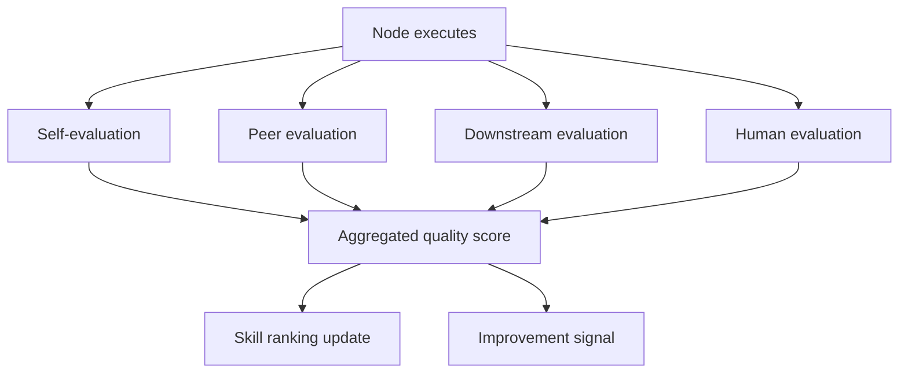
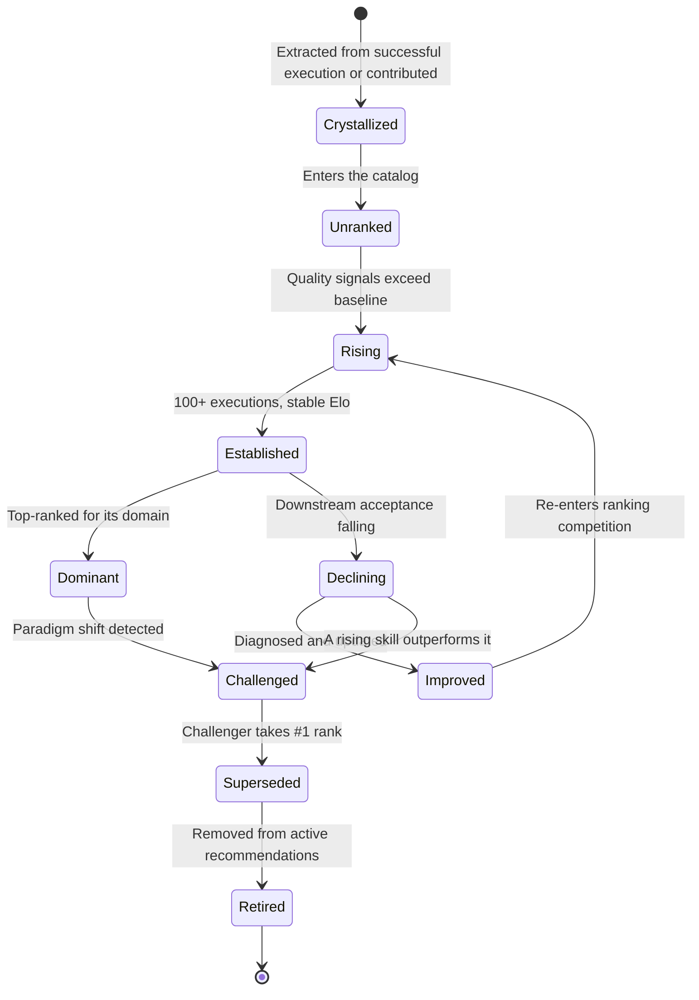
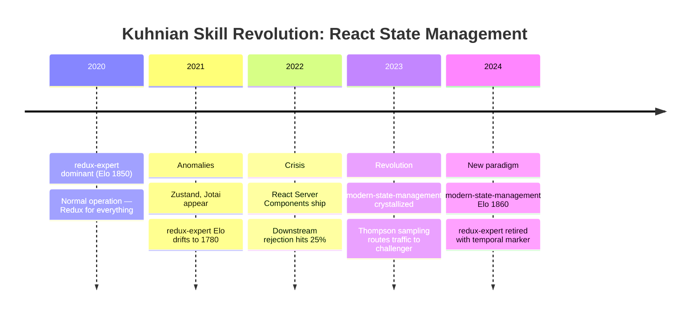
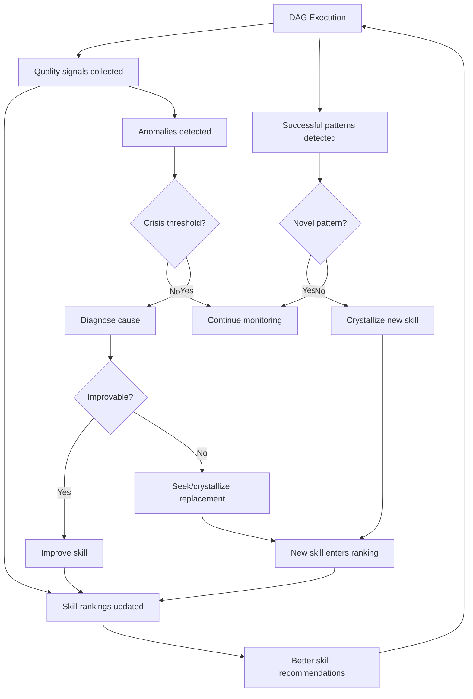

# Skill Lifecycle: Self-Evaluation, Ranking, and Kuhnian Revolution

How winDAGs uses execution data to create, improve, retire, and supersede skills automatically. Includes the multi-evaluator architecture (self-scoring, peer-scoring, downstream-scoring, human-scoring) and the Kuhnian paradigm shift model for skill evolution.

---

## The Four Evaluators

Your question — "Can agents score their own responses, or a Haiku agent evaluate them, or downstream agents?" — has a nuanced answer: **all four, and they each catch different failures.**



### Evaluator 1: Self-Evaluation (The Agent Grades Itself)

**How**: After producing output, the agent runs a self-check against the skill's QA checklist and output contract.

**Model**: Use the SAME model that produced the output (no extra cost for a separate call — just append "Now evaluate your output against these criteria" to the same conversation). Or, for cheaper self-eval, use a Haiku call with the output + checklist.

```python
SELF_EVAL_PROMPT = """
You just produced the following output for the task "{task}".

Output:
{output}

Evaluate your own work on these dimensions (0.0 to 1.0):
1. Completeness: Does the output address all parts of the task?
2. Contract compliance: Does it match the required output schema?
3. Confidence: How confident are you in the correctness?
4. Skill adherence: Did you follow the skill's steps in order?

Return JSON: {{"completeness": 0.X, "contract": 0.X, "confidence": 0.X, "adherence": 0.X, "overall": 0.X, "concerns": ["..."]}}
"""
```

**What it catches**: Contract violations, obvious omissions, cases where the agent knows it's uncertain.

**What it misses**: Self-evaluation has a **sycophancy bias** — models systematically overrate their own output. Research (Wataoka et al. 2024) quantified this: GPT-4's self-preference bias is 0.749 on Demographic Parity metrics. The mechanism is perplexity-driven: models assign higher scores to outputs with lower perplexity relative to their own distribution, and their own outputs naturally have the lowest perplexity. Even Llama-3.1 exhibits this artifact. Calibration varies by model: Opus self-evaluates more accurately than Haiku. Self-scores should be weighted ~0.15x (lowest of the four evaluators).

**Cost**: ~$0.001 if using Haiku, ~$0 if appended to the same conversation.

### Evaluator 2: Peer Evaluation (A Different Agent Grades It)

**How**: A separate, dedicated evaluator agent (a "judge node") reviews the output using the skill-grader skill. The judge should be a different model or at least a different conversation to avoid self-serving bias.

```python
async def peer_evaluate(output: dict, task: str, skill_used: str) -> dict:
    """Dedicated judge agent evaluates output quality."""
    return await execute_with_model(
        model='claude-haiku-4.5',  # Cheap judge
        system=load_skill('skill-grader'),
        prompt=f"""
        Task: {task}
        Skill used: {skill_used}
        Output to evaluate:
        {json.dumps(output)}
        
        Grade this output on the 10 axes. Return the grading report.
        """,
    )
```

**What it catches**: Logical errors the producing agent can't see, skill misapplication, quality issues that require a fresh perspective.

**What it misses**: May not understand domain context as well as the producing agent. Can be fooled by confident-sounding but incorrect output.

**Cost**: ~$0.001-0.003 per evaluation (Haiku). Worth it for any node whose output feeds a human gate or final deliverable.

**Key insight**: A Haiku judge with the skill-grader skill is surprisingly effective. The rubric is mechanical enough that even a cheap model can follow it accurately. You're paying for the SKILL's structure, not the model's reasoning.

**Debiasing**: Use position swapping (MT-Bench pattern): call the judge twice with the output and reference in swapped order. Only count as a positive verdict when both orderings agree. This neutralizes position bias, which can be as high as 75% inconsistency on weaker judges (Claude-v1: 23.8% consistency after swap). GPT-4 class models reach ~65% consistency without swapping, ~77.5% with few-shot examples.

**Ensemble judging**: Aggregating judgments from two different model families (e.g., Claude Haiku + GPT-4o-mini) further reduces self-enhancement bias, where a model family's judge systematically rates its own family higher. Arena-Hard-Auto found ensemble judges achieve 96.5% correlation with human preference vs. 93.2% for a single judge.

### Evaluator 3: Downstream Evaluation (The Next Node Grades It)

**How**: The downstream node, when it receives input from upstream, evaluates whether that input is usable before starting its own work. This is the most natural evaluation because it happens automatically as part of DAG execution.

```python
DOWNSTREAM_EVAL_PROMPT = """
You are about to begin your task: {downstream_task}

You received this input from the upstream node ({upstream_role}):
{upstream_output}

Before starting, evaluate the input:
1. Is it structurally valid? (matches expected schema)
2. Is it complete? (has all fields you need)
3. Is it plausible? (no obvious errors or contradictions)
4. Is it useful? (does it actually help with your task)

Return JSON: {{"valid": true/false, "complete": true/false, "plausible": true/false, "useful": true/false, "issues": ["..."]}}

If all four are true, proceed with your task.
If any is false, report the issue and request re-execution.
"""
```

**What it catches**: Contract mismatches, incomplete data, outputs that are technically valid but functionally useless for the next step. This is the **strongest signal** because it measures real utility, not abstract quality.

**What it misses**: Subtle quality issues that don't manifest until much later in the pipeline. A downstream node may accept mediocre input if it can work around it.

**Cost**: ~$0 if embedded in the downstream node's prompt as a preamble. The evaluation happens as part of the downstream node's normal reasoning.

### Evaluator 4: Human Evaluation (The Gold Standard)

**How**: At human-in-the-loop gates, the human's decision (approve / reject / modify) is the highest-fidelity quality signal.

**What it catches**: Everything the other three miss. Subjective quality, domain correctness, alignment with actual user intent, taste.

**What it misses**: Nothing — but it's expensive (human time) and slow.

**Cost**: Human time. Only use at gates where it matters (final deliverables, irreversible actions, high-stakes decisions).

### Aggregating the Four Scores

```python
def aggregate_quality(
    self_score: float | None,
    peer_score: float | None,
    downstream_accepted: bool | None,
    human_approved: bool | None,
) -> float:
    """Weighted aggregate of all available quality signals."""
    scores = []
    
    if self_score is not None:
        scores.append((self_score, 0.15))       # Low weight: sycophancy bias
    if peer_score is not None:
        scores.append((peer_score, 0.25))        # Medium weight: fresh perspective
    if downstream_accepted is not None:
        scores.append((1.0 if downstream_accepted else 0.3, 0.35))  # High weight: real utility
    if human_approved is not None:
        scores.append((1.0 if human_approved else 0.0, 0.50))       # Highest weight: gold standard
    
    if not scores:
        return 0.5  # No signal
    
    # Normalize weights to sum to 1.0
    total_weight = sum(w for _, w in scores)
    return sum(s * w for s, w in scores) / total_weight
```

Weights reflect trust hierarchy: **human > downstream > peer > self**.

---

## Skill Ranking System

### Elo-Based Skill Ranking

Borrow from Chatbot Arena's Elo system. Every skill execution is a "match" against the task. Win = quality score ≥ 0.8. Loss = quality score < 0.5. Draw = in between.

```python
def update_skill_elo(skill_name: str, quality_score: float, domain: str):
    """Update skill's Elo rating based on execution outcome."""
    current_elo = get_skill_elo(skill_name, domain)
    
    # Expected score based on current rating
    expected = 1.0 / (1.0 + 10 ** ((1500 - current_elo) / 400))
    
    # Actual score (continuous, not binary)
    actual = quality_score
    
    # K-factor: higher for new skills (more volatile), lower for established
    executions = get_execution_count(skill_name, domain)
    k = 32 if executions < 50 else 16 if executions < 200 else 8
    
    new_elo = current_elo + k * (actual - expected)
    set_skill_elo(skill_name, domain, new_elo)
```

### Multi-Dimensional Ranking

A single Elo isn't enough. Rank skills on multiple axes:

| Axis | Signal | Weight |
|------|--------|--------|
| **Effectiveness** | Downstream acceptance rate | 30% |
| **Efficiency** | Enables model downgrading (works on Haiku?) | 20% |
| **Reliability** | Contract compliance rate | 20% |
| **Cost** | Average token usage when loaded | 15% |
| **Freshness** | Last updated, temporal markers present | 15% |

### Skill Leaderboard

```
Domain: Code Review
━━━━━━━━━━━━━━━━━━━━━━━━━━━━━━━━━━━━━━━━━━━━━━
#1  code-review-skill         Elo: 1847  ▲  Executions: 2,341
#2  react-server-components   Elo: 1723  ▲  Executions: 891  
#3  typescript-strict-mode    Elo: 1698  ─  Executions: 456
#4  testing-patterns          Elo: 1612  ▼  Executions: 234
#5  legacy-code-reviewer      Elo: 1489  ▼  Executions: 89   ⚠️ DECLINING
```

---

## Skill Lifecycle States



### Crystallized (Birth)

A new skill enters existence. It has no execution history and no ranking.

- **Triggers**: A research agent discovers a repeatable process. A user contributes domain expertise. The meta-DAG's evaluator detects a recurring successful pattern across multiple executions that had no pre-built skill.
- **Mechanism**: An Opus agent with `skill-architect` extracts the process from the execution trace into a SKILL.md following the standard template (When to Use, NOT for, Core Process, Anti-Patterns, Output Contract).
- **Exit condition**: The skill is syntactically valid and passes `skill-grader` with at least a C overall.

### Unranked (Catalog Entry)

The skill exists in the catalog but has no performance data. It appears in search results but is not recommended by default.

- **Elo**: Initialized at 1500 (baseline).
- **K-factor**: 32 (high volatility — early executions move the rating quickly).
- **Visibility**: Available if explicitly requested or if Thompson sampling selects it for exploration (see below).
- **Exit condition**: 10+ executions produce quality signals.

### Rising (Gaining Confidence)

Quality signals are net positive. The skill's Elo is climbing. It begins appearing in recommendations.

- **Elo**: Trending upward from 1500.
- **K-factor**: 32 (still volatile — the system is still learning about this skill).
- **Visibility**: Included in recommendations when Thompson sampling draws a high sample.
- **Exit condition**: 100+ successful executions and Elo stable within ±20 for 2 weeks.

### Established (Proven)

The skill has enough execution history for its ranking to be statistically meaningful. It is a standard recommendation for its domain.

- **Elo**: Stable, typically 1600-1800.
- **K-factor**: 16 (moderate — updates are dampened to prevent noise).
- **Visibility**: Default recommendation for matching tasks.
- **Monitoring**: Drift detection runs on a rolling 30-day window (see Anomaly Detection below).
- **Exit condition (up)**: Reaches #1 rank in its domain → Dominant.
- **Exit condition (down)**: Downstream acceptance drops >10% over 30 days → Declining.

### Dominant (Top-Ranked)

The skill is the best-performing option for its domain. It is the default selection.

- **Elo**: Typically 1800+, highest in its domain.
- **K-factor**: 8 (low — established skills resist noise).
- **Visibility**: First recommendation. Used as the baseline for evaluating challengers.
- **Risk**: Complacency. The skill may become stale if the underlying domain evolves (framework changes, model capability shifts, new anti-patterns emerge).
- **Exit condition**: A challenger's Elo overtakes it, or anomaly detection flags a paradigm shift.

### Declining (Quality Dropping)

Something changed — the domain evolved, a dependency shifted, or the skill's advice became subtly wrong. Downstream acceptance is falling but no single failure is dramatic.

- **Signals**: Downstream rejection rate increasing. Self-score diverging from peer/downstream scores (sycophancy drift). Contract violations increasing on specific output fields.
- **Diagnosis**: The system runs `skill-grader` and `diagnose_declining_skill()` to identify which axes are degrading and why.
- **Actions**: Generate specific improvement recommendations. Flag for human review if urgency is high.
- **Exit condition (up)**: Improvements applied → Improved state.
- **Exit condition (lateral)**: A rising skill outperforms it → Challenged state.

### Improved (Updated)

The skill has been diagnosed and updated — either automatically (Sonnet + skill-architect) or by a human maintainer. It re-enters the ranking competition as if newly rising.

- **Elo**: Reset to its pre-decline level (not back to 1500 — it retains historical credit).
- **K-factor**: 16 (moderate — needs to re-prove itself but isn't starting from scratch).
- **Changelog**: A new version entry documents what changed and why.
- **Exit condition**: Elo stabilizes above its domain median → back to Established.

### Challenged (Competitor Emerging)

A newer skill is outperforming this one on the same domain. Both are being served (Thompson sampling allocates traffic between them) while the system gathers comparative data.

- **Mechanism**: Thompson sampling naturally handles this — it routes some traffic to the challenger even while the incumbent has higher expected value, because the challenger's uncertainty (wider posterior) means it occasionally draws higher samples.
- **Duration**: Typically 50-200 executions of comparative data.
- **Exit condition**: Challenger's Elo exceeds incumbent's for 2 consecutive weeks → Superseded.

### Superseded (Replaced)

The challenger has won. The old skill is no longer the default recommendation.

- **Visibility**: Demoted from recommendations. Still available if explicitly requested.
- **Temporal marker**: The skill's SKILL.md receives a deprecation notice: "As of [date], use [new-skill] instead. This skill covers the pre-[paradigm] approach."
- **Retention period**: 90 days in the catalog for backward compatibility.
- **Exit condition**: 90 days with <5 executions → Retired.

### Retired (Removed)

The skill is archived. It no longer appears in the catalog or search results.

- **Archived**: Stored with full execution history for analysis.
- **Recoverable**: Can be un-retired if the paradigm shifts back (rare but possible — e.g., a framework reverts a breaking change).

---

## Thompson Sampling for Skill Exploration

Pure Elo-based ranking has an **exploitation problem**: the top-ranked skill always gets selected, so new or improved skills never get enough traffic to prove themselves. Thompson sampling solves this.

### The Intuition

Instead of always picking the skill with the highest Elo (exploitation), model each skill's true quality as a **probability distribution** (Beta distribution parameterized by successes and failures). On each execution, sample from each skill's distribution and pick the one with the highest sample. Skills with high expected quality get picked most often (exploitation), but skills with high uncertainty occasionally draw lucky samples (exploration).

```python
import numpy as np

class ThompsonSkillSelector:
    """Select skills using Thompson sampling for explore/exploit balance."""
    
    def __init__(self):
        # Beta distribution parameters per (skill, domain)
        # alpha = successes + 1, beta = failures + 1 (prior: Beta(1,1) = uniform)
        self.params: dict[tuple[str, str], tuple[float, float]] = {}
    
    def select(self, candidates: list[str], domain: str) -> str:
        """Sample from each candidate's posterior, pick the highest draw."""
        samples = {}
        for skill in candidates:
            alpha, beta = self.params.get((skill, domain), (1.0, 1.0))
            samples[skill] = np.random.beta(alpha, beta)
        return max(samples, key=samples.get)
    
    def update(self, skill: str, domain: str, quality_score: float):
        """Update posterior after observing an execution outcome."""
        alpha, beta = self.params.get((skill, domain), (1.0, 1.0))
        # Treat quality_score as a continuous reward in [0, 1]
        alpha += quality_score
        beta += (1.0 - quality_score)
        self.params[(skill, domain)] = (alpha, beta)
```

### Why This Matters for the Lifecycle

- **New skills** (Unranked/Rising) have wide posteriors (high uncertainty). Thompson sampling will occasionally route traffic to them, giving them a chance to prove themselves without requiring explicit A/B tests.
- **Established skills** have tight posteriors (low uncertainty). They get selected most of the time, but not 100% — leaving room for challengers.
- **Challenged skills** compete head-to-head naturally. Thompson sampling allocates traffic proportionally to each skill's probability of being the best, converging toward the true winner as data accumulates.
- **Skill variants** (e.g., v1 vs. v2 of the same skill, or two competing approaches to the same task) are explored automatically. No manual A/B test configuration needed.

### Warring Heuristics

Thompson sampling also enables **competitive evaluation of alternative approaches** to the same problem:

```
Task: "Review this TypeScript PR"

Candidate skills, each a different heuristic:
  - code-review-skill (structured rubric approach)
  - pair-programming-reviewer (conversational approach)
  - security-first-reviewer (security-centric approach)

Thompson sampling routes traffic across all three.
After 200 executions: code-review-skill Elo 1820, security-first 1740, pair-programming 1650.
Routing converges to ~70% / 20% / 10%.
```

The system doesn't need to know in advance which approach is best. It discovers it through competitive execution.

---

## Anomaly Detection for Kuhnian Revolution

Paradigm shifts in skills follow Thomas Kuhn's model of scientific revolutions. The detection system borrows from ML drift monitoring (Evidently AI, WhyLabs, Arize patterns).

### The Kuhn Cycle Applied to Skills

**Normal operation**: The skill works within a stable paradigm. Rankings are stable. Downstream acceptance is high. No anomalies.

**Anomaly accumulation**: The world changes (new framework version, new model capabilities, new anti-patterns emerge). The skill's advice is subtly wrong more often. Downstream rejection rate creeps upward. But no single failure is dramatic enough to trigger replacement.

**Crisis**: Anomalies cross a statistical threshold. The skill's effectiveness has degraded significantly compared to its 6-month baseline. The system flags it for review.

**Revolution**: A new skill is crystallized (from research, from a user, from successful improvisation) that addresses the new paradigm. Thompson sampling routes traffic to it. If it outperforms the incumbent over ~100 executions, it supersedes it.

**New paradigm**: The new skill becomes dominant. The old skill is deprecated with a temporal marker.



### Statistical Drift Detection

Borrow from ML production monitoring. Use the same algorithms that Evidently AI, WhyLabs, and Arize use for concept drift, applied to skill execution metrics:

- **Baseline**: The skill's 6-month rolling average on each quality axis.
- **Current window**: The most recent 30 days of executions.
- **Detection method**: Population Stability Index (PSI) on the distribution of downstream acceptance scores. PSI < 0.10 = stable. PSI 0.10-0.25 = moderate drift, flag for monitoring. PSI ≥ 0.25 = significant drift, flag as crisis.
- **Complementary signal**: Hellinger distance on the distribution of quality scores across evaluators. More robust than PSI for small sample sizes.

```python
def detect_paradigm_shift(domain: str) -> list[dict]:
    """Detect skills undergoing Kuhnian crisis using drift detection."""
    skills = get_skills_for_domain(domain)
    crises = []
    
    for skill in skills:
        baseline = get_quality_distribution(skill, days=180)
        current = get_quality_distribution(skill, days=30)
        
        # PSI: Population Stability Index
        psi = compute_psi(baseline, current)
        
        # Hellinger distance for robustness
        hellinger = compute_hellinger(baseline, current)
        
        # Two-tier alerting
        if psi >= 0.25 or hellinger >= 0.3:
            severity = "crisis"
        elif psi >= 0.10 or hellinger >= 0.15:
            severity = "warning"
        else:
            continue
        
        challengers = find_rising_skills(domain, min_elo_delta=50, days=30)
        
        crises.append({
            "skill": skill.name,
            "domain": domain,
            "severity": severity,
            "psi": psi,
            "hellinger": hellinger,
            "challengers": [c.name for c in challengers],
            "recommendation": (
                "SUPERSEDE" if challengers and severity == "crisis" else
                "IMPROVE" if severity == "warning" else
                "RETIRE"
            ),
        })
    
    return crises
```

### Crystallization from Successful Improvisation

When a DAG node succeeds without a pre-built skill, and that pattern repeats 3+ times, the system extracts a new skill:

```python
async def crystallize_skill(node_id: str, traces: list[dict]) -> str:
    """Extract a new skill from repeated successful improvisation."""
    return await execute_with_model(
        model='claude-opus-4.6',
        system=load_skill('skill-architect'),
        prompt=f"""
        These {len(traces)} DAG executions succeeded on similar tasks without
        a pre-built skill. Extract the common process into a reusable skill.
        
        Execution traces:
        {json.dumps(traces, indent=2)}
        
        Create a SKILL.md following the skill-architect template.
        Include: When to Use, NOT for, Core Process (numbered steps),
        Anti-Patterns (at least 1), Output Contract.
        """,
    )
```

---

## The Feedback Loop: DAG Execution → Skill Evolution

Every DAG execution contributes to skill evolution:



### What This Means for winDAGs as a Product

The skill lifecycle is the **core differentiator**:
- Every execution makes the system smarter (data network effect)
- Skills self-improve or get replaced (quality ratchet)
- The marketplace surfaces the best skills automatically (curation at scale)
- Temporal knowledge stays current because stale skills get detected and flagged (anomaly detection)
- Users don't need to be skill experts — the system tells them which skills are working

No other agent platform has this. LangGraph has tools. CrewAI has roles. But nobody has a ranked, self-improving, self-evaluating skill ecosystem where the library gets better every time someone runs a DAG.

---

## Evaluation Architecture Recommendations

### For Every Node (Cheap, Always-On)
- Self-evaluation: appended to the same conversation, ~$0 extra
- Downstream evaluation: embedded in the next node's preamble, ~$0 extra

### For Important Nodes (Moderate Cost)
- Peer evaluation via Haiku + skill-grader: ~$0.001-0.003
- Use for: any node feeding a human gate, final deliverable nodes, nodes with high failure rates

### For Human Gates (Expensive, High-Fidelity)
- Human approval/rejection: highest-quality signal
- Use for: irreversible actions, high-stakes decisions, final outputs

### For Skill Ranking (Batch, Background)
- Aggregate all signals across executions
- Update Elo ratings in batch (hourly or daily)
- Run anomaly detection weekly
- Flag skills in crisis for review

### Research That Would Improve This

| Topic | Value | Suggested Query |
|-------|-------|----------------|
| LLM-as-judge calibration | High | "How do LLM-as-judge systems calibrate self-evaluation scores? What are the biases? How do LMSYS, AlpacaEval, and MT-Bench handle judge reliability?" |
| Skill marketplace economics | Medium | "What are the business models for developer tool marketplaces? How do VS Code extensions, npm packages, and Terraform modules achieve network effects?" |
| Anomaly detection for model drift | Medium | "How do ML monitoring systems detect concept drift and model degradation in production? Patterns from Evidently AI, WhyLabs, Arize." |
