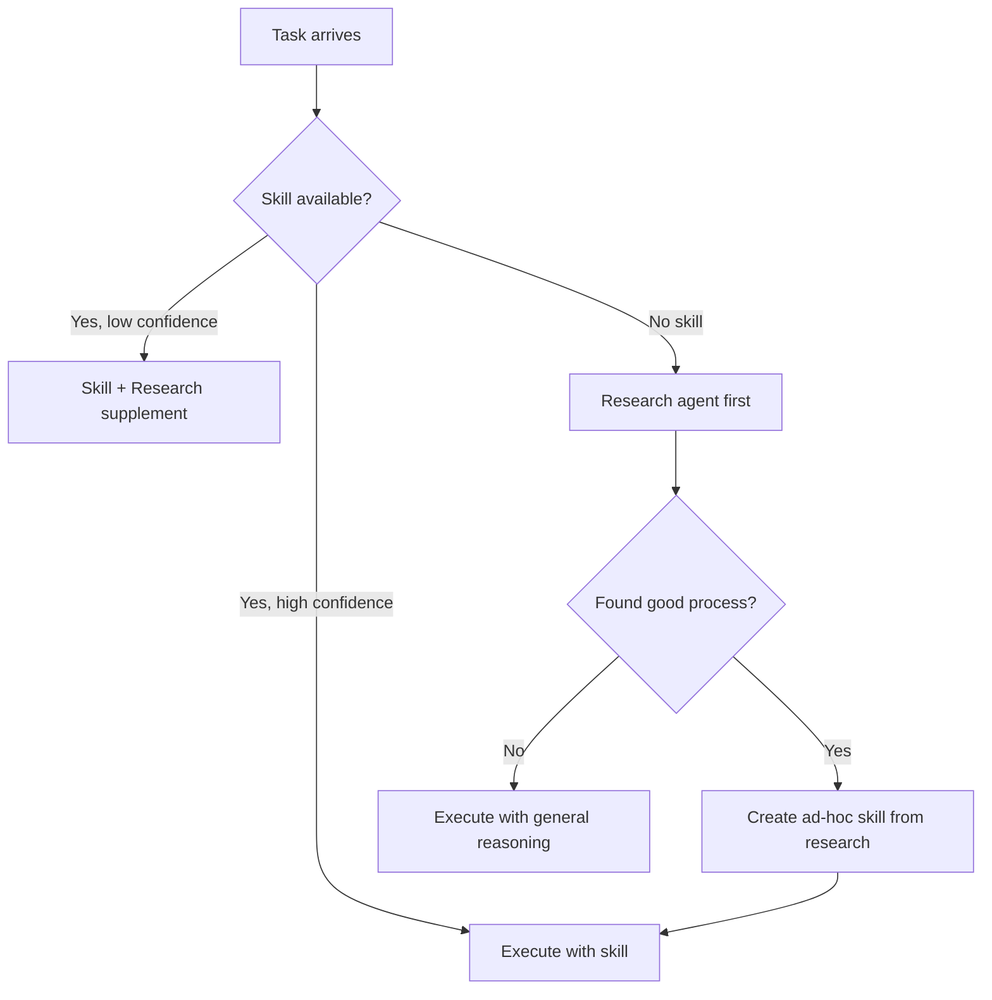

# Skills vs. On-the-Fly Research Agents

When does a pre-built skill library help winDAGs agents, and when should agents research on the fly? The short answer: they're complementary, not competing, and a good skill library is dramatically more valuable than most people expect.

---

## The Core Distinction

| Dimension | Pre-Built Skills | Research Agents |
|-----------|-----------------|-----------------|
| **What they encode** | Deterministic expert knowledge: decision trees, anti-patterns, shibboleths, output contracts | Dynamic, task-specific knowledge: latest library versions, current data, novel domains |
| **When consumed** | Loaded at agent startup (~0 latency) | Discovered at runtime (~5-30s per search) |
| **Cost per use** | ~0 tokens (already in context) to ~5K tokens (skill loaded on demand) | ~2-10K tokens per research query + processing |
| **Consistency** | Identical process every time | May find different sources, reach different conclusions |
| **Staleness risk** | Can be outdated (mitigated by temporal markers) | Always current (but may be wrong) |
| **Coverage** | Only domains you've built skills for | Any domain with web-searchable knowledge |

---

## Why Skills Are More Valuable Than They Appear

### 1. Skills Compress Repeated Decision Costs

Without a skill, every time a DAG node needs to "review a PR" it must:
1. Reason about what makes a good review (~500 tokens of thinking)
2. Decide on a review methodology (~300 tokens)
3. Remember common anti-patterns (~400 tokens)
4. Figure out output format (~200 tokens)

Total: ~1,400 tokens of overhead PER EXECUTION, every time.

With `code-review-skill` preloaded, all of that is in context for ~3K tokens ONCE, and the agent follows the pre-defined process with zero reasoning overhead. Over 100 DAG executions, the skill saves ~140K tokens of repeated reasoning — roughly $0.42 on Sonnet, $2.10 on Opus.

**The math**: A skill costs tokens once; ad-hoc reasoning costs tokens every time. Skills are amortized constants; improvisation is O(n).

### 2. Skills Prevent the Errors That Matter Most

Research agents find information. Skills encode **what NOT to do**. The anti-patterns and shibboleths in a skill represent hard-won knowledge about failures:

- "Don't use CLIP for counting objects" (saves hours of debugging)
- "React 18+ runs useEffect twice in dev mode" (saves a false bug report)
- "Don't use Redux for server state, use React Query" (saves an architecture mistake)

A research agent might find this information if it searches the right query. Or it might find a 2021 blog post that says the opposite. Skills encode the CURATED answer, including why the alternatives are wrong.

### 3. Skills Define Output Contracts

This is the killer feature for DAGs specifically. When node A passes output to node B, both need to agree on the format. Skills define explicit output contracts:

```json
{
  "status": "pass | warn | fail",
  "findings": [...],
  "summary": "string"
}
```

A research agent inventing its own output format on each run will produce inconsistent shapes that break downstream nodes. Skills make the DAG reliable.

### 4. Skills Enable Model Downgrading

With a good skill, even a cheap model (Haiku, GPT-4o-mini, Llama-3-8B) can follow a precise process. Without a skill, you need an expensive model (Opus, o1) to reason through the process from scratch.

**Example**: A "validate JSON schema" skill with clear steps works on Haiku ($0.001/call). Without the skill, you need Sonnet ($0.01/call) to figure out how to validate schemas. That's a 10x cost difference per node.

Skills let you push more nodes to cheaper models, which is the primary cost lever in DAG execution.

---

## When Research Agents Win

### 1. Novel Domains With No Skill

If nobody has built a skill for "quantum error correction codes," a research agent is the only option. Skills can't cover everything.

### 2. Data That Changes Daily

"What's the current price of NVDA stock?" or "What are the latest CVEs for Log4j?" need real-time data. Skills encode processes, not data.

### 3. User-Specific Context Discovery

"What are the best restaurants near the user's hotel?" requires real-time search. No skill can pre-encode this.

### 4. Exploration/Divergent Tasks

"Find creative approaches to solving X" benefits from research diversity. Skills encode convergent, known-good paths. Research enables divergent discovery.

---

## The Hybrid Architecture

The optimal winDAGs architecture uses BOTH:



### Pattern: Research-Augmented Skill Execution

1. Load the relevant skill (defines process, anti-patterns, output format)
2. If the skill references technologies or APIs: run a quick research check for version/deprecation updates
3. Execute the skill's process, using research results to fill knowledge gaps

This gives you the consistency of skills with the freshness of research.

### Pattern: Research → Skill Crystallization

When a research agent discovers a good process for a novel domain:
1. Execute the task using the researched process
2. If it succeeds, extract the process as a new skill
3. Future DAG executions use the skill directly (faster, cheaper, consistent)

This is how the skill library grows organically from DAG execution.

---

## Cost Model: Skills vs. Research per DAG Execution

Assume a 10-node DAG executing a "refactor codebase" task:

### Without Skills (Pure Research/Reasoning)

| Node | Model | Reasoning Overhead | Research Calls | Cost |
|------|-------|--------------------|---------------|------|
| Analyze | Sonnet | ~1500 tokens figuring out method | 0 | $0.045 |
| Plan | Sonnet | ~1200 tokens deciding format | 0 | $0.036 |
| Execute (x5) | Sonnet | ~800 tokens each figuring out approach | 0 | $0.120 |
| Review | Sonnet | ~1000 tokens inventing rubric | 0 | $0.030 |
| Validate | Sonnet | ~600 tokens deciding criteria | 0 | $0.018 |
| Report | Sonnet | ~400 tokens choosing format | 0 | $0.012 |
| **Total** | | **~9,500 wasted tokens** | **0** | **$0.261** |

### With Skills (Skill-Equipped Agents)

| Node | Model | Skill Loaded | Reasoning Overhead | Cost |
|------|-------|-------------|-------------------|------|
| Analyze | Haiku | code-review-skill | ~0 (follows steps) | $0.003 |
| Plan | Sonnet | refactoring-surgeon | ~0 | $0.018 |
| Execute (x5) | Sonnet | refactoring-surgeon | ~0 | $0.090 |
| Review | Haiku | code-review-checklist | ~0 | $0.003 |
| Validate | Haiku | test-automation-expert | ~0 | $0.003 |
| Report | Haiku | technical-writer | ~0 | $0.002 |
| **Total** | | **Skills used: 4** | **~0 wasted tokens** | **$0.119** |

**Savings**: 54% cost reduction, plus faster execution (no reasoning overhead) and more consistent output (defined contracts).

The savings compound: 100 DAG runs saves ~$14.20. 1,000 runs saves ~$142. And that's just one DAG template.

---

## What This Means for winDAGs

1. **Build a core skill library first** — The 10-20 skills most DAG nodes need
2. **Add research capability second** — For novel domains and real-time data
3. **Crystallize research into skills** — Grow the library from successful research
4. **Route cheap nodes to Haiku + skills** — Skills enable model downgrading
5. **Reserve Opus/o1 for truly novel reasoning** — Don't waste expensive models on processes that are already known
