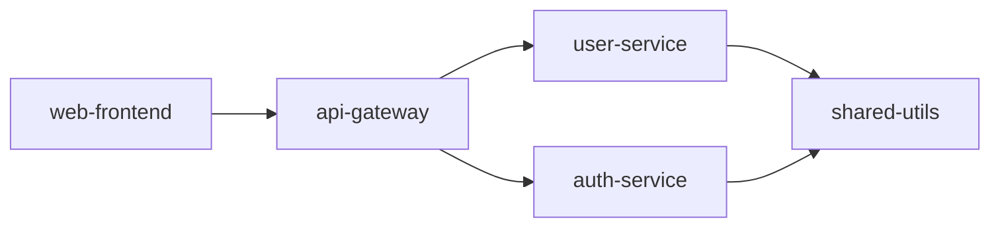

# Dependency Detection Patterns

Patterns for identifying and analyzing dependencies across ecosystems.

---

## Dependency File Detection

### By Ecosystem

| Language | Primary File | Lock File | Additional |
|----------|--------------|-----------|------------|
| Node.js | package.json | package-lock.json, yarn.lock, pnpm-lock.yaml | .npmrc |
| Python | requirements.txt | Pipfile.lock, poetry.lock | setup.py, pyproject.toml |
| Ruby | Gemfile | Gemfile.lock | .ruby-version |
| Go | go.mod | go.sum | vendor/ |
| Rust | Cargo.toml | Cargo.lock | - |
| Java | pom.xml | - | build.gradle |
| .NET | *.csproj | packages.lock.json | nuget.config |
| PHP | composer.json | composer.lock | - |

---

## Parsing Dependency Files

### Node.js package.json
```javascript
const pkg = require('./package.json');

const allDeps = {
  runtime: Object.keys(pkg.dependencies || {}),
  dev: Object.keys(pkg.devDependencies || {}),
  peer: Object.keys(pkg.peerDependencies || {}),
  optional: Object.keys(pkg.optionalDependencies || {}),
};

// Detect monorepo
const isMonorepo = pkg.workspaces !== undefined;

// Detect package manager
const packageManager = pkg.packageManager?.split('@')[0] || 'npm';
```

### Python Requirements
```python
import re

def parse_requirements(file_path):
    deps = []
    with open(file_path) as f:
        for line in f:
            line = line.strip()
            if line and not line.startswith('#') and not line.startswith('-'):
                # Handle version specifiers
                match = re.match(r'^([a-zA-Z0-9_-]+)(.*)$', line)
                if match:
                    deps.append({
                        'name': match.group(1),
                        'constraint': match.group(2) or '*'
                    })
    return deps
```

---

## Common Dependency Patterns

### Framework Detection

```bash
# Node.js frameworks
grep -q '"express"' package.json && echo "Express"
grep -q '"fastify"' package.json && echo "Fastify"
grep -q '"next"' package.json && echo "Next.js"
grep -q '"nuxt"' package.json && echo "Nuxt"
grep -q '"@nestjs/core"' package.json && echo "NestJS"

# Python frameworks
grep -q 'django' requirements.txt && echo "Django"
grep -q 'flask' requirements.txt && echo "Flask"
grep -q 'fastapi' requirements.txt && echo "FastAPI"
grep -q 'celery' requirements.txt && echo "Celery (async tasks)"

# Frontend frameworks
grep -q '"react"' package.json && echo "React"
grep -q '"vue"' package.json && echo "Vue"
grep -q '"@angular/core"' package.json && echo "Angular"
grep -q '"svelte"' package.json && echo "Svelte"
```

### Database Client Detection

```bash
# SQL
grep -qE 'pg|postgres|sequelize' package.json && echo "PostgreSQL"
grep -qE 'mysql2?|knex' package.json && echo "MySQL"
grep -qE 'sqlite3|better-sqlite3' package.json && echo "SQLite"

# NoSQL
grep -q 'mongodb\|mongoose' package.json && echo "MongoDB"
grep -q 'redis\|ioredis' package.json && echo "Redis"
grep -q 'elasticsearch' package.json && echo "Elasticsearch"

# ORMs
grep -q 'prisma' package.json && echo "Prisma ORM"
grep -q 'typeorm' package.json && echo "TypeORM"
grep -q 'sequelize' package.json && echo "Sequelize"
```

### Cloud Service SDKs

```bash
# AWS
grep -q '@aws-sdk\|aws-sdk' package.json && echo "AWS SDK"
grep -q 'boto3' requirements.txt && echo "AWS (Python)"

# Google Cloud
grep -q '@google-cloud' package.json && echo "Google Cloud"
grep -q 'google-cloud' requirements.txt && echo "Google Cloud (Python)"

# Azure
grep -q '@azure' package.json && echo "Azure"
grep -q 'azure-' requirements.txt && echo "Azure (Python)"
```

---

## Security Vulnerability Patterns

### High-Risk Indicators

```bash
# Wildcard versions (Node.js)
grep '"*"' package.json  # Any version
grep '">=' package.json  # No upper bound

# Very old packages
npm outdated --json | jq '.[] | select(.current != .wanted)'

# Known vulnerable patterns
grep -q 'request"' package.json && echo "⚠️ 'request' is deprecated"
grep -q 'node-uuid' package.json && echo "⚠️ Use 'uuid' instead"
grep -q 'moment"' package.json && echo "⚠️ Consider 'date-fns' or 'dayjs'"
```

### Audit Commands

```bash
# Node.js
npm audit --json | jq '.vulnerabilities | keys[]'

# Python
pip-audit --format=json

# Ruby
bundle audit check

# Go
go list -m -json all | nancy sleuth
```

---

## Dependency Graph Generation

### Mermaid Output

```javascript
function generateDependencyMermaid(repos) {
  const lines = ['graph LR'];

  repos.forEach(repo => {
    const deps = repo.dependencies || {};
    Object.keys(deps).forEach(dep => {
      // Check if dep is an internal repo
      if (repos.some(r => r.name === dep)) {
        lines.push(`  ${repo.name}-->$\{dep\}`);
      }
    });
  });

  return lines.join('\n');
}
```

### Output Example


---

## Upgrade Path Analysis

### Breaking Change Detection

| Ecosystem | Breaking Change Indicator |
|-----------|--------------------------|
| npm | Major version bump (semver) |
| Python | Check CHANGELOG, deprecation warnings |
| Go | go.mod requires statement |

### Safe Upgrade Process

1. **Audit current state**: `npm audit` / `pip-audit`
2. **Check breaking changes**: Read CHANGELOGs
3. **Update patch versions first**: Low risk
4. **Update minor versions**: Medium risk
5. **Update major versions last**: High risk, plan carefully
6. **Run tests after each step**: Catch regressions early
