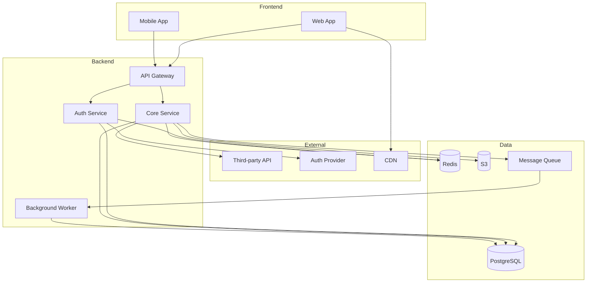

# Infrastructure Mapping

Techniques for discovering cloud resources, services, and deployment topology.

---

## Cloud Resource Discovery

### AWS

```bash
# List all resources (requires AWS CLI + credentials)
aws resourcegroupstaggingapi get-resources --output json > aws-resources.json

# Common services audit
aws ec2 describe-instances --query 'Reservations[*].Instances[*].[InstanceId,State.Name,Tags]'
aws rds describe-db-instances --query 'DBInstances[*].[DBInstanceIdentifier,Engine,DBInstanceStatus]'
aws s3 ls
aws lambda list-functions --query 'Functions[*].[FunctionName,Runtime,LastModified]'
aws ecs list-clusters
aws eks list-clusters

# IAM users/roles (security audit)
aws iam list-users
aws iam list-roles --query 'Roles[*].RoleName'
```

### GCP

```bash
# List all projects
gcloud projects list

# Compute resources
gcloud compute instances list
gcloud container clusters list
gcloud run services list
gcloud functions list

# Storage
gcloud storage ls

# SQL
gcloud sql instances list
```

### Azure

```bash
# List all resources
az resource list --output table

# Specific services
az vm list
az webapp list
az sql server list
az storage account list
az aks list
```

---

## Infrastructure-as-Code Analysis

### Terraform State Parsing

```bash
# List all resources in state
terraform state list

# Show specific resource
terraform state show aws_instance.web

# Export as JSON
terraform show -json > tf-state.json

# Parse for dependencies
jq '.values.root_module.resources[] | {type: .type, name: .name}' tf-state.json
```

### CloudFormation Analysis

```bash
# List stacks
aws cloudformation list-stacks --stack-status-filter CREATE_COMPLETE UPDATE_COMPLETE

# Get stack resources
aws cloudformation list-stack-resources --stack-name MyStack

# Export template
aws cloudformation get-template --stack-name MyStack > template.json
```

---

## Docker Compose Topology

```yaml
# Example docker-compose.yml analysis
# Services = boxes, depends_on = arrows

# Extract service map:
services:
  api:
    depends_on: [db, redis]
  worker:
    depends_on: [db, redis, rabbitmq]
  web:
    depends_on: [api]
```

### Generate Mermaid from Docker Compose

```python
import yaml

def compose_to_mermaid(compose_file):
    with open(compose_file) as f:
        data = yaml.safe_load(f)

    lines = ['graph TD']
    services = data.get('services', {})

    for name, config in services.items():
        deps = config.get('depends_on', [])
        if isinstance(deps, dict):
            deps = list(deps.keys())

        for dep in deps:
            lines.append(f'  \{name\}-->\{dep\}')

    return '\n'.join(lines)
```

---

## Network Topology Discovery

### From Code

```bash
# Find hardcoded URLs/IPs
grep -rn 'http://\|https://\|localhost\|127\.0\.0\.1' --include="*.js" --include="*.py"

# Find port references
grep -rn ':[0-9]\{4,5\}' --include="*.js" --include="*.py" --include="*.yml"

# DNS references
grep -rn '\.com\|\.io\|\.internal' --include="*.js" --include="*.py" --include="*.env*"
```

### From Configuration

```bash
# Docker Compose ports
grep -A5 'ports:' docker-compose.yml

# Kubernetes services
grep -A10 'kind: Service' k8s/*.yml

# Environment files
grep -i 'HOST\|URL\|ENDPOINT' .env.example
```

---

## Service Dependency Map Template



---

## Resource Inventory Template

```json
{
  "metadata": {
    "project": "legacy-app",
    "discovered": "2024-01-15",
    "clouds": ["aws"]
  },
  "compute": [
    {
      "type": "ec2",
      "id": "i-0abc123",
      "name": "api-server",
      "state": "running",
      "size": "t3.medium",
      "region": "us-east-1"
    }
  ],
  "databases": [
    {
      "type": "rds",
      "engine": "postgres",
      "id": "prod-db",
      "size": "db.t3.medium",
      "storage_gb": 100
    }
  ],
  "storage": [
    {
      "type": "s3",
      "name": "app-uploads",
      "region": "us-east-1",
      "public": false
    }
  ],
  "networking": {
    "vpc_id": "vpc-abc123",
    "load_balancers": ["app-lb"],
    "dns": ["api.example.com"]
  },
  "secrets": {
    "manager": "aws-secrets-manager",
    "keys": ["db-password", "api-key-stripe"]
  },
  "estimated_monthly_cost": "$250"
}
```

---

## Health Check Discovery

```bash
# Find health endpoints in code
grep -rn 'health\|ready\|alive' --include="*.js" --include="*.py" --include="*.yml"

# Common patterns
/health
/healthz
/ready
/readiness
/liveness
/api/health
/api/v1/health

# Kubernetes probes
grep -A5 'livenessProbe\|readinessProbe' k8s/*.yml
```

---

## Cost Analysis

### Quick AWS Cost Check

```bash
# Get last month's cost by service
aws ce get-cost-and-usage \
  --time-period Start=2024-01-01,End=2024-01-31 \
  --granularity MONTHLY \
  --metrics UnblendedCost \
  --group-by Type=DIMENSION,Key=SERVICE \
  --query 'ResultsByTime[0].Groups[*].[Keys[0],Metrics.UnblendedCost.Amount]' \
  --output table
```

### Resource Tagging Audit

```bash
# Find untagged resources
aws resourcegroupstaggingapi get-resources \
  --query 'ResourceTagMappingList[?length(Tags)==`0`].ResourceARN'
```
